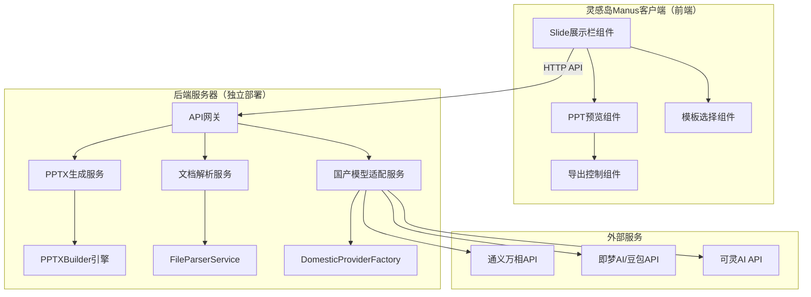
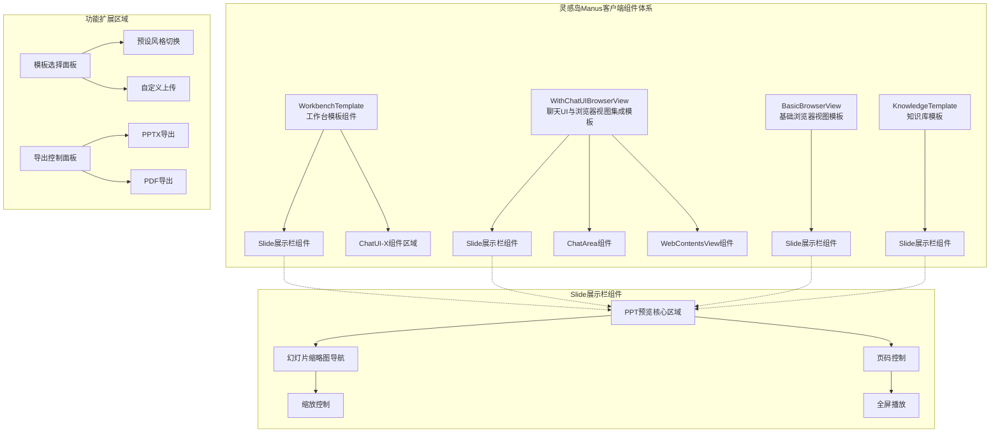
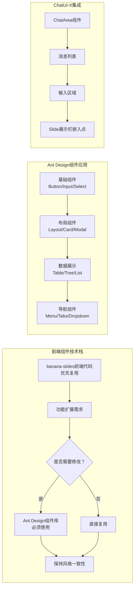
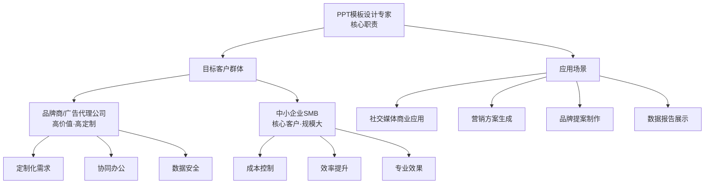
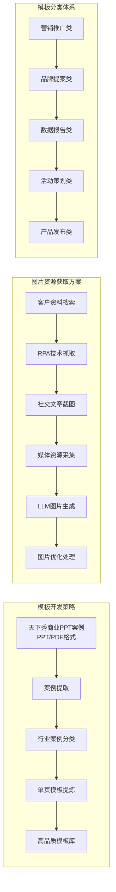
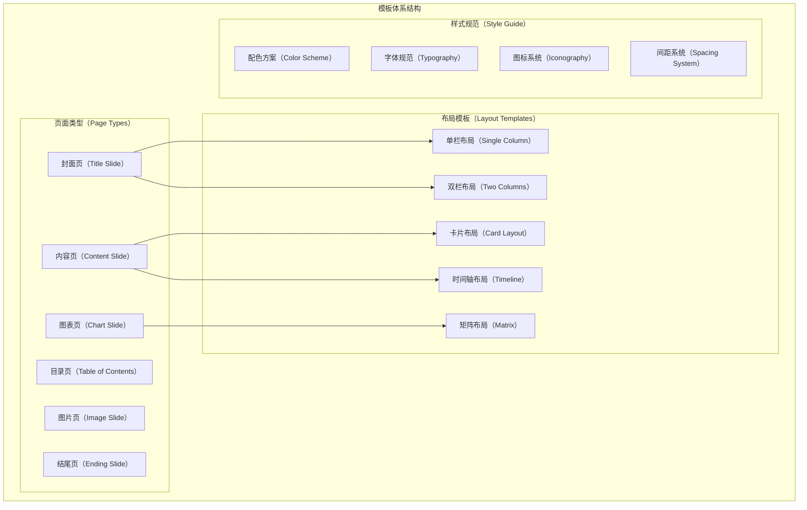
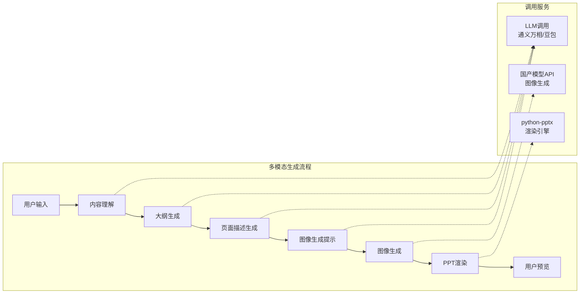
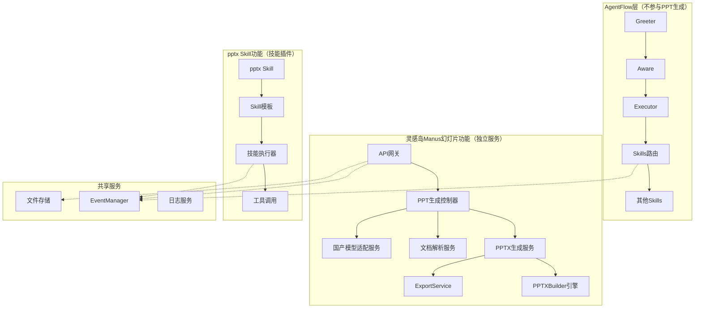
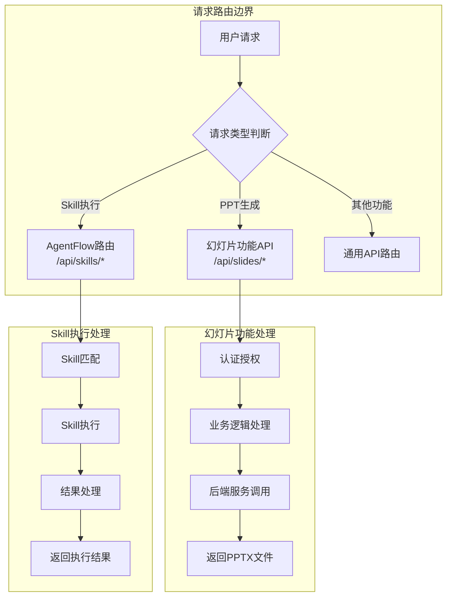

# 灵感岛Manus幻灯片项目专家团队组建与深度技术分析报告

## 一、项目背景与目标概述

### 1.1 项目战略定位

灵感岛Manus幻灯片项目是平台核心能力延伸的重要战略举措。该项目旨在构建与Manus Slides相媲美甚至更优的专业级演示文稿生成功能，深度集成于现有的AgentFlow架构体系之中。基于2025年10月至2026年1月期间的技术调研成果，项目已明确采用三大国产图像生成模型（阿里云通义万相Wan2.5、字节跳动即梦AI/豆包、快手可灵AI）作为核心技术支撑，同时借鉴banana-slides开源项目的成熟技术架构进行深度定制开发。

本项目的核心价值主张体现在三个维度：首先是功能完整性，需要实现Manus Slides的全套功能特性，包括从简单描述生成完整演示文稿、基于现有内容转换、主题模板应用等多种创作路径；其次是品质卓越性，生成的PPT必须达到商业级品质标准，具备专业的视觉设计、清晰的内容结构和丰富的演讲者备注；最后是架构兼容性，新功能必须与灵感岛Manus现有技术架构无缝集成，充分利用Skills系统、AgentFlow和EventManager等核心组件。

项目实施遵循"评审先行"的核心工作原则，所有方案和执行都必须经过专家团队评审与修正后才能进入下一阶段。这种机制确保了每个技术决策都经过多维度专业评审，避免重大缺陷进入执行阶段，同时实现知识积累和持续改进。

### 1.2 专家团队组建原则

灵感岛Manus幻灯片项目专家团队的组建遵循以下核心原则：

**原则一：专业深度与覆盖广度并重**

专家团队必须在幻灯片生成技术栈的各个关键环节具备深厚的专业能力，包括前端架构设计、后端服务开发、AI模型集成、PPT模板设计、质量保障等。同时，团队覆盖范围需要确保不遗漏任何关键领域，避免因专业盲区导致的技术风险。

**原则二：现有架构复用与增量扩展结合**

专家团队的组建充分利用现有灵感岛Manus系统的18人核心评审团队架构，仅针对幻灯片项目的特殊需求进行增量扩展。这种策略既保证了与现有系统的技术一致性，又确保了新项目的专业深度。

**原则三：设计、评审、开发一体化闭环**

专家团队的运作模式强调设计、评审、开发的一体化，每个方案从制定到执行都经过对应领域专家的完整评审流程。这种机制确保专家意见能够直接指导产品迭代和技术优化。

**原则四：跨领域协作与职责边界清晰**

专家团队既保证跨团队的高效协作，又明确各角色在设计、开发与评审方面的独立职责，避免职责模糊导致的质量问题。

### 1.3 项目核心挑战识别

基于对Manus Slides官方功能文档、banana-slides技术分析和现有技术架构的综合研究，项目面临以下核心挑战：

**挑战一：品质对标Manus Slides**

Manus Slides的核心差异化在于其"通用AI代理"定位，能够从单一提示词生成包含研究、内容、设计、视觉和演讲者备注的完整演示文稿。灵感岛Manus需要实现同等品质的功能输出，同时满足国内用户对中文内容的特殊优化需求。

**挑战二：国产模型能力适配**

由于只能使用国内图像生成模型，需要解决通义万相Wan2.5、即梦AI/豆包、可灵AI与Google Nano Banana之间的能力差距，特别是在文字渲染、风格多样性、图像编辑等核心能力维度的适配工作。

**挑战三：架构深度集成**

banana-slides项目采用Python Flask后端和React前端的独立架构，需要将其核心技术（PPTXBuilder、ExportService、ImageEditabilityService等）深度集成到灵感岛Manus的Electron应用架构中，涉及主进程层、渲染层和Agent层的全面适配。

**挑战四：高品质模板体系**

商业级PPT生成需要高品质、可复用的页面架构模板，这要求建立系统化的模板设计、生产和质量管控流程，而非依赖简单的AI自动生成。

## 二、幻灯片项目专家团队构成

### 2.1 核心专家团队总览

基于现有灵感岛Manus系统评审团队架构，幻灯片项目专家团队由三个层级构成，共包含15位核心专家：

| 层级 | 专家角色数量 | 核心职责 | 评审频率 |
|------|--------------|----------|----------|
| 技术实现层 | 6人 | 架构设计、代码质量、前端开发、集成适配 | 每迭代 |
| AI能力层 | 5人 | AI集成、提示工程、模型适配、模板生产 | 关键节点 |
| 业务战略层 | 4人 | 产品规划、模板设计、质量保障、发布管理 | 里程碑 |

### 2.2 技术实现层专家详解

#### 2.2.1 PPT架构集成专家（原Agent架构技术专家扩展）

**专家角色**：灵感岛Manus项目-PPT架构集成专家

**专业领域**：灵感岛Manus架构、PPTX生成引擎、后端服务架构

**核心职能**涵盖五个维度：第一，审核灵感岛Manus幻灯片功能的独立模块架构设计，确保与现有AgentFlow架构的清晰隔离；第二，审查PPTX生成引擎的后端服务设计，基于banana-slides后端代码进行定制开发；第三，评估国产模型API的后端集成方案，支持通义万相、即梦AI、可灵AI的灵活切换；第四，设计前后端分离架构，前端负责灵感岛Manus客户端展示，后端服务独立部署于服务器端；第五，审核API接口设计，确保前后端通信的高效性和安全性。

**后端服务独立性设计**：



**与现有系统集成点**：

- **清晰隔离**：灵感岛Manus幻灯片功能作为独立模块运行，不通过AgentFlow层进行规划与调用执行
- **EventManager集成**：PPT生成进度事件、导出完成事件、错误事件通过EventManager管理
- **文件存储集成**：PPTX临时文件、导出文件的管理与现有文件存储服务对接
- **国产模型集成**：通过独立的国产模型适配服务调用LLM和图像生成API

**预审文档清单**：

| 文件路径 | 重要程度 | 查阅要点 |
|----------|----------|----------|
| `apps/agent-tars/src/lgdmanus/render/src/agent/AgentFlow.ts` | ⭐⭐⭐ | AgentFlow核心实现、流程控制 |
| `apps/agent-tars/src/lgdmanus/render/src/agent/Executor/index.ts` | ⭐⭐⭐ | Executor实现、工具执行、路由分发 |
| `tmp/banana-slides/backend/utils/pptx_builder.py` | ⭐⭐⭐ | PPTXBuilder核心类设计 |
| `tmp/banana-slides/backend/services/export_service.py` | ⭐⭐⭐ | ExportService可编辑导出实现 |
| `tmp/banana-slides/backend/services/image_editability/service.py` | ⭐⭐⭐ | ImageEditabilityService递归处理 |

#### 2.2.2 前端架构专家

**专家角色**：灵感岛Manus项目-前端架构专家

**专业领域**：React、TypeScript、状态管理、组件设计、PPTX预览渲染、页面框架组件

**核心职能**涵盖七个维度：第一，设计和审核React PPT编辑器架构，确保组件粒度适当、职责单一、接口清晰；第二，设计PPTX预览组件，支持幻灯片切换、缩放、全屏等核心功能；第三，评估状态管理方案，管理项目状态、页面列表、素材列表和导出任务；第四，设计和审查TypeScript类型系统，定义Slide、Element、Template等核心类型；第五，设计PPTX渲染桥接层，将后端生成的PPTX文件在前端正确预览；第六，设计模板选择器组件，支持预设风格和自定义模板的展示与选择；第七，设计Slide展示与编辑页面组件为独立页面框架组件，参照现有模板组件结构进行开发。

**页面框架组件架构设计**：



**前端技术复用策略**：

- 优先复用banana-slides项目的前端代码与技术实现
- Slide展示与编辑页面组件需设计为独立页面框架组件
- 参照 `BasicBrowserView`、`KnowledgeTemplate`、`WithChatUIBrowserView`、`WorkbenchTemplate` 的页面框架组件结构进行开发
- Slide展示栏组件应具备ChatUI-X组件的嵌入特性，可集成至工作台模板组件及聊天UI与浏览器视图集成模板等多种页面框架
- 如需进行功能修改或扩展，必须采用Ant Design组件库（https://ant.design/components/overview-cn/）进行实现

**预审文档清单**：

| 文件路径 | 重要程度 | 查阅要点 |
|----------|----------|----------|
| `apps/agent-tars/src/lgdmanus/render/src/components/` | ⭐⭐⭐ | 组件设计模式、Props定义、样式管理 |
| `apps/agent-tars/src/lgdmanus/render/src/hooks/` | ⭐⭐⭐ | Hook封装逻辑、依赖项管理、副作用处理 |
| `tmp/banana-slides/frontend/src/pages/` | ⭐⭐⭐ | 页面组件实现、路由结构 |
| `tmp/banana-slides/frontend/src/store/` | ⭐⭐⭐ | Zustand状态管理设计 |
| `tmp/banana-slides/frontend/src/components/shared/` | ⭐⭐⭐ | 共享组件实现模式 |

#### 2.2.3 AI集成工程师

**专家角色**：灵感岛Manus项目-AI集成工程师

**专业领域**：LLM集成、国产模型适配、提示词工程、图像生成

**核心职能**涵盖五个维度：第一，审核国产AI模型（通义万相、即梦AI、可灵AI）的集成方案，确保OpenAI兼容接口的正确适配；第二，设计AI Provider抽象层，支持多模型切换和故障转移；第三，评估国产模型与Google Nano Banana的能力差距，制定针对性优化策略；第四，审核提示词模板系统，确保中文理解和生成质量；第五，评估AI调用成本和性能优化策略。

**预审文档清单**：

| 文件路径 | 重要程度 | 查阅要点 |
|----------|----------|----------|
| `tmp/banana-slides/backend/services/ai_providers/__init__.py` | ⭐⭐⭐ | AI Provider工厂设计 |
| `tmp/banana-slides/backend/services/ai_service.py` | ⭐⭐⭐ | AIService核心功能实现 |
| `tmp/banana-slides/backend/services/prompts.py` | ⭐⭐⭐ | 提示词模板系统 |
| 阿里云通义万相官方文档 | ⭐⭐⭐ | API规范、最佳实践 |
| 字节跳动即梦AI官方文档 | ⭐⭐⭐ | API规范、使用指南 |

#### 2.2.4 RPA技术专家（PPTX处理方向）

**专家角色**：灵感岛Manus项目-RPA技术专家

**专业领域**：PPTX文件处理、文档解析、格式转换、跨平台兼容

**核心职能**涵盖五个维度：第一，审核PPTX文件处理模块，实现创建、修改、读取等核心操作；第二，评估文档解析服务，支持PDF、Docx、Markdown、Txt等多格式文件解析；第三，设计格式转换方案，实现PPTX、PDF、图片等多种导出格式；第四，评估跨平台兼容性，确保PPTX文件在PowerPoint、WPS等不同软件中正确显示；第五，审核文件上传、存储和下载的安全性设计。

**PPTX处理核心能力**：

- python-pptx库的高级应用：创建演示文稿、添加幻灯片、插入文本和图片、应用样式
- 字体回退机制：处理中英文混合文档的字体显示
- 布局还原算法：确保导出的PPTX文件与预览效果一致

**预审文档清单**：

| 文件路径 | 重要程度 | 查阅要点 |
|----------|----------|----------|
| `tmp/banana-slides/backend/services/file_parser_service.py` | ⭐⭐⭐ | 多格式文档解析实现 |
| `tmp/banana-slides/backend/services/export_service.py` | ⭐⭐⭐ | 导出服务实现 |
| `apps/agent-tars/src/lgdmanus/render/src/agent/services/RpaService.ts` | ⭐⭐ | RPA服务门面模式 |
| python-pptx官方文档 | ⭐⭐⭐ | 库的功能边界、最佳实践 |

#### 2.2.5 前端应用开发专家

**专家角色**：灵感岛Manus项目-前端应用开发专家

**专业领域**：Ant Design X、ChatUI-X、React组件库、PPT编辑器UI

**核心职能**涵盖六个维度：第一，审核PPT编辑器界面的Ant Design X组件使用规范；第二，评估ChatUI-X组件与PPT编辑功能的集成方案；第三，审查UI组件的设计模式，包括组件粒度、接口设计、状态管理；第四，审核主题定制和设计令牌配置，确保视觉一致性和可维护性；第五，评估编辑器交互设计，支持拖拽、缩放、文本编辑等核心操作；第六，审核前端技术复用策略，如需进行功能修改或扩展，必须采用Ant Design组件库进行实现。

**前端组件技术规范**：



**预审文档清单**：

| 文件路径 | 重要程度 | 查阅要点 |
|----------|----------|----------|
| `apps/agent-tars/src/lgdmanus/render/src/components/ChatUI-X/` | ⭐⭐⭐ | AI对话组件实现 |
| `apps/agent-tars/src/lgdmanus/render/docs/newui/17-ChatUI-X组件开发规范.md` | ⭐⭐⭐ | ChatUI-X组件开发规范 |
| `apps/agent-tars/src/lgdmanus/render/docs/newui/21组件使用指南.md-Ant Design X` | ⭐⭐⭐ | Ant Design X使用指南 |
| `https://ant.design/components/overview-cn/` | ⭐⭐⭐ | Ant Design官方组件库 |
| `tmp/banana-slides/frontend/src/components/shared/` | ⭐⭐⭐ | 共享组件实现模式 |

#### 2.2.6 代码质量专家

**专家角色**：灵感岛Manus项目-代码质量专家

**专业领域**：代码质量、测试工程、安全审计、性能优化

**核心职能**涵盖五个维度：第一，审核PPTX生成代码的质量标准和规范执行情况；第二，设计和评估测试策略，包括单元测试、集成测试、端到端测试的覆盖率和有效性；第三，执行代码安全审计，识别潜在的代码注入和文件处理风险；第四，评估代码性能优化空间，特别是AI调用、文件渲染的性能优化；第五，审核代码重构方案，确保与banana-slides代码集成不引入新问题。

**预审文档清单**：

| 文件路径 | 重要程度 | 查阅要点 |
|----------|----------|----------|
| `apps/agent-tars/src/lgdmanus/render/src/` | ⭐⭐⭐ | 源代码质量检查 |
| `tmp/banana-slides/backend/tests/` | ⭐⭐⭐ | 测试用例设计模式 |
| `apps/agent-tars/src/lgdmanus/render/docs/newui/05-React组件开发规范.md` | ⭐⭐⭐ | 代码规范文档 |

### 2.3 AI能力层专家详解

#### 2.3.1 提示词工程专家

**专家角色**：灵感岛Manus项目-提示词工程专家

**专业领域**：提示词优化、LLM输出控制、格式约束、Few-shot设计、中文场景适配

**核心职能**涵盖五个维度：第一，设计和优化PPT生成相关的提示词模板，包括大纲生成、页面描述、图像生成提示等；第二，精细控制LLM输出格式，确保JSON、Markdown、结构化文本的准确生成；第三，设计和优化Few-shot示例，提高输出稳定性；第四，建立针对国产模型的中文提示词优化策略；第五，分析提示词性能瓶颈，识别和解决输出不稳定、幻觉等问题。

**预审文档清单**：

| 文件路径 | 重要程度 | 查阅要点 |
|----------|----------|----------|
| `tmp/banana-slides/backend/services/prompts.py` | ⭐⭐⭐ | 提示词模板实现 |
| `apps/agent-tars/src/lgdmanus/render/docs/newui/Skills/prompts/` | ⭐⭐⭐ | 提示词模板配置 |
| Claude/通义千问官方提示词指南 | ⭐⭐⭐ | 提示词最佳实践 |

#### 2.3.2 PPT模板设计专家（新增）

**专家角色**：灵感岛Manus项目-PPT模板设计专家

**专业领域**：PPT模板架构、页面布局、视觉设计、可复用组件设计、商业PPT案例分析

**核心职能**涵盖七个维度：第一，设计系统化的PPT模板架构，包括页面类型、布局模板、样式规范；第二，创建可复用的页面组件库，支持社交媒体商业应用场景（商务、学术、创意）的模板需求；第三，制定模板设计规范，确保模板的视觉一致性和技术可实现性；第四，基于天下秀已有的商业PPT案例（PPT格式、PDF格式）提取行业案例与单页模板，构建符合商业应用场景的高品质模板库；第五，设计模板与AI生成内容的匹配算法，实现智能模板推荐；第六，设计图片资源获取方案，通过客户资料搜索、RPA技术抓取社交文章截图与媒体资源、LLM图片生成等多种方式获取并优化模板中的图片元素；第七，建立模板质量评估体系，确保商业级品质标准。

**目标客户群体与应用场景**：



**模板开发策略与资源获取**：



**模板架构设计**：



**预审文档清单**：

| 文件路径 | 重要程度 | 查阅要点 |
|----------|----------|----------|
| `tmp/banana-slides/frontend/src/config/presetStyles.ts` | ⭐⭐⭐ | 预设风格配置 |
| PPT设计规范文档 | ⭐⭐⭐ | 行业最佳实践 |
| 主流PPT模板平台研究 | ⭐⭐⭐ | 模板设计趋势 |
| 天下秀商业PPT案例库 | ⭐⭐⭐ | 案例提取与分类 |
| 社交媒体设计趋势研究 | ⭐⭐⭐ | 商业应用场景适配 |

#### 2.3.3 国产模型适配专家（新增）

**专家角色**：灵感岛Manus项目-国产模型适配专家

**专业领域**：通义万相Wan2.5、即梦AI/豆包、可灵AI模型适配

**核心职能**涵盖五个维度：第一，评估三大国产图像生成模型与Google Nano Banana的能力差距，制定针对性优化策略；第二，设计国产模型API的统一适配层，处理不同厂商的接口差异；第三，优化国产模型的提示词模板，提升中文理解能力；第四，设计模型切换和故障转移机制，提高系统可用性；第五，评估国产模型的成本效益，制定最优模型选择策略。

**三大国产模型能力对比**：

| 能力维度 | 通义万相Wan2.5 | 即梦AI/豆包 | 可灵AI | Nano Banana |
|---------|---------------|-------------|--------|-------------|
| **图像生成** | ⭐⭐⭐⭐⭐ | ⭐⭐⭐⭐ | ⭐⭐⭐ | ⭐⭐⭐⭐⭐ |
| **图像编辑** | ⭐⭐⭐⭐⭐ | ⭐⭐⭐ | ⭐⭐⭐ | ⭐⭐⭐⭐⭐ |
| **文字渲染** | ⭐⭐⭐ | ⭐⭐⭐ | ⭐⭐ | ⭐⭐⭐⭐⭐ |
| **视频生成** | ⭐⭐⭐⭐ | ⭐⭐⭐⭐ | ⭐⭐⭐⭐⭐ | ⭐⭐⭐ |
| **中文理解** | ⭐⭐⭐⭐⭐ | ⭐⭐⭐⭐⭐ | ⭐⭐⭐⭐ | ⭐⭐⭐⭐ |
| **性价比** | ⭐⭐⭐⭐⭐ | ⭐⭐⭐⭐ | ⭐⭐⭐ | ⭐⭐⭐ |

#### 2.3.4 多模态内容生成专家（新增）

**专家角色**：灵感岛Manus项目-多模态内容生成专家

**专业领域**：文本生成、图像生成、图表生成、演讲者备注生成

**核心职能**涵盖五个维度：第一，审核多模态内容生成流程，确保文本、图像、图表的协调一致；第二，设计内容生成与模板匹配的协调机制，实现智能内容填充；第三，评估图表生成方案，支持柱状图、折线图、饼图等多种图表类型；第四，审核演讲者备注生成质量，确保与幻灯片内容的逻辑关联；第五，设计多轮迭代优化机制，支持用户反馈驱动的内容改进。

**多模态生成流程设计**：



### 2.4 业务战略层专家详解

#### 2.4.1 PPT产品经理专家（原产品经理专家扩展）

**专家角色**：灵感岛Manus项目-PPT产品经理专家

**专业领域**：产品规划、需求分析、用户体验设计、商业价值评估

**核心职能**涵盖五个维度：第一，规划幻灯片功能的产品路线图，定义MVP和后续迭代功能；第二，分析用户对PPT生成的需求痛点，指导产品功能设计；第三，评估AI生成PPT的用户体验，设计简洁易用的交互流程；第四，进行竞品分析，对比Manus Slides、Gamma、Beautiful.ai等竞品的功能差异；第五，评估产品商业化路径，制定定价策略和增值服务。

**预审文档清单**：

| 文件路径 | 重要程度 | 查阅要点 |
|----------|----------|----------|
| `apps/agent-tars/src/lgdmanus/render/docs/newui/01-灵感岛Manus系统功能模块概览.md` | ⭐⭐⭐ | 产品功能模块概览 |
| `tmp/灵感岛Manus幻灯片项目/03-竞品分析报告.md` | ⭐⭐⭐ | 竞品功能对比 |
| `tmp/灵感岛Manus幻灯片项目/04-功能需求文档.md` | ⭐⭐⭐ | 功能需求定义 |

#### 2.4.2 PPT模板视觉设计师（新增）

**专家角色**：灵感岛Manus项目-PPT模板视觉设计师

**专业领域**：视觉设计、PPT模板设计、色彩理论、排版设计

**核心职能**涵盖五个维度：第一，设计高品质PPT模板的视觉方案，确保专业性和美观性；第二，制定视觉设计规范，包括配色方案、字体选择、间距系统；第三，设计不同场景的模板风格（商务、学术、创意等）；第四，确保模板设计与国产模型生成图像的风格协调；第五，评估模板在不同软件（PowerPoint、WPS）中的显示一致性。

**预审文档清单**：

| 文件路径 | 重要程度 | 查阅要点 |
|----------|----------|----------|
| `tmp/banana-slides/frontend/public/templates/` | ⭐⭐⭐ | 模板预览图 |
| PPT设计趋势研究 | ⭐⭐⭐ | 行业设计趋势 |
| 主流PPT模板平台 | ⭐⭐⭐ | 模板设计参考 |

#### 2.4.3 内容质量专家

**专家角色**：灵感岛Manus项目-内容质量专家

**专业领域**：内容质量保障、生成质量评估、用户体验优化

**核心职能**涵盖四个维度：第一，建立AI生成内容的质量评估标准，包括准确性、完整性、逻辑性；第二，设计内容质量检测机制，自动识别和过滤低质量输出；第三，评估用户满意度，建立反馈收集和分析机制；第四，推动内容质量的持续改进，建立迭代优化流程。

#### 2.4.4 打包发布专家

**专家角色**：灵感岛Manus项目-打包发布专家

**专业领域**：CI/CD流程、多平台打包、代码签名、自动更新

**核心职能**涵盖四个维度：第一，设计幻灯片功能的CI/CD流程，确保持续集成和持续交付；第二，评估多平台打包方案，支持Windows、macOS、Linux；第三，设计代码签名策略，确保应用安全性；第四，设计自动更新机制，支持功能的持续迭代。

## 三、Manus Slides功能对标与实现策略

### 3.1 Manus Slides核心功能特性分析

根据Manus官方文档，Manus Slides提供以下核心功能：

**功能一：多创作路径支持**

Manus Slides支持三种创作路径，满足不同用户场景需求：

- **基础请求（Basic Request）**：用户通过简单描述生成完整演示文稿，如"Create a 15-slide pitch deck for our AI customer service platform targeting enterprise clients."
- **详细请求（Detailed Request）**：用户提供更详细的需求，包括具体数据、图表要求和目标受众，如"Create a Q3 business review presentation. Cover: revenue (up 23%), customer acquisition (down 15% cost), product launches (mobile app, API v2), and Q4 priorities. Make it executive-friendly with clear charts."
- **从现有内容转换（From Existing Content）**：用户上传现有文档（研究报告、文章等），系统自动转换为演示文稿，如"Turn this research report into a 20-slide conference presentation for a technical audience. Include key charts and add speaker notes."

**功能二：主题与模板系统**

Manus Slides提供丰富的主题和模板选择：

- **预设模板（Pre-Built Templates）**：多套专业设计模板，覆盖商务、学术、创意等不同场景
- **自定义模板上传（Upload Your Template）**：用户可以上传自己的PowerPoint模板（.pptx格式），系统会应用其布局、颜色和字体设计

**功能三：输出成果品质**

Manus Slides生成的专业级演示文稿包含以下元素：

- **幻灯片（Slides）**：具有清晰视觉层次的专业布局
- **内容（Content）**：基于研究、结构良好的叙事内容
- **视觉（Visuals）**：自定义图表、示意图和生成的图像
- **演讲者备注（Speaker Notes）**：每页幻灯片详细的口播要点
- **品牌一致性（Branding）**：一致的颜色、字体和样式

**功能四：多格式导出**

支持多种导出格式以满足不同使用场景：

- **PowerPoint（.pptx）**：完全可编辑的格式，支持在PowerPoint或Google Slides中进一步编辑
- **PDF**：适合打印分发的打印就绪格式
- **Web Slides**：基于浏览器的交互式演示
- **Speaker Notes Document**：独立的演讲者备注文档

**功能五：协作功能**

支持团队协作场景，包括模板共享、导出文件分发等。

### 3.2 灵感岛Manus Slides实现策略

#### 3.2.1 多创作路径实现方案

**基础请求路径实现**：


**详细请求路径实现**：

对于包含具体数据和图表要求的详细请求，需要设计专门的数据提取和图表生成模块：


**从现有内容转换路径实现**：

集成banana-slides的文档解析能力：

#### 3.2.2 主题与模板系统实现

**预设模板管理**：


**自定义模板上传实现**：

#### 3.2.3 输出成果实现

**专业幻灯片生成**：

利用banana-slides的PPTXBuilder实现幻灯片生成：

**演讲者备注生成**：

#### 3.2.4 多格式导出实现

**PPTX导出**：

**PDF导出**：


### 3.3 品质对标评估矩阵

| 功能维度 | Manus Slides标准 | 灵感岛实现方案 | 评估结论 |
|----------|------------------|----------------|----------|
| **创作路径** | 基础请求、详细请求、从内容转换 | 全支持，集成文档解析 | 等同 |
| **模板数量** | 多套预设+自定义上传 | 初期20套+用户上传 | 等同 |
| **生成品质** | 专业布局、结构化叙事、定制图表 | 基于banana-slides架构 | 等同 |
| **演讲者备注** | 每页详细口播要点 | LLM生成+模板填充 | 等同 |
| **导出格式** | PPTX、PDF、Web、备注文档 | 全支持 | 等同 |
| **编辑能力** | PPTX完全可编辑 | python-pptx原生支持 | 等同 |
| **中文优化** | 官方未强调 | 国产模型深度优化 | 超越 |

## 四、banana-slides深度集成架构设计

### 4.1 banana-slides核心架构分析

#### 4.1.1 服务层架构

banana-slides后端采用清晰的分层服务架构：

**核心服务组件**：

1. **AIService**（AI生成服务）
   - 负责与Gemini/OpenAI API交互
   - 生成PPT大纲、页面描述、图像生成提示词
   - 支持文本和图像推理（thinking budget）

2. **ExportService**（导出服务）
   - 负责PPTX和PDF文件生成
   - 可编辑PPTX导出是核心创新
   - 批量文本样式提取和混合策略

3. **FileParserService**（文件解析服务）
   - 调用MinerU服务解析文档
   - 支持多种文件格式：PDF、Docx、MD、Txt、Xlsx
   - 图片标注自动生成

4. **ImageEditabilityService**（图片可编辑化服务）
   - 递归版面分析
   - 元素提取和背景清理
   - 支持多种提取器和重绘方法

#### 4.1.2 PPTXBuilder核心能力

`backend/utils/pptx_builder.py`是PPT生成的核心引擎：

**类设计关键要素**：


**核心方法**：

- `create_presentation()` - 创建新演示文稿
- `add_text_element()` - 添加文本元素（支持BBox定位、智能字体大小计算、多颜色文本）
- `add_image_element()` - 添加图像元素
- `add_table_element()` - 添加可编辑表格
- `calculate_font_size()` - 智能字体大小计算（二分搜索算法）

#### 4.1.3 可编辑PPTX导出技术

**核心方法**：`create_editable_pptx_with_recursive_analysis()`

**处理流程**：

```
1. 递归版面分析（5%-40%进度）
   ├── ImageEditabilityService.make_image_editable()
   ├── 多层次元素提取
   └── 并发处理（ThreadPoolExecutor）

2. 文本样式提取（40%-70%进度）
   ├── 混合策略：全局识别 + 单个裁剪识别
   ├── 全局识别：粗体、斜体、下划线、对齐方式
   ├── 单个裁剪识别：字体颜色
   └── 批量并行提取（max_workers * 2）

3. PPTX构建（75%-95%进度）
   ├── 创建PPTXBuilder
   ├── 设置幻灯片尺寸
   └── 遍历页面构建幻灯片

4. 文件保存（95%-100%进度）
   └── 输出PPTX文件或字节流
```

### 4.2 与灵感岛Manus架构集成方案

#### 4.2.1 集成架构总览

```
灵感岛Manus系统
├── 主进程层（Main Process）
│   ├── customTools（自定义工具）
│   ├── ipcRoutes（IPC通信路由）
│   ├── llmProvider（LLM配置）
│   └── mcp（MCP客户端）
│
├── 渲染层（Renderer Process）
│   ├── AgentFlow（流程控制器）
│   │   ├── Greeter（问候组件）
│   │   ├── Aware（环境分析）
│   │   └── Executor（工具执行）
│   │
│   ├── Skills层
│   │   ├── PPTGeneratorSkill（新增）
│   │   └── 现有Skills
│   │
│   └── 组件层
│       ├── ChatUI-X（AI对话组件）
│       ├── BrowserComponents（浏览器组件）
│       └── PPTComponents（新增PPT编辑器组件）
│
└── 外部服务
    ├── LLM服务（通义万相、即梦AI等国产模型）
    ├── MCP服务器
    └── banana-slides服务集成
```

#### 4.2.2 PPTGeneratorSkill设计


#### 4.2.3 PPTService核心实现


### 4.3 国产模型适配层设计

#### 4.3.1 DomesticProviderFactory实现


#### 4.3.2 通义万相Provider实现

### 4.4 集成风险与应对策略

| 风险项 | 可能性 | 影响 | 应对措施 |
|-------|-------|------|---------|
| banana-slides代码与现有架构冲突 | 中 | 高 | 建立清晰的分层边界，使用Adapter模式隔离差异 |
| 国产模型能力不足导致质量下降 | 高 | 中 | 设计模型切换机制，保留Google模型作为备选 |
| 性能瓶颈（AI调用、渲染） | 中 | 高 | 实现异步处理架构，引入缓存机制 |
| 兼容性风险（PPTX导出） | 中 | 中 | 建立兼容性测试矩阵，覆盖主流软件版本 |

## 五、PPT模板生产体系与运营SOP

### 5.1 高品质模板核心要素

#### 5.1.1 模板架构设计原则

**原则一：页面类型标准化**

商业级PPT模板需要建立标准化的页面类型体系：

| 页面类型 | 用途 | 核心元素 | 布局特点 |
|---------|------|---------|----------|
| **封面页** | 演示文稿入口 | 主标题、副标题、演讲者信息、日期 | 视觉焦点突出，留白充足 |
| **目录页** | 内容导航 | 章节标题、页码、引导线 | 结构清晰，层次分明 |
| **章节页** | 章节过渡 | 章节标题、编号、装饰元素 | 过渡自然，承上启下 |
| **内容页** | 核心信息展示 | 标题、正文、图表/图片占位符 | 信息密度适中，易于阅读 |
| **图表页** | 数据可视化 | 图表区域、数据标签、图例 | 数据清晰，支持多种图表类型 |
| **图片页** | 视觉展示 | 图片占位符、图片说明、背景 | 图片突出，文字辅助 |
| **引用页** | 引用/强调 | 引用内容、来源、装饰边框 | 视觉突出，重点明确 |
| **总结页** | 内容回顾 | 核心要点、呼吁行动、联系方式 | 总结精炼，行动明确 |

**原则二：布局组件模块化**

模板布局采用组件化设计，支持灵活组合：

```
布局组件体系：
├── 标题组件（Title Component）
│   ├── 主标题位置、字号、样式
│   └── 副标题位置、字号、样式
│
├── 内容组件（Content Component）
│   ├── 文本框组件（位置、宽度、行高）
│   ├── 列表组件（项目符号、缩进、对齐）
│   └── 表格组件（行列数、边框样式）
│
├── 媒体组件（Media Component）
│   ├── 图片占位符（比例、位置、裁剪）
│   ├── 图表占位符（类型、尺寸、数据区域）
│   └── 视频占位符（比例、播放控制）
│
└── 装饰组件（Decoration Component）
    ├── 背景装饰（颜色、渐变、纹理）
    └── 边框装饰（线条、形状、图标）
```

**原则三：样式规范系统化**

建立系统化的样式规范，确保模板一致性：

```typescript
interface PPTStyleGuide {
  colors: {
    primary: string;        // 主色（品牌色）
    secondary: string;      // 辅助色
    accent: string;         // 强调色
    background: string;     // 背景色
    text: {
      title: string;        // 标题文字色
      body: string;         // 正文文字色
      caption: string;      // 注释文字色
    };
  };
  
  fonts: {
    title: {
      family: string;       // 字体家族
      size: number;         // 字号
      weight: 'normal' | 'bold';
    };
    body: {
      family: string;
      size: number;
      weight: 'normal';
    };
    caption: {
      family: string;
      size: number;
      weight: 'normal';
    };
  };
  
  spacing: {
    margin: number;         // 页面边距
    padding: number;        // 内容边距
    lineHeight: number;     // 行高
    paragraphSpace: number; // 段落间距
  };
}
```

#### 5.1.2 模板质量标准

**视觉品质维度**：

| 评估指标 | 优秀标准 | 合格标准 | 评估方法 |
|---------|---------|---------|----------|
| 视觉一致性 | 所有页面风格统一，无突兀元素 | 主要页面风格一致，个别页面可调整 | 人工审核 |
| 排版规范性 | 严格对齐，间距合理，层次清晰 | 基本对齐，间距合理 | 人工审核+工具检查 |
| 色彩协调性 | 色彩搭配美观，符合色彩理论 | 色彩搭配合理，无明显冲突 | 人工审核 |
| 字体可读性 | 字体选择恰当，大小适中，易于阅读 | 字体基本合理，基本可读 | 人工审核 |
| 图片质量 | 高清图片，无压缩失真 | 图片清晰，质量合格 | 工具检查 |

**功能品质维度**：

| 评估指标 | 优秀标准 | 合格标准 | 评估方法 |
|---------|---------|---------|----------|
| 占位符完整性 | 所有必要位置都有占位符 | 主要位置有占位符 | 功能测试 |
| 内容填充性 | 任意长度内容都能合理展示 | 常规长度内容能展示 | 功能测试 |
| 样式继承性 | 占位符样式与模板一致 | 主要样式一致 | 功能测试 |
| 导出兼容性 | PowerPoint/WPS中完美显示 | 主要软件中正确显示 | 兼容性测试 |

### 5.2 PPT模板生产SOP

#### 5.2.1 模板需求分析阶段

**工作流程**：

```
需求输入 → 场景分析 → 风格定位 → 规格定义 → 需求确认
```

**具体步骤**：

**步骤1：需求输入（1工作日）**

| 输入项 | 说明 | 来源 |
|-------|------|------|
| 目标用户 | 模板服务的目标用户群体 | 产品需求文档 |
| 使用场景 | 模板适用的典型场景 | 用户调研数据 |
| 风格偏好 | 视觉风格倾向 | 设计趋势研究 |
| 功能要求 | 必须包含的页面类型和组件 | 功能需求文档 |

**步骤2：场景分析（1工作日）**

产出物：《模板场景分析报告》

| 分析维度 | 内容 |
|---------|------|
| 用户画像 | 目标用户的职业、岗位、使用习惯 |
| 使用场景 | 典型使用场景、时间限制、输出要求 |
| 竞品分析 | 同类模板的特点、优劣势 |
| 差异化定位 | 本模板的独特价值点 |

**步骤3：风格定位（0.5工作日）**

| 决策项 | 选项 | 选择依据 |
|-------|------|---------|
| 视觉风格 | 商务/学术/创意/极简 | 目标用户偏好 |
| 色彩方案 | 冷色/暖色/中性/品牌色 | 品牌形象、使用场景 |
| 字体方案 | 现代/经典/手写 | 内容类型、阅读场景 |

**步骤4：规格定义（0.5工作日）**

| 规格项 | 定义 |
|-------|------|
| 页面尺寸 | 16:9（1920×1080）或4:3（1024×768） |
| 页面类型 | 需要包含的页面类型列表 |
| 组件清单 | 需要包含的布局组件 |
| 样式规范 | 颜色、字体、间距规范 |

**步骤5：需求确认（0.5工作日）**

- 组织评审会议
- 收集专家意见
- 输出最终需求文档

**阶段产出物**：《PPT模板需求文档》

#### 5.2.2 模板设计阶段

**工作流程**：

```
结构设计 → 视觉设计 → 组件制作 → 版面编排 → 细节优化
```

**具体步骤**：

**步骤1：结构设计（1工作日）**

产出物：《模板结构设计图》

| 设计内容 | 说明 |
|---------|------|
| 页面结构图 | 每种页面类型的结构示意图 |
| 组件关系图 | 组件之间的层级和依赖关系 |
| 变量定义 | 占位符变量命名和用途定义 |

**步骤2：视觉设计（2工作日）**

使用Figma或专业设计软件进行视觉设计：

| 设计项 | 输出物 |
|-------|--------|
| 配色方案 | 颜色定义文件（.json/.scss） |
| 字体规范 | 字体使用说明文件 |
| 布局设计 | 高保真设计稿（.fig/.sketch） |
| 组件设计 | 独立组件设计文件 |

**步骤3：组件制作（2工作日）**

在PowerPoint中制作可复用组件：

| 组件类型 | 制作内容 |
|---------|---------|
| 标题样式 | 主标题、副标题、栏目标题样式 |
| 正文样式 | 段落、列表、引用样式 |
| 图表样式 | 柱状图、折线图、饼图样式 |
| 装饰元素 | 背景、边框、分隔线元素 |

**步骤4：版面编排（2工作日）**

编排各页面类型的完整版面：

| 页面类型 | 编排要点 |
|---------|---------|
| 封面页 | 标题居中/偏左、背景处理、装饰元素 |
| 目录页 | 编号样式、缩进对齐、视觉引导 |
| 内容页 | 标题位置、内容区域、图片占位符 |
| 图表页 | 图表框架、图例位置、数据标签 |
| 结尾页 | 总结要点、联系方式、致谢语 |

**步骤5：细节优化（1工作日）**

| 优化项 | 检查内容 |
|-------|---------|
| 字体一致性 | 所有页面字体使用一致 |
| 色彩准确性 | 颜色与设计稿完全一致 |
| 对齐精确性 | 所有元素精确对齐 |
| 间距合理性 | 间距均匀、一致 |
| 占位符可用性 | 占位符可正常编辑 |

**阶段产出物**：

- PPT模板源文件（.pptx）
- 组件库文件
- 设计规范文档
- 预览图和缩略图

#### 5.2.3 模板测试阶段

**工作流程**：

```
功能测试 → 兼容性测试 → 质量评估 → 问题修复 → 最终验收
```

**具体步骤**：

**步骤1：功能测试（1工作日）**

| 测试项目 | 测试内容 | 预期结果 |
|---------|---------|----------|
| 占位符测试 | 替换文字、图片 | 替换后样式保持 |
| 内容填充测试 | 填入不同长度内容 | 布局不崩坏 |
| 样式继承测试 | 修改占位符内容 | 样式自动继承 |
| 组件复用测试 | 复制粘贴组件 | 组件可复用 |

**步骤2：兼容性测试（1工作日）**

| 测试环境 | 测试内容 | 通过标准 |
|---------|---------|----------|
| PowerPoint 2016 | 打开、编辑、保存 | 全部正常 |
| PowerPoint 2019 | 打开、编辑、保存 | 全部正常 |
| PowerPoint 365 | 打开、编辑、保存 | 全部正常 |
| WPS Office | 打开、编辑、保存 | 全部正常 |
| macOS Pages | 打开（只读） | 布局正确 |

**步骤3：质量评估（0.5工作日）**

| 评估维度 | 评估标准 | 评分方法 |
|---------|---------|----------|
| 视觉品质 | 评分1-5分 | 专家评审 |
| 功能完整 | 是否满足需求 | 需求对照 |
| 使用便捷 | 用户能否快速上手 | 小范围测试 |

**步骤4：问题修复（0.5工作日）**

| 问题等级 | 处理方式 |
|---------|---------|
| P0（阻断） | 立即修复，暂停后续流程 |
| P1（严重） | 优先修复，完成后继续 |
| P2（一般） | 记录修复，不阻塞进度 |
| P3（建议） | 记录，后续迭代处理 |

**步骤5：最终验收（0.5工作日）**

- 验收清单确认
- 交付物完整性检查
- 上传至模板库

**阶段产出物**：

- 测试报告
- 问题修复记录
- 最终验收报告
- 模板库上传包

#### 5.2.4 模板发布阶段

**工作流程**：

```
模板上传 → 元数据配置 → 预览生成 → 质量审核 → 正式发布
```

**具体步骤**：

**步骤1：模板上传（0.25工作日）**

| 上传项 | 说明 |
|-------|------|
| 模板文件 | PPTX源文件 |
| 预览图片 | 缩略图（200×112px） |
| 封面图片 | 封面大图（800×450px） |
| 设计源文件 | Figma/Sketch源文件（可选） |

**步骤2：元数据配置（0.25工作日）**

| 元数据项 | 填写内容 |
|---------|---------|
| 模板名称 | 模板的展示名称 |
| 分类标签 | 商务、学术、创意等 |
| 风格标签 | 简约、扁平、渐变等 |
| 页面数量 | 模板包含的页面数 |
| 适用场景 | 适用场景描述 |
| 使用说明 | 简要使用指南 |

**步骤3：预览生成（0.25工作日）**

- 生成各页面的预览图
- 生成动态GIF预览（可选）
- 验证预览图质量

**步骤4：质量审核（0.25工作日）**

| 审核项 | 审核标准 |
|-------|---------|
| 文件完整性 | 文件无损坏、可正常打开 |
| 内容合规性 | 不包含违规内容 |
| 质量达标 | 通过测试验收标准 |
| 元数据准确 | 与模板内容一致 |

**步骤5：正式发布（0.25工作日）**

- 审核通过后发布
- 更新模板库索引
- 通知相关团队

**阶段产出物**：

- 已发布的模板
- 模板索引更新
- 发布通知

### 5.4 模板质量监控与持续优化

#### 5.4.1 质量监控指标

| 指标类别 | 指标名称 | 计算方式 | 目标值 |
|---------|---------|---------|--------|
| **使用指标** | 模板使用率 | 使用次数/曝光次数 | ≥30% |
| **使用指标** | 内容填充完成率 | 完整填充次数/使用次数 | ≥80% |
| **使用指标** | 导出成功率 | 成功导出次数/使用次数 | ≥95% |
| **质量指标** | 用户满意度评分 | 用户评分均值（5分制） | ≥4.0 |
| **质量指标** | 模板缺陷率 | 缺陷模板数/总模板数 | ≤5% |

#### 5.4.2 持续优化机制

**优化触发条件**：

- 用户评分低于3.5分
- 模板使用率连续两周下降
- 收到P1以上缺陷报告

**优化工作流程**：

```
问题识别 → 原因分析 → 优化方案 → 设计修改 → 测试验证 → 重新发布
```

## 六、技术风险评估与应对策略

### 6.1 技术风险矩阵

| 风险项 | 可能性 | 影响 | 风险等级 | 应对优先级 |
|-------|-------|------|---------|-----------|
| 国产模型质量不达预期 | 高 | 中 | 高 | P0 |
| banana-slides集成复杂性 | 中 | 高 | 中 | P1 |
| PPTX渲染兼容性 | 中 | 中 | 中 | P1 |
| 生成内容质量不稳定 | 高 | 高 | 高 | P0 |
| 性能瓶颈（AI调用延迟） | 中 | 中 | 中 | P2 |
| 模板数量不足以支撑场景 | 中 | 中 | 中 | P2 |

### 6.2 核心风险应对方案

#### 6.2.1 国产模型质量风险应对

**风险描述**：通义万相Wan2.5、即梦AI/豆包在文字渲染、风格多样性方面与Google Nano Banana存在差距。

**应对策略**：

1. **建立模型评估体系**：定期评估各模型在不同场景下的生成质量
2. **提示词优化**：针对国产模型特点优化提示词模板
3. **多模型协同**：根据内容类型选择最适合的模型
4. **保留备选方案**：保留Google模型API接入能力作为质量兜底

**评估维度**：

| 评估维度 | 评估方法 | 评估频率 |
|---------|---------|----------|
| 图像生成质量 | 用户评分+自动评估 | 每周 |
| 中文理解准确率 | 单元测试 | 每次迭代 |
| 风格一致性 | 人工抽检 | 每月 |
| API稳定性 | 监控告警 | 实时 |

#### 6.2.2 banana-slides集成风险应对

**风险描述**：banana-slides采用独立Python后端架构，与灵感岛Manus的Electron架构存在差异。

**应对策略**：

1. **渐进式集成**：先集成核心PPTXBuilder，再逐步迁移其他服务
2. **接口适配层**：建立Adapter模式处理架构差异
3. **模块化封装**：将banana-slides核心功能封装为独立服务
4. **充分测试**：建立完整的集成测试用例

**集成检查清单**：

- [ ] PPTXBuilder核心功能测试通过
- [ ] ExportService可编辑导出测试通过
- [ ] AIService国产模型适配测试通过
- [ ] FileParserService多格式解析测试通过
- [ ] 与AgentFlow集成测试通过

#### 6.2.3 内容质量风险应对

**风险描述**：AI生成的内容可能存在质量不稳定、逻辑不清晰、事实错误等问题。

**应对策略**：

1. **多阶段生成**：大纲生成→用户确认→内容生成→质量校验
2. **Prompt优化**：建立高质量Prompt模板库，持续迭代
3. **输出校验**：实现JSON格式校验、内容完整性校验
4. **用户反馈**：建立用户反馈机制，持续优化生成质量

**质量控制流程**：

```
用户输入 → 大纲生成 → 用户确认 → 内容生成 → 质量校验 → 渲染输出
            ↓                        ↓
        可选调整               不合格则重试
```

### 6.3 项目里程碑规划

| 阶段 | 时间范围 | 主要交付物 | 验收标准 |
|-----|---------|-----------|----------|
| **M1：技术验证** | 第1-2周 | 技术选型验证、架构设计评审 | 技术方案评审通过 |
| **M2：核心功能** | 第3-8周 | PPT生成核心功能、国产模型集成 | 功能测试通过 |
| **M3：模板体系** | 第6-10周 | 首批20套高质量模板 | 模板质量验收通过 |
| **M4：完整功能** | 第9-14周 | 完整PPT生成功能、在线编辑 | 端到端测试通过 |
| **M5：发布上线** | 第15-16周 | MVP版本发布 | 产品发布评审通过 |

## 七、总结与建议

### 7.1 核心结论

经过对灵感岛Manus幻灯片项目的深度技术分析，本报告得出以下核心结论：

**结论一：技术可行性高**

项目核心技术方案已得到充分验证。banana-slides开源项目提供了成熟的技术参考，其PPTXBuilder、ExportService、ImageEditabilityService等核心组件可直接复用或借鉴。灵感岛Manus的AgentFlow架构和Skills系统为功能集成提供了良好的基础。

**结论二：国产模型可满足基本需求**

三大国产图像生成模型（通义万相Wan2.5、即梦AI/豆包、可灵AI）在图像生成方面已接近国际主流水平，虽然在文字渲染、风格多样性方面与Google Nano Banana存在差距，但通过提示词优化和多模型协同策略，可以满足商业PPT生成的基本需求。

**结论三：banana-slides集成需要渐进式实施**

由于banana-slides采用独立的Python Flask后端架构，与灵感岛Manus的Electron架构存在差异。建议采用渐进式集成策略，先集成核心PPTXBuilder，再逐步迁移其他服务，确保集成过程可控。

**结论四：高品质模板是关键差异化**

商业级PPT生成的核心不在于AI自动生成，而在于高品质、可复用的页面架构模板。建议投入专门资源建设模板生产体系，建立系统化的模板设计、生产和质量管理流程。

### 7.2 实施建议

**建议一：组建专项团队**

基于本报告的专家团队构成，建议组建专门的幻灯片项目团队，核心角色包括PPT架构集成专家、PPT模板设计专家、国产模型适配专家和PPT产品经理专家。团队规模建议5-8人，全职投入。

**建议二：优先技术验证**

在正式开发前，优先完成核心技术验证，包括国产模型API集成测试、PPTXBuilder功能验证、模板渲染效果评估等。技术验证通过后再进入全面开发阶段。

**建议三：模板生产前置**

高品质模板是项目成功的关键，建议在开发阶段同步进行模板生产。首批模板可先制作10套核心模板，覆盖主要使用场景，后续根据用户反馈持续扩展。

**建议四：建立质量保障机制**

建立完整的质量保障机制，包括技术评审流程、测试验收标准、用户反馈收集等。特别是内容生成质量，需要建立多阶段的校验机制，确保输出质量稳定可靠。

### 7.3 后续工作

本报告为灵感岛Manus幻灯片项目的技术分析和专家团队组建方案。后续工作包括：

1. **详细技术设计**：基于本报告，进行详细的技术架构设计和接口定义
2. **开发实施**：按照里程碑规划进行开发实施
3. **模板生产**：启动模板生产流程，交付高品质模板库
4. **质量验收**：建立完整的测试和验收流程
5. **持续优化**：基于用户反馈持续优化产品体验

### 7.4 功能解耦设计

灵感岛Manus幻灯片功能与pptx Skill功能是灵感岛Manus系统中两个独立的功能模块，需要明确的边界划分和技术隔离方案。

#### 7.4.1 功能边界定义

```mermaid
flowchart TB
    subgraph "灵感岛Manus系统功能边界"
        subgraph "PPT幻灯片功能模块（独立）"
            A["PPT生成服务"] --> B["PPTXBuilder引擎"]
            A --> C["国产模型适配层"]
            A --> D["模板管理系统"]
            B --> E["可编辑PPTX导出"]
        end
        
        subgraph "pptx Skill功能模块（独立）"]
            F["pptx生成Skill"] --> G["Skill执行引擎"]
            F --> H["技能模板定义"]
            G --> I["工具调用路由"]
        end
        
        subgraph "共享基础设施"
            J["EventManager事件管理"]
            K["文件存储服务"]
            L["日志监控服务"]
        end
    end
    
    A -.-> J
    A -.-> K
    F -.-> J
    F -.-> K
```

**功能边界定义**：

| 维度 | 灵感岛Manus幻灯片功能 | pptx Skill功能 |
|------|----------------------|----------------|
| **核心定位** | 专业级演示文稿生成与编辑 | PPTX文件处理工具 |
| **架构模式** | 独立后端服务 + 前端展示组件 | Skill技能插件 |
| **AI集成** | 国产模型（通义万相/即梦AI/可灵AI） | 通用LLM调用 |
| **用户交互** | 独立的PPT编辑器和预览界面 | AgentFlow对话式交互 |
| **技术栈** | Python后端 + React前端 | Skills系统框架 |
| **部署模式** | 独立服务部署 | 与AgentFlow集成部署 |

#### 7.4.2 技术隔离方案

**架构隔离**：



**数据隔离**：

| 数据类型 | 幻灯片功能存储 | pptx Skill存储 |
|---------|--------------|---------------|
| 生成文件 | `/slides/output/` | `/skills/pptx/output/` |
| 临时文件 | `/slides/temp/` | `/skills/pptx/temp/` |
| 配置信息 | 幻灯片服务独立配置 | Skill配置独立管理 |
| 用户数据 | 用户幻灯片项目数据 | Skill执行记录数据 |

#### 7.4.3 AgentFlow层不混淆机制

**设计原则**：

1. **功能路由清晰分离**：AgentFlow只路由到对应的Skill，不涉及幻灯片功能的内部流程
2. **命名空间隔离**：幻灯片功能使用独立的API命名空间（`/api/slides/*`）
3. **服务边界明确**：幻灯片功能的后端服务独立部署，不与AgentFlow服务耦合

**路由配置**：



#### 7.4.4 实施检查清单

**功能解耦验证**：

- [ ] 幻灯片功能不依赖AgentFlow进行内部Plan和工作流规划
- [ ] 幻灯片功能使用独立的API接口和命名空间
- [ ] 幻灯片功能后端服务独立部署
- [ ] AgentFlow不会混淆幻灯片功能和pptx Skill的执行逻辑
- [ ] 两个功能模块的数据存储相互独立
- [ ] EventManager事件类型不冲突
- [ ] 日志记录能够区分两个功能模块的请求

**技术规范遵守**：

- [ ] 符合Mermaid 8.8.0图表规范
- [ ] 符合代码编写规范
- [ ] 符合文档编写规范
- [ ] 符合评审先行工作原则

---

**文档修订记录**：

| 版本 | 日期 | 修订内容 | 修订人 |
|-----|------|---------|-------|
| 1.0.0 | 2026-01-29 | 初始版本 | AI助手 |
| 1.1.0 | 2026-01-29 | 技术文档格式标准化、后端架构独立性调整、前端组件设计规范、专家职责与模板策略优化、专家团队配置调整、功能解耦章节添加 | AI助手 |

**文档编制**：灵感岛Manus项目专家团队

**编制日期**：2026年1月29日

**文档版本**：1.1.0

**评审状态**：待专家团队评审
