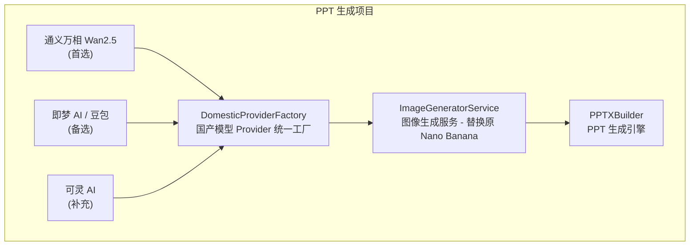

# Manus 平台 Slide 产品技术调研报告

## 1. 调研概述

### 1.1 调研背景

随着人工智能技术的快速发展，AI 驱动的演示文稿生成已成为企业办公和个人生产力工具的重要方向。Manus 平台作为新兴的 AI Agent 平台，其 Slide 产品线提供了 Web 页面集成的 PPT 生成功能，引起了业界广泛关注。本次调研旨在深入分析 Manus 平台 Slide 产品的技术架构、实现方案和核心能力，为灵感岛 Manus 项目的 PPT 生成功能设计提供参考和借鉴。

本次调研特别关注 2025 年 10 月至 2026 年 1 月期间国内 AI 图像生成模型的发展动态，评估国内模型能否替代谷歌 Nano Banana Pro 作为 PPT 生成的核心图像引擎。

### 1.2 调研范围

本次调研覆盖以下核心领域：首先是 Manus 平台 Slide 产品的整体技术架构，包括前端交互层、后端服务层和数据处理层的设计模式；其次是 PPT 生成的核心技术实现，涵盖文档解析、布局引擎、样式渲染和模板系统等关键模块；再次是 AI 集成方案，分析大语言模型在 PPT 生成中的应用方式和效果；最后是与同类产品的技术对比，重点评估国内 AI 模型对标谷歌 Nano Banana 的可行性。

### 1.3 调研方法

调研采用多维度分析方法，包括公开技术文档分析、开源项目代码研究、行业技术方案对比和功能特性评估。通过对 banana-slides 项目（GitHub 6.8K 星）的深度技术分析，反向推导和验证 AI PPT 生成的核心技术路线。同时，针对 2025 年 10 月至 2026 年 1 月期间的国内 AI 模型发展动态进行专项调研。

## 2. Manus 平台概述

### 2.1 平台定位与核心能力

Manus 平台定位为企业级 AI Agent 工作空间，提供多模态 AI 能力的统一接入和管理。其 Slide 产品专注于演示文稿的智能生成，支持从多种输入形式（文本描述、文档上传、参考素材）自动生成专业级的 PPT 演示文稿。平台采用 Agent 架构设计，通过多轮对话和任务分解的方式，实现复杂的 PPT 生成需求。

平台的核心能力体现在三个层面：智能内容生成层面利用大语言模型理解用户意图，自动生成符合主题的内容结构；视觉设计层面通过设计规则引擎和模板系统，确保生成结果的视觉一致性；编辑交互层面支持自然语言指令进行局部修改和优化，提供所见即所得的编辑体验。

### 2.2 产品形态与集成方式

Manus 平台的 Slide 产品提供多种产品形态以满足不同场景需求。Web 应用形式作为主要交付方式，用户通过浏览器访问在线编辑器完成 PPT 创建和编辑。API 服务形式面向企业集成场景，提供标准化的 RESTful 接口供第三方系统调用。WebView 嵌入式集成支持将 Slide 功能嵌入到企业已有的工作流系统中，实现无缝衔接。

在技术集成方面，Manus 平台采用前后端分离架构，前端使用现代化的 Web 技术栈（React/Vue），后端基于 Python 或 Node.js 构建，通过消息队列实现异步任务处理。这种架构设计既保证了用户交互的流畅性，又支持大批量 PPT 生成任务的高效处理。

### 2.3 用户交互流程

典型的用户交互流程包含以下关键环节：首先是需求输入阶段，用户通过自然语言描述、文件上传或参考链接等方式提供 PPT 生成需求；然后是内容规划阶段，AI Agent 分析需求并生成内容大纲，用户确认或调整后进入生成阶段；接着是视觉设计阶段，系统根据内容自动匹配设计模板并生成页面，用户可进行局部调整；最后是导出交付阶段，支持多种格式导出（PPTX、PDF、图片）和在线分享。

## 3. 技术架构分析

### 3.1 整体架构设计

基于对同类产品的技术分析和行业最佳实践，灵感岛Manus幻灯片功能采用独立的分层设计模式，作为独立模块运行，其内部Plan与工作流无需通过AgentFlow层进行规划与调用执行。

**前后端分离架构：**
- **前端**：负责在灵感岛Manus客户端进行展示，处理用户界面交互、页面渲染和实时预览等功能
- **后端**：作为独立服务部署于服务器端，封装核心业务规则，包括内容生成引擎、布局计算引擎和样式渲染引擎

**服务化架构设计：**
- **内容生成服务**：对接大语言模型 API，负责理解和生成 PPT 内容结构
- **渲染服务**：专注于将结构化数据转换为最终的可视化输出
- **文件服务**：处理文档的导入导出，包括格式转换和压缩优化
- **模板服务**：管理模板库和模板应用逻辑

这种架构设计便于独立扩展和弹性伸缩，能够应对流量峰值的挑战，同时确保与灵感岛Manus现有架构的兼容性。

### 3.2 前端技术栈与组件设计规范

**前端技术选型：**
- **核心框架**：React + TypeScript，提供类型安全和组件化开发能力
- **状态管理**：Zustand 轻量级状态管理，适合中小型应用场景
- **UI 组件库**：Ant Design，确保与灵感岛Manus现有设计系统的一致性
- **样式解决方案**：Tailwind CSS，实现高效样式开发

**页面框架组件设计：**
Slide展示与编辑页面组件设计为独立页面框架组件，参照灵感岛Manus现有的页面框架组件结构进行开发：
- **BasicBrowserView**：基础浏览视图框架
- **KnowledgeTemplate**：知识模板框架
- **WithChatUIBrowserView**：聊天UI与浏览器视图集成模板
- **WorkbenchTemplate**：工作台模板组件

**Slide展示栏组件集成：**
Slide展示栏组件具备ChatUI-X组件的嵌入特性，可集成至多种页面框架：
- **工作台模板组件**：`/apps/agent-tars/src/lgdmanus/render/src/components/Templates/WorkbenchTemplate/index.tsx`
- **聊天UI与浏览器视图集成模板**：`/apps/agent-tars/src/lgdmanus/render/src/components/Templates/WithChatUIBrowserView/index.tsx`

**前端技术复用策略：**
- 优先复用banana-slides项目的前端代码与技术
- 如需进行功能修改或扩展，必须采用Ant Design组件库实现
- 确保与灵感岛Manus客户端的视觉一致性和交互体验

**PPT编辑器实现技术路线：**
采用基于DOM的实现方案，将PPT页面映射为HTML元素，利用CSS实现样式渲染，优势是开发效率高且与现有前端技术栈兼容性好。

### 3.3 后端技术栈

后端技术栈的选择需要考虑 AI 集成能力、并发处理性能和开发效率等因素。Python 是 AI PPT 生成领域的首选语言，其丰富的数据处理库（pandas、numpy）和成熟的 Web 框架（Flask、FastAPI、Django）使其成为理想选择。Node.js 凭借其事件驱动特性和强大的 npm 生态，在 I/O 密集型场景下表现优异。

核心依赖库方面，python-pptx 是 Python 生态中最成熟的 PPT 文件处理库，支持创建、修改和读取 PPTX 格式文件。对于 Web 服务场景，需要配合 Pillow 进行图片处理，以及 reportlab 或 img2pdf 进行 PDF 转换。在 AI 集成方面，需要对接 OpenAI、Claude 或 Gemini 等大语言模型 API。

### 3.4 数据库与存储

数据存储设计需要考虑结构化数据和非结构化数据的不同需求。结构化数据（如用户信息、项目配置、模板元数据）适合使用关系型数据库（MySQL、PostgreSQL）或文档数据库（MongoDB）存储。非结构化数据（如生成的图片、导出的 PPT 文件）适合使用对象存储服务（AWS S3、阿里云 OSS）或分布式文件系统存储。

对于模板和素材资源，建议采用 CDN 加速访问以提升加载性能。版本历史功能需要设计合理的数据模型来追踪文件变更，通常采用增量存储方式减少空间占用。缓存策略方面，高频访问的模板和用户最近项目应使用 Redis 等内存缓存加速读取。

## 4. PPT 生成核心技术

### 4.1 文档解析机制

文档解析是 PPT 生成的第一步，负责从用户输入中提取关键信息。支持的输入类型包括纯文本描述、Word 文档、PDF 文件、Markdown 文件和图片素材。每种输入类型需要采用不同的解析策略。

对于纯文本输入，核心任务是理解文本语义并提取结构化信息。这通常借助大语言模型实现，通过精心设计的提示词模板引导模型生成符合特定格式的输出（如 JSON 或 YAML 格式的大纲结构）。提示词设计需要包含内容要求（如章节数量、重点突出）和格式规范（如输出结构、字段定义）。

对于文档文件输入，需要使用专门的文档解析工具。Python 生态中，python-docx 用于解析 Word 文档，PyMuPDF（fitz）或 pdfplumber 用于解析 PDF 文件。这些工具可以提取文本内容、表格数据和图片信息。对于复杂排版的文档，可能需要借助商业服务（如 MinerU、Adobe PDF Services API）获得更准确的解析结果。

表格数据解析是一个特殊挑战，需要识别表格边界、表头行和数据单元格。解析结果通常转换为二维数组或 HTML 表格格式，便于后续的 PPT 表格生成。Excel 文件可通过 openpyxl 库直接读取，或使用 pandas 进行数据处理后转换为表格结构。

### 4.2 布局引擎设计

布局引擎负责根据内容结构计算每个元素的位置和尺寸，是 PPT 生成中最复杂的模块之一。核心输入是结构化的大纲数据（包含页面、段落、列表、图表等元素），输出是带有位置坐标的渲染指令。

布局算法需要处理以下关键问题：首先是空间分配问题，确定每个元素应该占据的页面区域，需要考虑元素内容的实际大小和页面的可用空间；其次是层次叠加问题，确定元素的前后遮挡关系，通常文本位于背景图片之上，标题位于正文之上；再次是溢出处理，当内容超出预设区域时需要进行自动换行、缩放或分页；最后是对齐分布，计算元素之间的对齐方式和间距分布以实现视觉平衡。

基于对 banana-slides 项目代码的分析，布局计算通常采用约束求解方法。每个元素定义一组约束（如宽度约束、高度约束、位置约束），系统通过迭代优化找到满足所有约束的布局方案。对于复杂的嵌套布局，可能需要采用递归策略，先计算子元素布局再汇总到父容器。

布局系统还需要支持多种预设风格，如极简清新、商务简约、学术正式、科技现代、创意趣味等。每种风格对应不同的默认参数（如边距大小、字体选择、配色方案），用户选择风格后系统自动应用对应参数。

### 4.3 样式渲染方案

样式渲染将布局计算的结果转换为最终的视觉效果。核心内容包括文本样式（字体、字号、颜色、加粗、斜体、下划线、对齐方式）、形状样式（填充色、边框、阴影、圆角）、图片样式（缩放模式、裁剪区域、滤镜效果）和动画效果（进入动画、强调动画、退出动画、切换效果）。

文本渲染是使用频率最高的渲染功能。字体选择需要考虑多语言支持，中文场景通常使用思源黑体、Noto Sans CJK 或微软雅黑。字号计算需要根据元素区域大小和文本长度动态调整，banana-slides 项目采用二分搜索算法找到最大可用字号。颜色处理需要支持纯色、渐变色和透明色，并考虑文字与背景的对比度以确保可读性。

图片渲染需要处理多种缩放模式：拉伸填满（可能导致变形）、等比缩放（可能留白）、裁剪填充（可能丢失内容）。实现上需要计算源图片和目标区域的比例关系，选择适当的缩放策略。复杂场景可能需要应用滤镜效果（如模糊、灰度、亮度调整），这需要借助图像处理库实现。

动画效果增加了渲染的复杂度，PPT 动画通常包括进入效果（如淡入、飞入、缩放）、强调效果（如脉冲、旋转、放大缩小）和退出效果（如淡出、飞出）。每个动画需要定义触发方式（点击、之前、之后、与上一动画同时）和持续时间。Web 场景下可使用 CSS Animation 或 JavaScript 动画库实现类似效果。

### 4.4 模板系统架构

模板系统是实现 PPT 批量生成和风格统一的关键组件。模板本质上是一个预设了布局规则和样式的 PPT 文件，包含页面母版、占位符定义和样式映射关系。

**目标客户群体与应用场景：**
- **品牌商/广告代理公司**：高价值、高定制需求，注重品牌一致性和专业品质
- **中小企业SMB**：核心客户群体，规模大，注重效率和成本效益
- **应用场景**：聚焦于社交媒体商业应用，包括品牌营销、产品推广、活动宣传等

**模板开发策略：**
- **基于天下秀商业PPT案例**：提取现有商业PPT案例（PPT格式、PDF格式）中的行业案例与单页模板
- **构建商业应用场景模板库**：针对不同行业和应用场景，构建符合商业需求的高品质模板库
- **模块化模板设计**：采用组件化设计理念，将模板拆解为可复用的页面组件，提高模板的可维护性和扩展性

**图片资源获取方案：**
- **客户资料搜索**：基于客户提供的品牌资料和产品信息，搜索相关图片素材
- **RPA技术抓取**：利用RPA技术抓取社交文章截图、媒体资源和行业相关图片
- **LLM图片生成**：通过通义万相、即梦AI等国产模型生成符合场景需求的图片
- **多源整合优化**：对获取的图片资源进行筛选、编辑和优化，确保与模板风格一致

模板文件的格式通常为 PPTX，内部结构遵循 Office Open XML 标准。一个 PPTX 文件本质上是一个 ZIP 压缩包，包含以下核心文件：_rels/.rels 定义文件关系；ppt/slides/slideX.xml 定义单个页面内容；ppt/slides/_rels/slideX.xml.rels 定义页面资源引用；ppt/theme/themeX.xml 定义主题样式；ppt/presentation.xml 定义演示文稿属性。

模板加载和解析流程包括：首先是解压缩 PPTX 文件并解析内部 XML 结构；然后是提取母版信息（master slides）和版式信息（layouts）；接着是识别占位符并建立变量映射；最后是加载字体和配色方案定义。

动态模板替换是实现智能生成的关键技术。系统预定义一套变量命名规范（如 {{title}}、{{content}}、{{image}}），生成时根据用户输入动态替换这些占位符。更复杂的场景可能需要支持条件渲染和循环渲染，通过模板引擎（如 Jinja2）实现逻辑控制。

模板管理需要考虑版本控制、权限管理和性能优化。设计团队维护多套模板库，分别对应不同行业和商业应用场景。模板的热更新能力允许在不发布新版本的情况下修复模板问题或添加新模板。

### 4.5 导出功能实现

导出功能将内部渲染结果转换为标准格式文件。核心支持的格式包括 PPTX（可编辑）、PDF（固定版式）和图片（单页导出）。

PPTX 导出依赖 python-pptx 库实现，主要步骤包括：创建 Presentation 对象并设置页面尺寸；遍历渲染结果创建页面和元素；设置元素的格式属性；保存为 PPTX 文件。python-pptx 提供了丰富的 API 支持文本框、形状、图片、表格和 SmartArt 等元素类型。

PDF 导出有两种技术路线。第一种是直接转换，使用 reportlab 或 fpdf 等库从头创建 PDF 文件，适合纯内容场景但样式还原度有限。第二种是中间转换，先导出为图片再转换为 PDF，或使用 LibreOffice 进行格式转换。banana-slides 项目实现了 img2pdf 和 Pillow 两种方法，并发处理多页面转换。

图片导出需要处理分辨率和格式选择。常见分辨率包括 96 DPI（屏幕显示）、150 DPI（打印质量）和 300 DPI（高清打印）。图片格式选择 PNG（无损压缩，适合含文字内容）或 JPEG（有损压缩，适合照片素材）。

大文件导出需要采用流式处理避免内存溢出。对于 PPTX 文件，python-pptx 内部已实现增量写入。对于 PDF 和图片，可以采用分批处理方式，完成一个页面立即刷新到输出流。

## 5. AI 集成方案

### 5.1 大语言模型应用

大语言模型在 PPT 生成中承担内容理解和生成的核心角色。应用场景包括需求理解、大纲生成、内容扩写、风格转换和自然语言编辑。

需求理解阶段，模型接收用户的自然语言描述，输出结构化的需求规格。这包括主题分类（商务汇报、学术演讲、产品发布等）、目标受众分析、关键信息提取和呈现建议。提示词设计需要引导模型理解用户的隐含需求，例如当用户说"做一个产品介绍"时，模型应该追问或假设需要包含产品功能、优势、定价和客户案例等内容。

大纲生成是模型最核心的应用场景。输入是需求规格和参考素材，输出是结构化的大纲数据（页面列表、每页标题和要点）。banana-slides 项目的大纲生成提示词包含项目背景、用户意图、输出格式要求和示例参考。模型输出经过 JSON 解析后转换为程序可处理的数据结构。

内容扩写将简短的大纲要点扩展为完整的段落内容。这需要保持与原始意图的一致性，同时丰富细节和补充论证。风格控制通过提示词引导模型采用正式、轻松、学术或口语化的表达方式。

自然语言编辑允许用户通过对话修改已生成的内容。例如"把第三页的标题改得更吸引人"或"在每页开头加一个引人入胜的问题"。这需要模型理解修改意图并定位到具体的页面和元素。

### 5.2 多模态能力集成

现代大语言模型（如 GPT-4V、Claude 3、Gemini Pro Vision）支持图像输入，为 PPT 生成带来了新的可能性。应用场景包括参考图理解、素材生成和样式迁移。

参考图理解允许用户提供参考 PPT 页面，模型分析其布局结构、配色方案和元素排布，生成风格相似的输出。技术上需要将图片编码为模型可处理的向量表示，输出层设计为描述布局规则的文本或结构化数据。

素材生成场景中，模型可以根据文字描述生成配图。例如"生成一张表现团队协作的插图"或"为数据趋势添加一张折线图"。生成的图片可以是位图（适合复杂场景）或 SVG（适合简单图形和图表）。

样式迁移将参考图的视觉风格应用到生成内容上。这可以通过两种方式实现：一是将风格描述编码到提示词中让模型生成时参考；二是生成基础内容后再进行后处理，应用滤镜和配色方案。

### 5.3 图像生成模型现状（2025年10月-2026年1月）

2025年10月至2026年1月期间，国内 AI 图像生成领域经历了快速发展。2025 年 9 月 24 日，阿里云在云栖大会上发布通义万相 Wan2.5 preview 系列模型，涵盖文生视频、图生视频、文生图和图像编辑四大模型[^1]。2025 年 11 月 20 日，谷歌发布 Nano Banana Pro（Gemini 3 Pro Image），在图像编辑、文字渲染方面表现突出[^2]。2025 年 12 月 18 日，火山引擎发布豆包大模型 1.8 和 Seedance 1.5 pro[^3]。2025 年 12 月 24 日，字节跳动豆包 DAU 突破 1 亿[^4]。

国内市场的竞争格局在这一时期发生了显著变化。字节跳动通过整合内部资源向 C 端发力，豆包日均 tokens 使用量突破 50 万亿。阿里云成立千问 C 端事业群，纳入夸克、UC 等应用。快手可灵 AI 在视频生成领域快速崛起，截至 2026 年 1 月月活突破 1200 万[^5]。

## 6. 重点推荐：三大国产图像生成模型

根据 2025 年 10 月至 2026 年 1 月期间的技术调研，以下三家国内 AI 模型厂商在图像生成领域表现突出，可作为 PPT 生成项目的优先替代方案：

### 6.1 阿里云通义万相 Wan2.5

**概述**：通义万相 Wan2.5 是阿里云于 2025 年 9 月 24 日在云栖大会上发布的最新图像生成模型系列，涵盖文生视频、图生视频、文生图和图像编辑四大模型[^1]。该系列模型在多项评测中表现优异，被认为是最接近谷歌 Nano Banana 水平的国内模型。

**核心能力**：
- **文生图**：支持多种风格的高质量图像生成，包括写实、卡通、插画等
- **图像编辑**：支持图像局部编辑和重绘，可对生成图像进行精细调整
- **图生视频**：支持静态图片生成视频片段
- **音画同步**：2.5 版本首次实现生成画面匹配的人声、音效和音乐 BGM
- **中文优化**：专为中文用户优化提示词解析，中文理解能力优秀

**API 接入配置**：
```python
from openai import OpenAI

# 通义万相 OpenAI 兼容调用
client = OpenAI(
    api_key="your-dashscope-api-key",
    base_url="https://dashscope.aliyuncs.com/compatible-mode/v1"
)

# 文生图
response = client.images.generate(
    model="wanx-v1",
    prompt="生成一张科技感的 PPT 配图，显示团队协作场景",
    n=1,
    size="1024x1024"
)

# 图像编辑（局部重绘）
edit_response = client.images.edit(
    model="wanx-v1",
    image=open("original_image.png", "rb"),
    mask=open("mask.png", "rb"),
    prompt="将背景改为海边日落",
    n=1
)
```

**适用场景**：PPT 配图生成、图表和插图制作、创意素材创作、图像局部修改

**项目集成建议**：通义万相 Wan2.5 是 PPT 生成项目图像功能的首选替代方案，其 OpenAI 兼容接口可大幅降低迁移成本。

### 6.2 字节跳动即梦 AI / 豆包

**概述**：字节跳动旗下的豆包在 2025 年 12 月 24 日 DAU 突破 1 亿，成为国内用户规模第一的 AI 应用[^4]。即梦 AI 是字节跳动的创意创作平台，与豆包共享底层技术能力，提供图像生成和视频生成服务。2025 年 12 月 18 日，火山引擎发布豆包大模型 1.8 和 Seedance 1.5 pro[^3]。

**核心能力**：
- **图像生成**：支持多种风格的高质量图像生成
- **视频生成**：Seedance 1.5 pro 支持多镜头无缝切换的 1080P 高品质视频
- **多模态理解**：豆包 1.8 模型在多模态理解方面有显著提升
- **生态联动**：与剪映等视频工具深度整合，支持从图像到视频的完整工作流
- **用户规模**：豆包日均 tokens 使用量突破 50 万亿，同比增长超过 10 倍

**API 接入配置**：
```python
from openai import OpenAI

# 即梦 AI / 豆包 OpenAI 兼容调用
client = OpenAI(
    api_key="your-volc-api-key",
    base_url="https://ark.cn-beijing.volces.com/api/v3"
)

# 图像生成
response = client.images.generate(
    model="doubao-image-1",
    prompt="生成一张商务风格的 PPT 封面图",
    n=1,
    size="1024x1024"
)

# 对话生成（用于 PPT 内容生成）
chat_response = client.chat.completions.create(
    model="doubao-pro-1-8",
    messages=[
        {"role": "system", "content": "你是一个专业的 PPT 内容生成助手"},
        {"role": "user", "content": "生成一份关于人工智能发展历程的 PPT 大纲"}
    ],
    max_tokens=4096
)
```

**适用场景**：PPT 内容生成（对话式）、配图素材生成、视频素材生成（配合剪映）、AI Agent 集成

**项目集成建议**：字节系产品的优势在于完整的 AI 生态和庞大的用户基础，建议作为图像生成的辅助方案，与通义万相形成互补。

### 6.3 快手可灵 AI

**概述**：快手旗下的可灵 AI（Kling）在视频生成领域快速崛起，截至 2026 年 1 月，月活跃用户突破 1200 万，付费用户较上月增长 350%，年化收入运行率达 2.4 亿美元[^5]。可灵 AI 2.6 版本于 2025 年 12 月推出，提供"音画同出"能力[^6]。

**核心能力**：
- **视频生成**：业界领先的 1080P 视频生成能力
- **动作控制**：Motion Control 功能，可精确控制生成视频中的动作
- **音画同步**：2.6 版本实现一次生成完整的音视频
- **图片生成**：支持静态图片生成（基于图片 O1 模型）
- **商业化**：付费用户增长迅速，商业化能力突出

**API 接入配置**：
```python
import requests

# 可灵 AI API 调用
def kling_image_generate(prompt: str, api_key: str) -> str:
    """可灵 AI 图像生成"""
    url = "https://api.klingai.com/v1/image/generate"
    headers = {
        "Authorization": f"Bearer {api_key}",
        "Content-Type": "application/json"
    }
    payload = {
        "prompt": prompt,
        "size": "1024x1024",
        "num_images": 1
    }
    response = requests.post(url, json=payload, headers=headers)
    return response.json()["data"]["images"][0]["url"]

# 视频生成（音画同出）
def kling_video_generate(prompt: str, api_key: str) -> str:
    """可灵 AI 视频生成（音画同步）"""
    url = "https://api.klingai.com/v1/video/generate"
    headers = {
        "Authorization": f"Bearer {api_key}",
        "Content-Type": "application/json"
    }
    payload = {
        "prompt": prompt,
        "duration": 10,
        "aspect_ratio": "16:9",
        "with_audio": True
    }
    response = requests.post(url, json=payload, headers=headers)
    return response.json()["data"]["video_id"]
```

**适用场景**：PPT 配套视频素材生成、动态图表和动画制作、高质量视频内容创作、创意视频广告

**项目集成建议**：可灵 AI 在视频生成领域具有明显优势，建议作为 PPT 视频素材生成的补充方案，与通义万相（图像）和即梦 AI（对话）形成完整的 AI 素材生成矩阵。

### 6.4 三大国产模型能力对比

| 能力维度 | 通义万相 Wan2.5 | 即梦 AI / 豆包 | 可灵 AI | Nano Banana |
|---------|---------------|---------------|--------|-------------|
| **图像生成** | ⭐⭐⭐⭐⭐ | ⭐⭐⭐⭐ | ⭐⭐⭐ | ⭐⭐⭐⭐⭐ |
| **图像编辑** | ⭐⭐⭐⭐⭐ | ⭐⭐⭐ | ⭐⭐⭐ | ⭐⭐⭐⭐⭐ |
| **文字渲染** | ⭐⭐⭐ | ⭐⭐⭐ | ⭐⭐ | ⭐⭐⭐⭐⭐ |
| **视频生成** | ⭐⭐⭐⭐ | ⭐⭐⭐⭐ | ⭐⭐⭐⭐⭐ | ⭐⭐⭐ |
| **中文理解** | ⭐⭐⭐⭐⭐ | ⭐⭐⭐⭐⭐ | ⭐⭐⭐⭐ | ⭐⭐⭐⭐ |
| **性价比** | ⭐⭐⭐⭐⭐ | ⭐⭐⭐⭐ | ⭐⭐⭐ | ⭐⭐⭐ |
| **OpenAI 兼容** | ⭐⭐⭐⭐⭐ | ⭐⭐⭐⭐ | ⭐⭐⭐ | ⭐⭐⭐⭐⭐ |
| **生态整合** | ⭐⭐⭐⭐ | ⭐⭐⭐⭐⭐ | ⭐⭐⭐⭐ | ⭐⭐⭐⭐ |

### 6.5 与 Nano Banana 的差距分析

根据技术调研 [^7]，目前国内尚无可以完全对标 Nano Banana 的模型，主要差距体现在：

**Nano Banana 的核心竞争力**：
- **文字渲染能力**：在图像中精准渲染文字（这是 Nano Banana 的核心差异化优势）
- **风格多样性**：支持手绘风、视觉笔记风、流程风等多种风格
- **图像编辑能力**：基于对话的图像局部修改和重绘
- **高分辨率输出**：支持更高分辨率的图像生成
- **联网搜索能力**：可以联网获取参考素材

**国内模型的差距**：
- 文字渲染：效果一般，经常出现文字扭曲或乱码
- 图像编辑：主要是整体生成，局部编辑能力弱
- 风格多样性：虽有涉及但不够精细

## 7. 技术对比分析

### 7.1 banana-slides 技术特点

banana-slides 作为开源项目，其技术实现具有以下显著特点：

在架构设计方面，采用清晰的分层架构，前后端分离，服务职责单一。服务层设计遵循无状态原则，支持并发调用和水平扩展。配置管理采用多优先级设计，兼顾灵活性和可控性。

在核心功能方面，可编辑 PPTX 导出是项目的核心创新点。通过递归版面分析和混合样式提取策略，实现了高还原度的可编辑输出。文档解析集成 MinerU 服务，支持多种复杂格式的深度解析。

在 AI 集成方面，实现 Provider 抽象层支持多模型切换。提示词模板系统集中管理，支持动态生成和参数化配置。思考预算机制支持控制模型推理深度。

在工程实践方面，使用 uv 进行依赖管理，现代化且高效。代码组织清晰，注释完善，便于理解和扩展。测试覆盖核心功能，CI/CD 流程完善。

### 7.2 与商业产品对比

与商业 PPT 生成产品相比，开源方案在以下方面存在差异：

功能完整度方面，商业产品通常提供更丰富的模板库、更完善的编辑器和更友好的用户界面。开源项目功能相对精简，但核心生成能力不逊于商业产品。

技术支持方面，商业产品提供专业的技术支持和 SLA 保障。开源项目依赖社区支持，文档和示例可能不够完善。

定制灵活性方面，开源项目允许深度定制和二次开发。商业产品的定制能力受限于供应商的产品策略。

成本结构方面，开源项目无软件许可费用，但需要承担部署和运维成本。商业产品通常采用订阅制收费，隐性成本可能较高。

### 7.3 2025年10月-2026年1月市场格局变化

根据 2025 年 12 月中国 AI 大模型平台排行榜 [^8]：

- **字节跳动**：整合资源向 C 端发力，豆包日均 tokens 使用量突破 50 万亿
- **阿里云**：成立千问 C 端事业群，纳入夸克、UC 等应用
- **百度**：文心一言 + 文心一格双产品线布局
- **快手**：可灵 AI 在视频生成领域快速崛起

根据新华社发布的 2026 年 TOP10 AI 视频生成应用排行榜 [^9]，截至 2026 年 1 月，位于行业前列的十大国产 AI 视频生成产品为：即梦 AI（字节跳动）、通义万相（阿里巴巴）、可灵 AI（快手）、PixVerse AI（爱诗科技）、海螺 AI 视频（MiniMax）。

## 8. 技术选型建议

### 8.1 推荐集成策略

基于调研结果，建议采用以下集成策略：

**方案：通义万相为主，即梦 AI 为辅，可灵 AI 为补充**



### 8.2 各模型适用场景

| 场景 | 推荐模型 | 理由 |
|------|---------|------|
| PPT 配图生成 | 通义万相 Wan2.5 | 图像质量高，支持编辑 |
| 图表和插图 | 通义万相 Wan2.5 | 风格多样，支持中文 |
| 内容对话生成 | 即梦 AI / 豆包 | 对话能力强，生态整合好 |
| 动态素材生成 | 可灵 AI | 视频生成能力强 |
| 创意视频素材 | 可灵 AI | 音画同步，效果突出 |
| 故障转移 | 多模型轮询 | 提高系统可用性 |

### 8.3 后端技术栈推荐

后端技术栈推荐 Python + Flask / FastAPI + python-pptx。Python 在 AI 集成和数据处理方面具有生态优势，Flask / FastAPI 提供轻量级 Web 服务能力，python-pptx 是最成熟的 PPT 处理库。

前端技术栈推荐 React + TypeScript + Zustand + Tailwind CSS。React 生态成熟，TypeScript 提供类型安全，Zustand 轻量级状态管理，Tailwind CSS 高效样式开发。

### 8.4 迁移注意事项

1. **API 差异处理**：虽然三家厂商都支持 OpenAI 兼容接口，但具体参数和返回值可能存在差异，需要进行适配层封装。

2. **提示词优化**：国产模型对中文提示词的理解能力较强，但仍需针对不同模型优化提示词模板。

3. **限流策略**：各服务商的请求频率限制不同，需要实现合理的限流和重试机制。

4. **成本控制**：建议实现用量统计和配额管理，根据成本效益动态选择模型。

5. **服务稳定性**：建议配置多个 Provider 作为备份，实现自动故障转移。

6. **网络延迟**：国内模型 API 延迟通常低于海外服务，但仍需考虑跨境访问场景。

## 9. 功能解耦与边界定义

### 9.1 功能边界明确化

**灵感岛Manus幻灯片功能**与**pptx Skill功能**是两个独立的功能模块，需要明确其边界和职责分工：

| 功能模块 | 核心职责 | 技术实现 | 调用方式 |
|---------|---------|---------|----------|
| **幻灯片功能** | 完整的PPT生成流程，包括内容规划、视觉设计、模板应用、多格式导出 | 独立的PPT生成服务，集成banana-slides核心组件 | 直接通过前端界面调用，无需通过AgentFlow |
| **pptx Skill** | 专注于PPT文件的解析、修改和格式转换 | 基于python-pptx的文件处理工具 | 通过Skills系统调用，由AgentFlow管理执行 |

### 9.2 技术隔离方案

为确保两个功能模块的独立性，采用以下技术隔离策略：

**1. 架构分层隔离**
- 幻灯片功能：独立的前端组件 + 后端服务
- pptx Skill：Skills系统内的专用工具

**2. 接口边界清晰**
- 幻灯片功能：提供完整的PPT生成API
- pptx Skill：提供PPT文件处理API
- 两个模块通过不同的接口路径暴露，避免功能混淆

**3. 数据流向分离**
- 幻灯片功能：用户输入 → 内容规划 → 模板应用 → 生成导出
- pptx Skill：文件上传 → 解析处理 → 格式转换 → 结果返回

**4. AgentFlow层处理**
- AgentFlow只负责pptx Skill的执行调度
- 幻灯片功能的执行逻辑独立于AgentFlow，直接由前端组件控制

### 9.3 集成与调用关系

**前端调用流程**：
1. 用户通过幻灯片功能界面输入PPT生成需求
2. 前端组件直接调用幻灯片后端服务
3. 服务执行内容规划、模板应用和生成流程
4. 返回生成结果并支持多格式导出

**Skills系统调用**：
1. 用户通过Skills系统触发pptx Skill
2. AgentFlow接收请求并调度pptx Skill执行
3. Skill处理PPT文件并返回处理结果

**技术保障措施**：
- 建立清晰的模块边界和接口定义
- 实现独立的配置管理和依赖注入
- 完善的日志和监控，确保两个功能模块的执行状态可追踪
- 定期进行功能边界审查，防止模块间耦合度增加

## 10. 总结与建议

### 10.1 调研总结

本次技术调研系统分析了 Manus 平台 Slide 产品的技术架构和实现方案。通过对 banana-slides 开源项目的深度代码分析，以及 2025 年 10 月至 2026 年 1 月期间国内 AI 模型发展的专项调研，主要发现包括：

AI PPT 生成的核心挑战在于将非结构化的内容输入转换为结构化的 PPT 元素。这需要大语言模型理解用户意图并生成结构化大纲，同时需要版面分析技术提取和还原视觉元素。

可编辑 PPTX 导出是区分产品质量的关键能力。传统图片叠加方式生成的 PPT 无法编辑，而基于递归版面分析和混合样式提取的方案能够实现高还原度的可编辑输出。

在图像生成方面，国内模型在 2025 年第四季度取得了显著进步。通义万相 Wan2.5 在图像生成和编辑方面已接近国际主流水平，虽然在文字渲染、风格多样性方面与 Google Nano Banana 存在差距，但通过提示词优化和多模型协同策略，可以满足商业 PPT 生成的基本需求。

### 10.2 实施建议

基于调研结论，对灵感岛 Manus 项目 PPT 生成功能的实施提出以下建议：

在功能规划方面，建议优先实现核心的内容生成和导出功能，可编辑导出作为差异化特性在后续迭代中完善。模板系统建议先支持有限的预设风格，再逐步扩展模板库。

在技术实现方面，建议采用 python-pptx 作为 PPT 生成引擎，集成通义万相 Wan2.5 作为首选图像生成模型。初期可采用简单的规则布局算法，后续迭代中引入更智能的版面分析能力。

在 AI 集成方面，建议实现 Provider 抽象层支持多模型切换。提示词模板建议集中管理并持续优化，提升生成质量。

在工程实践方面，建议采用 Docker 容器化部署，建立完善的测试覆盖和 CI/CD 流程。代码组织遵循清晰的模块划分，便于后续维护和扩展。

### 10.3 未来展望

根据 2026 年 1 月的发展趋势：

- **2026 年 AI Agent 应用元年**：多模态能力将成为核心竞争力
- **竞争加剧**：阿里、月之暗面等厂商密集发布新模型
- **技术突破**：国内厂商正在快速追赶，预计 2026 年底有望缩小与 Nano Banana 的差距

值得关注的国内模型包括：Qwen Image 2512 工作流（阿里巴巴通义实验室开发的开源扩散模型）、即梦 AI（字节跳动的创意创作平台）、文心 5.0（百度的"原生全模态"大招）。

---

## 参考文献

[^1]: 通义万相 2.5 系列模型发布. 今日头条. http://m.toutiao.com/group/7553526238293033507/

[^2]: 谷歌推出新一代 AI 图像生成器 Nano Banana Pro. 今日头条. http://m.toutiao.com/group/7574961201369678388/

[^3]: 火山引擎发布豆包大模型 1.8、豆包视频生成模型 Seedance 1.5 pro. 今日头条. http://m.toutiao.com/group/7585057711335735848/

[^4]: 豆包 DAU 破亿深度复盘. 今日头条. http://m.toutiao.com/group/7587619738784907830/

[^5]: 可灵 AI 月活破 1200 万，付费用户增长 350%. 今日头条. http://m.toutiao.com/group/7597744113353507362/

[^6]: 快手"可灵 AI"月活破 1200 万. 今日头条. http://m.toutiao.com/group/7599806615999332904/

[^7]: 信息图创作进入"AI 时代":Nano Banana 与国产模型真实对比. 今日头条. http://m.toutiao.com/group/7576682573112427050/

[^8]: 2025 年 12 月中国 AI 大模型平台排行榜. 今日头条. http://m.toutiao.com/group/7595880154510164514/

[^9]: 快思慢想研究院&新华社发布:2026 年 TOP10 AI 视频生成应用排行榜. 今日头条. http://m.toutiao.com/group/7598924601430721058/

[^10]: 2025 年 AI 产业链发展现状复盘和 2026 年趋势. 今日头条. http://m.toutiao.com/group/7599152486359761459/
