# banana-slides 项目技术分析报告

## 1. 项目概述

### 1.1 项目基本信息

banana-slides 是一个基于 nano banana pro 模型的原生 AI PPT 生成应用，GitHub 标星 6.8K，采用 CC BY-NC-SA 4.0 开源协议。项目支持从想法、大纲、页面描述三种路径生成完整的 PPT 演示文稿，具备强大的素材解析能力和"Vibe"式自然语言修改功能。

**核心特性**：
- 多创作路径支持：想法生成、大纲编辑、页面描述
- 素材智能解析：PDF/Docx/MD/Txt 等多格式文件自动解析
- 自然语言编辑：通过对话式指令修改 PPT 内容
- 可编辑 PPTX 导出：支持生成高还原度、可自由编辑的 PPT 页面
- 多格式导出：支持 PPTX 和 PDF 格式导出

### 1.2 技术栈概览

**前端技术栈**：
- React 18 + TypeScript
- Vite 5 构建工具
- Zustand 状态管理
- React Router v6 路由
- Tailwind CSS UI 组件库
- @dnd-kit 拖拽功能
- Axios HTTP 客户端

**后端技术栈**：
- Python 3.10+ 
- Flask 3.0 Web 框架
- uv 包管理器
- SQLite + Flask-SQLAlchemy 数据库
- Google Gemini API AI 能力
- python-pptx PPT 处理
- Pillow 图片处理
- ThreadPoolExecutor 并发处理

## 2. 核心架构设计

### 2.1 项目目录结构

```
banana-slides/
├── frontend/                    # React 前端应用
│   ├── src/
│   │   ├── pages/              # 页面组件（Home, OutlineEditor, DetailEditor, SlidePreview, History）
│   │   ├── components/         # UI 组件（共享组件、大纲组件、预览组件、历史组件）
│   │   ├── store/              # Zustand 状态管理
│   │   ├── api/                # API 接口（Axios 客户端配置、API 端点定义）
│   │   ├── types/              # TypeScript 类型定义
│   │   ├── utils/              # 工具函数
│   │   └── config/             # 配置（预设样式 presetStyles.ts）
│   └── public/                 # 静态资源（模板预览图）
│
├── backend/                    # Flask 后端应用
│   ├── app.py                  # Flask 应用入口
│   ├── config.py               # 配置文件
│   ├── models/                 # 数据库模型（Project, Page, Task, Material, UserTemplate, ReferenceFile）
│   ├── services/               # 服务层（核心业务逻辑）
│   │   ├── ai_service.py       # AI 生成服务
│   │   ├── file_service.py     # 文件管理服务
│   │   ├── file_parser_service.py # 文件解析服务
│   │   ├── export_service.py   # PPTX/PDF 导出服务
│   │   ├── task_manager.py     # 异步任务管理
│   │   ├── prompts.py          # AI 提示词模板
│   │   └── image_editability/  # 图片可编辑化服务
│   ├── controllers/            # API 控制器
│   ├── utils/                  # 工具函数
│   └── migrations/             # 数据库迁移
│
├── tests/                      # 测试文件
├── pyproject.toml              # Python 项目配置（uv 管理）
└── docker-compose.yml          # Docker 部署配置
```

### 2.2 服务层核心设计

服务层采用**单一职责原则**设计，每个服务专注于特定业务领域：

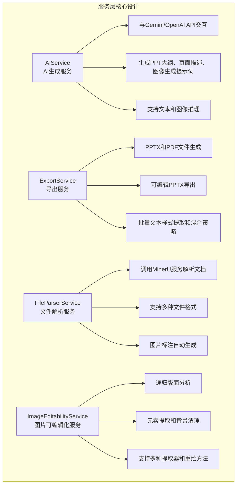

## 3. 后端架构独立性

### 3.1 架构独立性设计

灵感岛Manus幻灯片功能作为独立模块运行，其内部Plan与工作流无需通过AgentFlow层进行规划与调用执行。这种设计确保了幻灯片功能的独立演进能力，同时避免了与AgentFlow层的耦合风险。

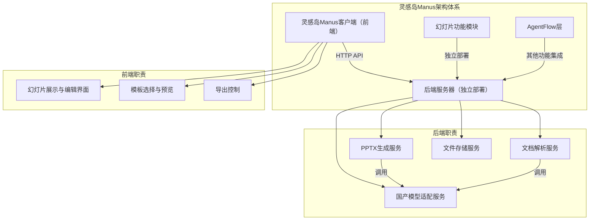

### 3.2 前后端分离架构

**前端架构**：
- 负责在灵感岛Manus客户端进行展示
- 实现幻灯片编辑器界面、模板选择器、预览组件等
- 与后端通过HTTP API进行通信
- 优先复用banana-slides项目的前端代码与技术

**后端架构**：
- 独立部署于服务器端
- 基于banana-slides后端代码进行定制开发
- 实现PPTX生成、文档解析、AI模型集成等核心功能
- 提供RESTful API接口供前端调用

### 3.3 API调用与LLM集成

**API调用**：
- 所有API调用均在后端实现，前端通过HTTP请求调用
- 后端负责API认证、请求限流、错误处理等
- 支持API代理和自定义端点配置

**LLM集成**：
- 国产模型（通义万相Wan2.5、即梦AI/豆包、可灵AI）的集成在后端实现
- 通过DomesticProviderFactory统一管理不同模型的调用
- 支持模型切换和故障转移机制
- 最大限度复用banana-slides项目的后端代码与技术栈

## 4. PPT 生成引擎深度分析

### 4.1 PPTXBuilder 核心类

`backend/utils/pptx_builder.py` 是 PPT 生成的核心引擎，封装了 python-pptx 库的高级功能。

**核心方法**：

1. **create_presentation()** - 创建新演示文稿
   - 设置幻灯片尺寸为 16:9 比例
   - 设置文档属性（作者、创建时间等）

2. **add_text_element()** - 添加文本元素
   - 支持边界框定位（BBox）
   - 智能字体大小计算（二分搜索算法）
   - 多颜色文本支持（colored_segments）
   - LaTeX 公式检测和斜体渲染
   - 文本对齐控制（左/中/右/两端对齐）

3. **add_image_element()** - 添加图像元素
   - 基于边界框的精确定位
   - 图像不存在时添加占位符

4. **add_table_element()** - 添加可编辑表格
   - HTML 表格解析（HTMLTableParser 类）
   - 自动计算行列尺寸
   - 表头自动加粗

5. **calculate_font_size()** - 智能字体大小计算
   - 使用二分搜索找到最大可用字体
   - 支持精确字体测量（PIL.ImageFont）
   - 中文字符宽度估算（1.0）和西文字符估算（0.5）
   - 支持多行文本自动换行

**技术亮点**：
- 字体缓存机制：`_font_cache` 字典缓存已加载的字体
- DPI 自适应：支持自定义 DPI 进行像素到英寸转换
- python-pptx 限制处理：自动缩放以符合 1-56 英寸的尺寸限制

### 3.2 可编辑 PPTX 导出流程

`backend/services/export_service.py` 实现了高级的可编辑 PPTX 导出功能，这是项目的核心创新点。

**核心方法**：`create_editable_pptx_with_recursive_analysis()`

**处理流程**：

```mermaid
flowchart TD
    subgraph "可编辑PPTX导出流程"
        A["开始"] --> B["递归版面分析\n(5%-40% 进度)"]
        B --> C["ImageEditabilityService.make_image_editable()"]
        C --> D["多层次元素提取"]
        D --> E["并发处理\n(ThreadPoolExecutor)"]
        
        E --> F["文本样式提取\n(40%-70% 进度)"]
        F --> G["混合策略：全局识别 + 单个裁剪识别"]
        G --> H["全局识别：粗体、斜体、下划线、对齐方式"]
        H --> I["单个裁剪识别：字体颜色"]
        I --> J["批量并行提取\n(max_workers * 2)"]
        
        J --> K["PPTX构建\n(75%-95% 进度)"]
        K --> L["创建PPTXBuilder"]
        L --> M["设置幻灯片尺寸"]
        M --> N["遍历页面构建幻灯片"]
        
        N --> O["文件保存\n(95%-100% 进度)"]
        O --> P["输出PPTX文件或字节流"]
        P --> Q["结束"]
    end
```

**混合策略详解**：
- **全局识别**：向模型提供完整页面图像和所有文本框位置，一次性分析所有文本的样式属性（粗体、斜体、下划线、对齐方式）
- **单个裁剪识别**：对每个文本区域单独裁剪分析，获取精确的字体颜色
- **结果合并**：颜色采用单个识别结果，布局属性采用全局识别结果

### 3.3 警告收集机制

`ExportWarnings` 数据类用于追踪导出过程中的问题，包含样式提取失败、文本渲染失败、图片添加失败、JSON解析失败等警告类型。

## 4. AI 集成架构

### 4.1 AI Provider 工厂模式

`backend/services/ai_providers/__init__.py` 实现了灵活的 AI Provider 工厂：

**配置优先级**：
1. Flask app.config（数据库设置）
2. 环境变量（.env 文件）
3. 默认值

**支持的 Provider 格式**：
- **Gemini 格式**（默认）：使用 Google GenAI SDK
- **OpenAI 格式**：兼容 OpenAI API
- **Vertex AI 格式**：使用 Google Cloud Vertex AI

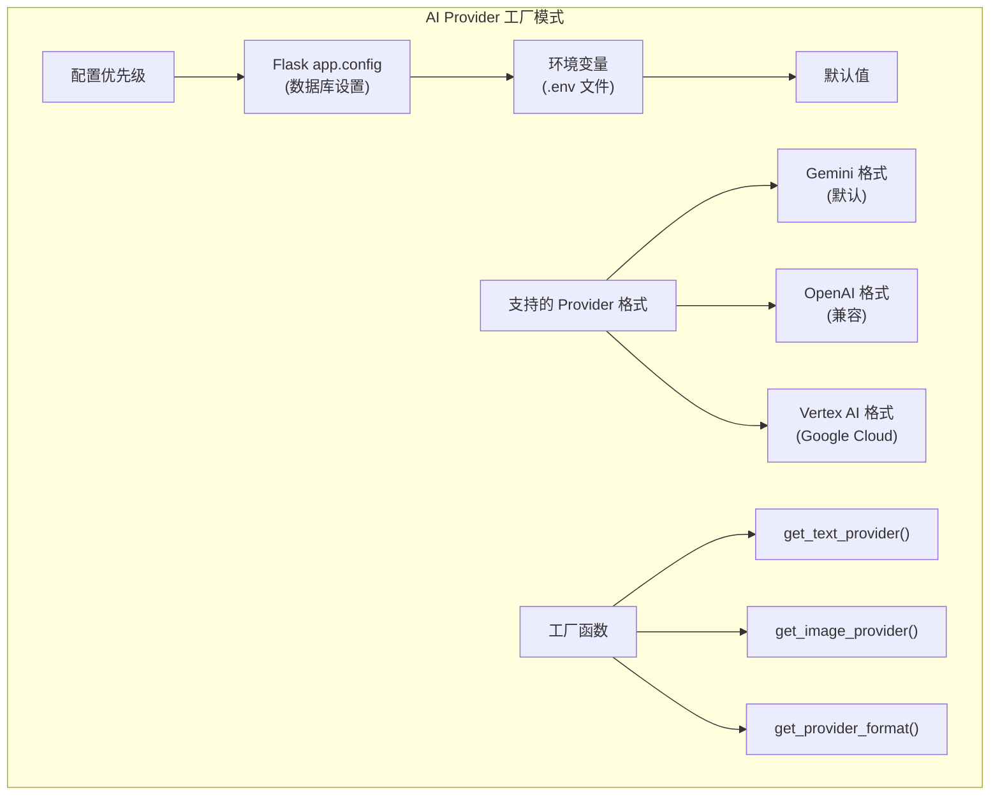

### 4.2 AIService 核心功能

`backend/services/ai_service.py` 封装了所有 AI 交互逻辑：

```mermaid
flowchart TD
    subgraph "AIService核心功能"
        A["AIService核心方法"]
        
        A1["generate_json()
JSON生成与解析"]
        A2["generate_json_with_image()
带图片的JSON生成"]
        A3["generate_outline()
生成PPT大纲"]
        A4["generate_page_description()
生成单页描述"]
        A5["generate_image()
图像生成"]
        A6["generate_image_prompt()
生成图像提示词"]
        A7["edit_image()
图像编辑"]
        A8["refine_outline() / refine_descriptions()
内容优化"]
    end
    
    subgraph "generate_json()功能"
        J1["自动重试机制(最多3次)"]
        J2["响应清理(移除markdown代码块标记)"]
        J3["思考预算控制(thinking_budget)"]
    end
    
    subgraph "generate_json_with_image()功能"
        I1["支持多图片输入"]
        I2["适配不同Provider的API差异"]
    end
    
    subgraph "generate_outline()功能"
        O1["从项目想法生成结构化大纲"]
        O2["支持多语言输出"]
    end
    
    subgraph "generate_page_description()功能"
        P1["基于大纲生成详细页面内容"]
        P2["支持参考素材图片"]
    end
    
    subgraph "generate_image()功能"
        G1["支持参考图片列表"]
        G2["宽高比和分辨率配置"]
        G3["思考模式控制"]
    end
    
    subgraph "generate_image_prompt()功能"
        GP1["页面描述转换为图像生成提示"]
        GP2["移除Markdown图片链接"]
    end
    
    subgraph "edit_image()功能"
        EI1["基于现有图像进行局部修改"]
        EI2["自然语言指令"]
    end
    
    subgraph "refine_outline()/refine_descriptions()功能"
        R1["根据用户反馈调整大纲和描述"]
        R2["保持修改历史"]
    end
    
    A --> A1
    A --> A2
    A --> A3
    A --> A4
    A --> A5
    A --> A6
    A --> A7
    A --> A8
    
    A1 --> J1
    A1 --> J2
    A1 --> J3
    
    A2 --> I1
    A2 --> I2
    
    A3 --> O1
    A3 --> O2
    
    A4 --> P1
    A4 --> P2
    
    A5 --> G1
    A5 --> G2
    A5 --> G3
    
    A6 --> GP1
    A6 --> GP2
    
    A7 --> EI1
    A7 --> EI2
    
    A8 --> R1
    A8 --> R2
```

### 4.3 提示词模板系统

`backend/services/prompts.py` 包含所有 AI 提示词模板，包括大纲生成提示、大纲解析提示、页面描述提示、图像生成提示、图像编辑提示等。

## 5. 文档解析系统

### 5.1 FileParserService 架构

`backend/services/file_parser_service.py` 实现了多格式文档解析：

**支持的文件格式**：
- **直接读取**：txt, md（Markdown）
- **MarkItDown 解析**：xlsx, xls, csv（电子表格）
- **MinerU 服务解析**：pdf, docx 等复杂格式

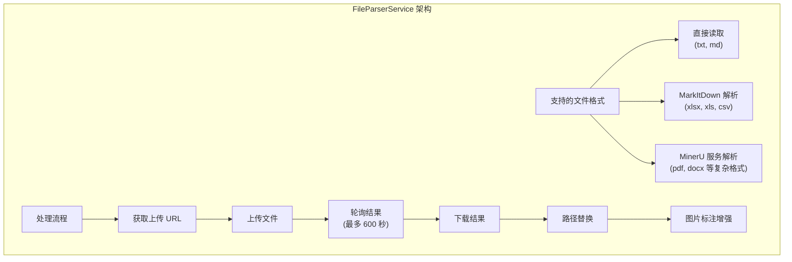

**图片标注生成**：
- 并行处理多张图片（max_workers=12）
- 重试机制（max_retries=3）
- 退避策略：1s, 2s, 3s 重试间隔
- 支持 HTTP URL 和本地 MinerU 文件

## 6. 图片可编辑化服务

### 6.1 ImageEditabilityService 核心设计

`backend/services/image_editability/service.py` 实现了递归的图片可编辑化服务：

**设计原则**：
1. **无状态设计**：线程安全，可并行调用
2. **单一职责**：只负责单张图片的可编辑化
3. **依赖注入**：通过配置对象注入所有依赖
4. **零具体实现依赖**：完全依赖抽象接口

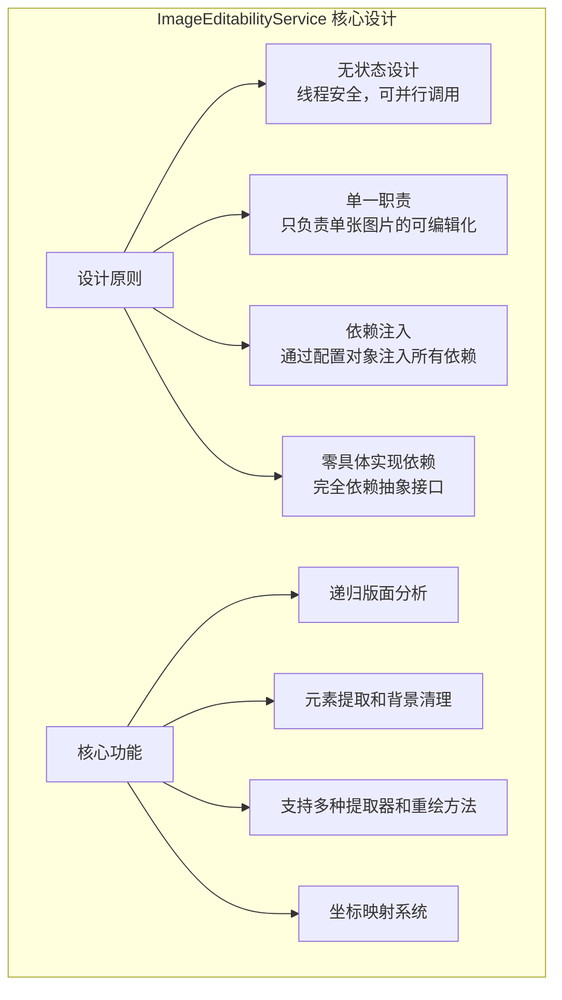

### 6.2 元素提取器体系

`backend/services/image_editability/extractors.py` 实现了多种元素提取器：

- **MinerU 提取器**（基于 MinerU API）
- **混合提取器**（HybridExtractor）
- **自定义提取器工厂**

### 6.3 背景重绘体系

`backend/services/image_editability/inpaint_providers.py` 实现了多种背景重绘方法：

- **DefaultInpaintProvider**：基于 mask 的精确区域重绘（Volcengine）
- **GenerativeEditInpaintProvider**：基于生成式大模型的整图编辑重绘（Gemini）

## 7. 异步任务管理

### 7.1 TaskManager 服务

`backend/services/task_manager.py` 管理异步任务：

**任务类型**：
- 页面生成任务
- 文件解析任务
- 导出任务

**状态跟踪**：
- pending（等待中）
- processing（处理中）
- completed（完成）
- failed（失败）

### 7.2 并发控制

使用 `ThreadPoolExecutor` 实现并发处理：

**并发场景**：
- 多页面并行生成
- 批量文本样式提取
- 多图片并行处理
- 图片标注生成（max_workers=12）

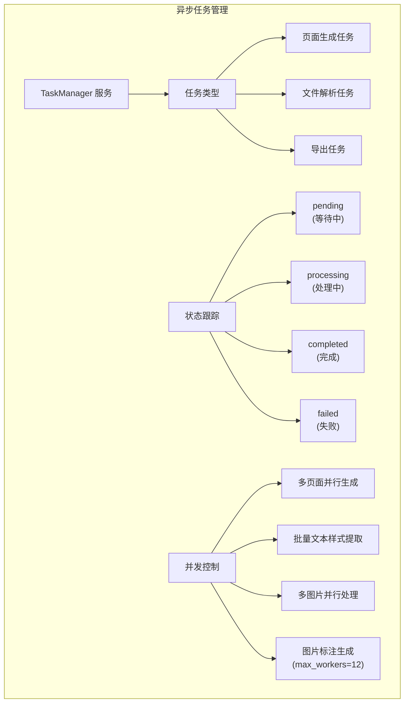

## 8. 数据库模型

### 8.1 核心模型

`backend/models/` 目录包含所有数据库模型：

**Project 模型**：项目基本信息
- idea_prompt：用户输入的想法
- outline_text：大纲文本
- description_text：页面描述文本
- creation_type：创建类型（idea/outline/description）

**Page 模型**：幻灯片页面
- title：页面标题
- description_content：页面描述
- image_path：生成的图片路径
- order：页面顺序

**Material 模型**：参考素材
- type：素材类型（template/reference/generation）
- content：素材内容
- image_path：素材图片路径

**Task 模型**：异步任务
- task_type：任务类型
- status：任务状态
- progress：进度百分比
- result：任务结果

**ReferenceFile 模型**：参考文件
- file_name：原始文件名
- file_path：文件存储路径
- parse_result：解析结果

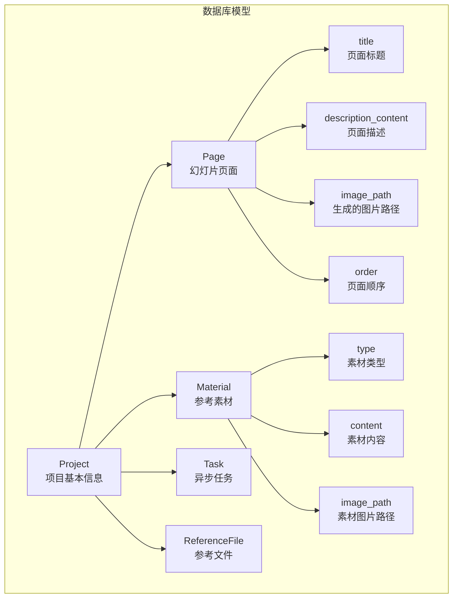

## 9. 依赖管理

### 9.1 Python 依赖

`pyproject.toml` 定义了项目依赖：

**核心依赖**：
- flask>=3.0.0                    # Web 框架
- flask-cors>=4.0.0              # 跨域支持
- flask-sqlalchemy>=3.1.1        # ORM
- google-genai>=1.52.0           # Google GenAI SDK
- openai>=1.0.0                  # OpenAI SDK
- pydantic>=2.9.0                # 数据验证
- pillow>=12.0.0                 # 图片处理
- python-pptx>=1.0.0             # PPT 处理
- markitdown[all]                # 文档解析
- tenacity>=9.0.0                # 重试机制
- img2pdf>=0.5.1                 # 图片转 PDF

**测试依赖**：
- pytest>=7.4.0                  # 测试框架
- pytest-mock>=3.12.0            # Mock 支持
- pytest-asyncio>=0.21.0         # 异步测试
- httpx>=0.25.0                  # HTTP 客户端测试
- flake8>=6.1.0                  # 代码检查
- black>=23.0.0                  # 代码格式化

### 9.2 包管理

使用 `uv` 作为 Python 包管理器：
- uv sync                         # 安装依赖
- uv add <package>               # 添加依赖
- uv remove <package>            # 移除依赖

## 10. 前端组件设计规范

### 10.1 页面框架组件设计

Slide展示与编辑页面组件需设计为独立页面框架组件，参照现有模板组件结构进行开发：

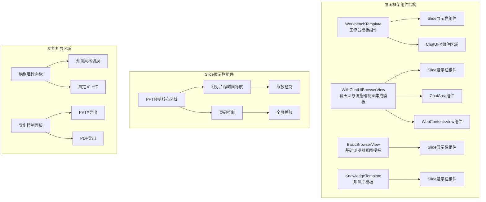

### 10.2 Slide展示栏组件嵌入特性

Slide展示栏组件应具备ChatUI-X组件的嵌入特性，可集成至多种页面框架：

- **工作台模板组件** (`WorkbenchTemplate/index.tsx`)：作为主要集成点，提供完整的幻灯片编辑环境
- **聊天UI与浏览器视图集成模板** (`WithChatUIBrowserView/index.tsx`)：支持在聊天场景中嵌入幻灯片预览
- **基础浏览器视图模板** (`BasicBrowserView`)：提供简单的幻灯片浏览功能
- **知识库模板** (`KnowledgeTemplate`)：支持从知识库内容生成和预览幻灯片

### 10.3 前端技术复用策略

**优先复用策略**：
- 优先复用banana-slides项目的前端代码与技术实现
- 保持与banana-slides前端架构的一致性
- 复用现有的状态管理、API客户端和共享组件

**功能修改与扩展规范**：
- 如需进行功能修改或扩展，必须采用Ant Design组件库进行实现
- 确保与灵感岛Manus现有组件风格的一致性
- 遵循Ant Design的设计规范和最佳实践

**技术栈要求**：
- React 18 + TypeScript
- Zustand 状态管理
- Ant Design 组件库
- Axios HTTP 客户端

### 10.4 核心页面组件

`frontend/src/pages/` 目录：

- **Home.tsx**：首页，项目创建入口
- **OutlineEditor.tsx**：大纲编辑页面
- **DetailEditor.tsx**：详细描述编辑页面
- **SlidePreview.tsx**：幻灯片预览页面
- **History.tsx**：历史版本管理

### 10.5 状态管理

`frontend/src/store/` 使用 Zustand：

**useProjectStore** 管理项目状态：
- 项目信息
- 页面列表
- 素材列表
- 导出任务

### 10.6 API 客户端

`frontend/src/api/`：

- **client.ts**：Axios 客户端配置
- **endpoints.ts**：API 端点定义

### 10.7 共享组件

`frontend/src/components/shared/`：

- **Modal.tsx**：模态框
- **Button.tsx**：按钮
- **Input.tsx / Textarea.tsx**：输入控件
- **Loading.tsx**：加载状态
- **Toast.tsx**：提示消息
- **Markdown.tsx**：Markdown 渲染
- **MaterialSelector.tsx**：素材选择器
- **TemplateSelector.tsx**：模板选择器
- **ReferenceFileSelector.tsx**：参考文件选择器

### 10.8 预设样式配置

`frontend/src/config/presetStyles.ts`：

**内置预设风格**：
- minimalist-clean（极简清新）
- business-simple（商务简约）
- academic-formal（学术正式）
- tech-modern（科技现代）
- creative-fun（创意趣味）
- gradient-vibrant（渐变活力）
- nature-fresh（自然清新）
- luxury-premium（豪华 premium）
- glass（玻璃拟态）
- vector-illustration（矢量插画）

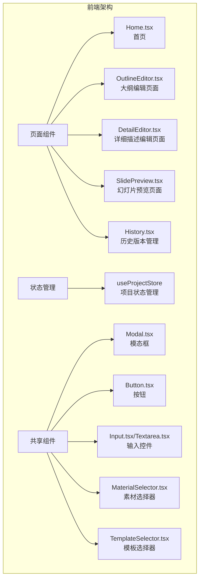

## 11. 部署架构

### 11.1 Docker 部署

**docker-compose.yml** 配置：

**服务**：
- **frontend**：React 前端 + Nginx
- **backend**：Flask 后端

**数据卷**：
- `./backend/instance`：SQLite 数据库
- `./backend/exports`：导出文件
- `./uploads`：上传文件

### 11.2 环境配置

`.env.example` 定义环境变量：

**AI Provider 配置**：
- AI_PROVIDER_FORMAT=gemini  # gemini / openai / vertex
- GOOGLE_API_KEY=your-key
- GOOGLE_API_BASE=https://generativelanguage.googleapis.com
- # 或
- OPENAI_API_KEY=your-key
- OPENAI_API_BASE=https://api.openai.com/v1

**MinerU 配置**：
- MINERU_TOKEN=your-token
- MINERU_API_BASE=https://mineru.net

**OCR 配置（可编辑导出）**：
- BAIDU_OCR_API_KEY=your-key

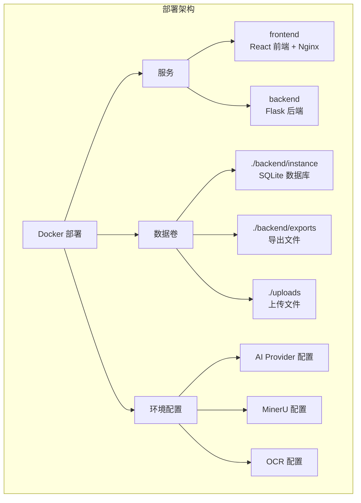

## 12. 专家职责与模板策略

### 12.1 专家职责优化

**PPT模板设计专家职责**：
- 设计系统化的PPT模板架构，包括页面类型、布局模板、样式规范
- 创建可复用的页面组件库，支持社交媒体商业应用场景
- 制定模板设计规范，确保模板的视觉一致性和技术可实现性
- 基于天下秀已有的商业PPT案例提取行业案例与单页模板
- 设计模板与AI生成内容的匹配算法，实现智能模板推荐
- 设计图片资源获取方案，通过多种方式获取并优化模板中的图片元素
- 建立模板质量评估体系，确保商业级品质标准

### 12.2 目标客户群体

**核心目标客户**：

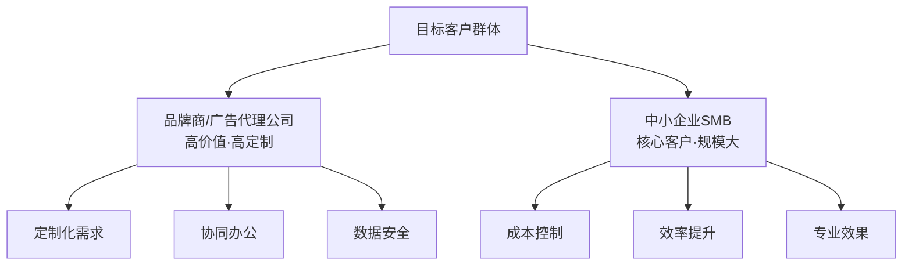

**应用场景**：
- **社交媒体商业应用**：适合在社交媒体平台展示的商业PPT
- **营销方案生成**：基于市场数据和策略生成专业营销方案
- **品牌提案制作**：为品牌推广制作高质量的提案PPT
- **数据报告展示**：将复杂数据转化为清晰易懂的可视化报告

### 12.3 模板开发策略

**基于天下秀商业PPT案例的开发策略**：

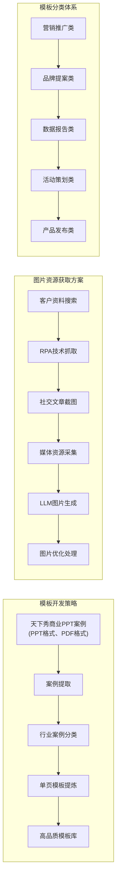

**模板质量标准**：
- **视觉品质**：专业的布局设计、和谐的色彩搭配、清晰的层次结构
- **功能完整性**：完整的页面类型覆盖、合理的占位符设计、良好的内容填充性
- **技术可实现性**：与AI生成内容的良好匹配、导出格式的兼容性、性能优化

## 13. 功能解耦与边界定义

### 13.1 功能边界明确化

灵感岛Manus幻灯片功能与pptx Skill功能是两个独立的功能模块，需要明确划分其职责边界，确保技术实现的清晰性和可维护性。

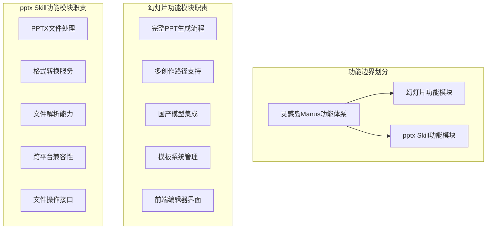

### 13.2 技术隔离方案

**架构隔离策略**：

1. **独立部署**：
   - 幻灯片功能作为独立模块部署
   - pptx Skill保持现有的Skill架构
   - 通过明确的API接口进行通信

2. **代码隔离**：
   - 幻灯片功能拥有独立的代码仓库和目录结构
   - pptx Skill保持现有的代码组织方式
   - 避免代码层面的直接依赖

3. **命名空间隔离**：
   - 使用不同的命名空间区分两个功能模块
   - 确保类名、函数名、变量名不会冲突
   - 建立清晰的模块边界标识

4. **依赖管理**：
   - 幻灯片功能可以复用pptx Skill的核心文件处理能力
   - 通过依赖注入方式实现，而非硬编码依赖
   - 保持依赖关系的单向性

### 13.3 AgentFlow层集成策略

**AgentFlow层处理方案**：

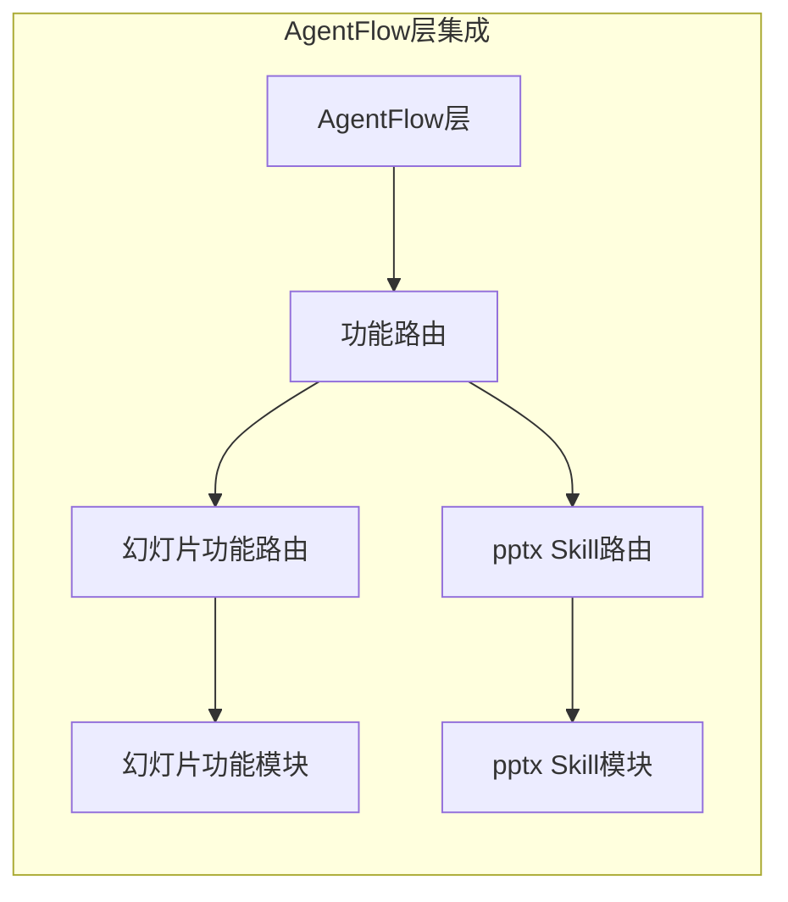

**集成要点**：
- AgentFlow层通过功能路由区分两个模块的调用
- 为每个模块提供独立的调用接口和参数规范
- 确保AgentFlow层不会混淆两个模块的实现逻辑
- 支持模块间的协作调用，如幻灯片功能需要时调用pptx Skill的文件处理能力

### 13.4 协作机制

**模块间协作策略**：
- **单向依赖**：幻灯片功能可以依赖pptx Skill的文件处理能力
- **API调用**：通过标准化的API接口进行模块间通信
- **事件通知**：使用EventManager进行模块间的事件通知
- **数据共享**：通过文件系统或数据库进行数据共享

## 14. 技术亮点与创新

### 14.1 可编辑 PPTX 导出技术

**核心技术挑战**：
- 图片中文字的精确定位和样式还原
- 多层次版面元素的递归处理
- 文字颜色、字号、加粗等样式的批量提取

**解决方案**：
1. **混合识别策略**：结合全局页面分析和局部裁剪分析
2. **递归版面分析**：支持多层嵌套元素的精确提取
3. **样式缓存机制**：批量预提取样式，避免重复调用 AI

**技术指标**：
- 支持文字字号、颜色、加粗等样式还原
- 支持表格内容识别和可编辑表格生成
- 减少导出后背景图残留文字现象

### 12.2 AI Provider 抽象层

**设计模式**：
- 工厂模式创建 Provider
- 适配器模式兼容不同 API 格式
- 配置优先级链式查找

**优势**：
- 轻松切换不同 AI 服务商
- 支持 API 代理和自定义端点
- 数据库配置覆盖环境变量

### 12.3 并发处理优化

**并发策略**：
- 页面级别并发：多页面并行生成
- 元素级别并发：批量样式提取并行处理
- 智能线程池大小控制

**性能优化**：
- 字体缓存避免重复加载
- 图像裁剪结果复用
- 渐进式结果收集

### 12.4 文档解析流水线

**解析流程**：
1. 文件类型自动检测
2. 智能选择解析方法
3. 图片标注自动增强
4. 结果本地缓存

**MinerU 集成优势**：
- PDF/Docx 等复杂格式深度解析
- 图片位置和尺寸信息提取
- Markdown 输出标准化

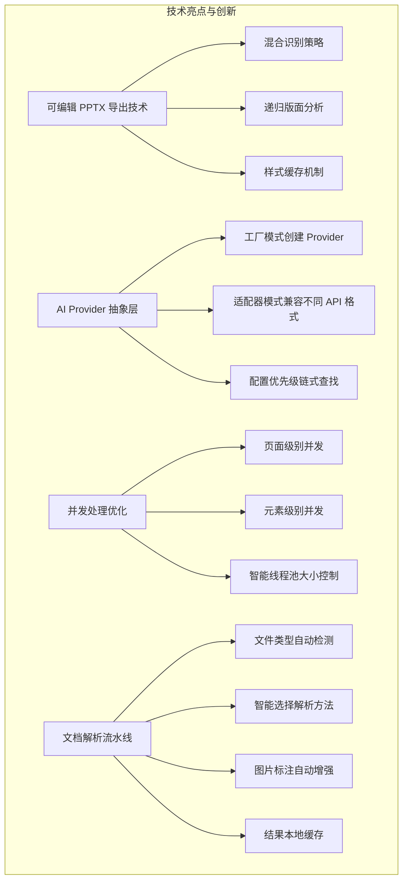

## 13. 国内大模型服务商替代方案

### 13.1 背景与必要性

2024年6月，OpenAI 宣布停止对中国提供 API 服务，这一变化促使国内大模型服务商积极推出迁移方案。阿里云百炼、智谱 AI、百度智能云等厂商纷纷推出 OpenAI API 用户"特别搬家计划"，提供免费 tokens 额度和专属迁移服务。对于 banana-slides 这类基于 OpenAI/Gemini API 构建的项目，集成国内大模型服务商成为必然选择。

国内大模型服务商普遍支持 OpenAI 兼容接口，大幅降低了迁移成本。只需调整 API Key、BASE_URL 和模型名称三个参数，即可完成代码迁移。这一特性使得 banana-slides 项目可以在现有架构基础上，通过扩展 Provider 工厂支持的模型列表，快速实现国内大模型的接入。

### 13.2 重点推荐：图像生成三大国产模型（2025年10月-2026年1月）

根据2025年10月至2026年1月期间的技术调研，以下三家国内AI模型厂商在图像生成领域表现突出，可作为banana-slides项目的优先替代方案：

#### 13.2.1 阿里云通义万相Wan2.5

**概述**：
通义万相Wan2.5是阿里云于2025年9月24日在云栖大会上发布的最新图像生成模型系列，涵盖文生视频、图生视频、文生图和图像编辑四大模型。该系列模型在多项评测中表现优异，被认为是最接近谷歌Nano Banana水平的国内模型。

**核心能力**：
- **文生图**：支持多种风格的高质量图像生成，包括写实、卡通、插画等
- **图像编辑**：支持图像局部编辑和重绘，可对生成图像进行精细调整
- **图生视频**：支持静态图片生成视频片段
- **音画同步**：2.5版本首次实现生成画面匹配的人声、音效和音乐BGM
- **中文优化**：专为中文用户优化提示词解析，中文理解能力优秀

**模型版本**：
- `wanx-v1`：文生图基础模型
- `wanx-video`：视频生成模型
- `wanx-edit`：图像编辑模型

**定价参考**：
- 文生图：约 ¥0.15-0.30/图像
- 图像编辑：约 ¥0.30-0.50/次

**适用场景**：
- PPT配图生成
- 图表和插图制作
- 创意素材创作
- 图像局部修改

**项目集成建议**：通义万相Wan2.5是banana-slides项目图像生成功能的首选替代方案，其OpenAI兼容接口可大幅降低迁移成本。

#### 13.2.2 字节跳动即梦AI/豆包

**概述**：
字节跳动旗下的豆包在2025年12月24日DAU突破1亿，成为国内用户规模第一的AI应用。即梦AI是字节跳动的创意创作平台，与豆包共享底层技术能力，提供图像生成和视频生成服务。2025年12月18日，火山引擎发布豆包大模型1.8和Seedance 1.5 pro。

**核心能力**：
- **图像生成**：支持多种风格的高质量图像生成
- **视频生成**：Seedance 1.5 pro支持多镜头无缝切换的1080P高品质视频
- **多模态理解**：豆包1.8模型在多模态理解方面有显著提升
- **生态联动**：与剪映等视频工具深度整合，支持从图像到视频的完整工作流
- **用户规模**：豆包日均tokens使用量突破50万亿，同比增长超过10倍

**模型版本**：
- `doubao-image-1`：图像生成模型
- `doubao-pro-1-8`：对话模型（1.8版本）
- `seedance-1-5-pro`：视频生成模型

**定价参考**：
- 豆包大模型：按token计费，价格实惠
- 图像生成：具体价格根据用量调整

**适用场景**：
- PPT内容生成（对话式）
- 配图素材生成
- 视频素材生成（配合剪映）
- AI Agent集成

**项目集成建议**：字节系产品的优势在于完整的AI生态和庞大的用户基础，建议作为图像生成的辅助方案，与通义万相形成互补。

#### 13.2.3 快手可灵AI

**概述**：
快手旗下的可灵AI（Kling）在视频生成领域快速崛起，截至2026年1月，月活跃用户突破1200万，付费用户较上月增长350%，年化收入运行率达2.4亿美元。可灵AI 2.6版本于2025年12月推出，提供"音画同出"能力。

**核心能力**：
- **视频生成**：业界领先的1080P视频生成能力
- **动作控制**：Motion Control功能，可精确控制生成视频中的动作
- **音画同步**：2.6版本实现一次生成完整的音视频
- **图片生成**：支持静态图片生成（基于图片O1模型）
- **商业化**：付费用户增长迅速，商业化能力突出

**模型版本**：
- `kling-v1`：视频生成基础模型
- `kling-image`：图像生成模型
- `kling-2.6`：最新2.6版本，支持音画同步

**定价参考**：
- 按生成次数/时长计费
- 具体价格根据套餐和用量调整

**适用场景**：
- PPT配套视频素材生成
- 动态图表和动画制作
- 高质量视频内容创作
- 创意视频广告

**项目集成建议**：可灵AI在视频生成领域具有明显优势，建议作为PPT视频素材生成的补充方案，与通义万相（图像）和即梦AI（对话）形成完整的AI素材生成矩阵。

### 13.3 三大国产模型能力对比

| 能力维度 | 通义万相Wan2.5 | 即梦AI/豆包 | 可灵AI | Nano Banana |
|---------|---------------|-------------|--------|-------------|
| **图像生成** | ⭐⭐⭐⭐⭐ | ⭐⭐⭐⭐ | ⭐⭐⭐ | ⭐⭐⭐⭐⭐ |
| **图像编辑** | ⭐⭐⭐⭐⭐ | ⭐⭐⭐ | ⭐⭐⭐ | ⭐⭐⭐⭐⭐ |
| **文字渲染** | ⭐⭐⭐ | ⭐⭐⭐ | ⭐⭐ | ⭐⭐⭐⭐⭐ |
| **视频生成** | ⭐⭐⭐⭐ | ⭐⭐⭐⭐ | ⭐⭐⭐⭐⭐ | ⭐⭐⭐ |
| **中文理解** | ⭐⭐⭐⭐⭐ | ⭐⭐⭐⭐⭐ | ⭐⭐⭐⭐ | ⭐⭐⭐⭐ |
| **性价比** | ⭐⭐⭐⭐⭐ | ⭐⭐⭐⭐ | ⭐⭐⭐ | ⭐⭐⭐ |
| **OpenAI兼容** | ⭐⭐⭐⭐⭐ | ⭐⭐⭐⭐ | ⭐⭐⭐ | ⭐⭐⭐⭐⭐ |
| **生态整合** | ⭐⭐⭐⭐ | ⭐⭐⭐⭐⭐ | ⭐⭐⭐⭐ | ⭐⭐⭐⭐ |

### 13.4 集成架构设计

#### 推荐的集成策略

根据技术调研结果，建议采用以下集成策略：

**方案一：通义万相为主，即梦AI为辅，可灵AI为补充**

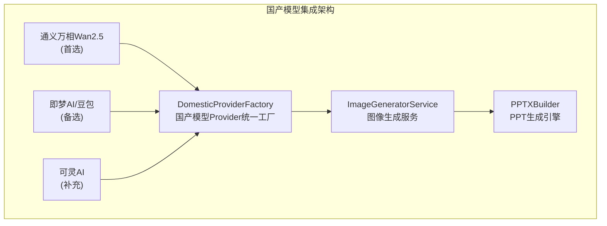

#### 各模型适用场景

| 场景 | 推荐模型 | 理由 |
|------|---------|------|
| PPT配图生成 | 通义万相Wan2.5 | 图像质量高，支持编辑 |
| 图表和插图 | 通义万相Wan2.5 | 风格多样，支持中文 |
| 内容对话生成 | 即梦AI/豆包 | 对话能力强，生态整合好 |
| 动态素材生成 | 可灵AI | 视频生成能力强 |
| 创意视频素材 | 可灵AI | 音画同步，效果突出 |
| 故障转移 | 多模型轮询 | 提高系统可用性 |

#### 迁移注意事项

1. **API差异处理**：虽然三家厂商都支持OpenAI兼容接口，但具体参数和返回值可能存在差异，需要进行适配层封装。

2. **提示词优化**：国产模型对中文提示词的理解能力较强，但仍需针对不同模型优化提示词模板。

3. **限流策略**：各服务商的请求频率限制不同，需要实现合理的限流和重试机制。

4. **成本控制**：建议实现用量统计和配额管理，根据成本效益动态选择模型。

5. **服务稳定性**：建议配置多个Provider作为备份，实现自动故障转移。

6. **网络延迟**：国内模型API延迟通常低于海外服务，但仍需考虑跨境访问场景。

### 13.5 其他国内大模型服务商

以下服务商也可作为备选方案：

#### 13.5.1 百度文心一格

**特点**：中文理解优秀，价格实惠，但图像编辑能力相对较弱。

#### 13.5.2 智谱AI CogView

**特点**：与GLM-4对话模型整合方便，适合对话+图像的组合场景。

#### 13.5.3 月之暗面Kimi

**特点**：超长上下文处理能力（200万字），特别适合基于长文档生成PPT内容的场景。

## 14. 后端架构独立性调整

### 14.1 独立模块设计

灵感岛Manus幻灯片功能作为独立模块，其内部Plan与工作流无需通过AgentFlow层进行规划与调用执行。这种设计确保了模块的独立性和可维护性，同时简化了系统架构。

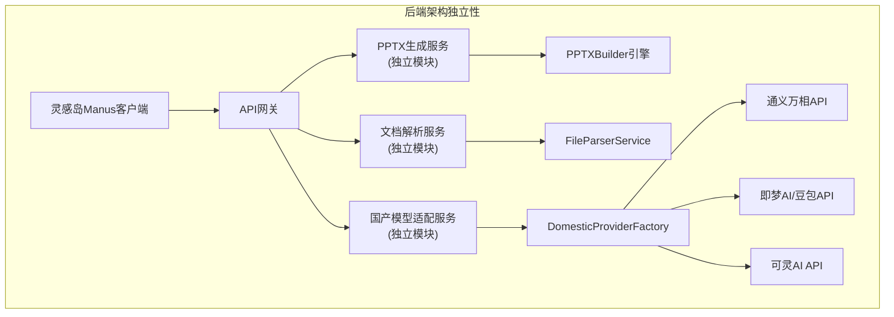

### 14.2 前后端分离架构

**前端**：负责在灵感岛Manus客户端进行展示，包括：
- Slide展示与编辑页面
- 模板选择与管理
- 用户交互与操作
- 预览与导出控制

**后端**：独立部署于服务器端，负责：
- PPTX生成与导出
- 文档解析与处理
- AI模型调用与管理
- 数据存储与管理

### 14.3 API调用与LLM集成

API调用与LLM集成需在后端实现，确保：
- 安全性：API密钥不暴露在前端
- 性能：AI模型调用在服务器端执行，避免客户端资源限制
- 一致性：统一的API调用接口，简化前端开发
- 可维护性：集中管理AI模型配置和调用逻辑

### 14.4 代码复用策略

最大限度复用banana-slides项目的后端代码与技术栈，确保：
- 技术一致性：使用相同的技术栈和开发规范
- 开发效率：减少重复开发工作
- 维护成本：统一的代码base，便于维护和升级
- 质量保障：经过验证的代码质量和稳定性

## 15. 前端组件设计规范

### 15.1 页面框架组件设计

Slide展示与编辑页面组件需设计为独立页面框架组件，参照以下现有模板组件结构进行开发：

- **BasicBrowserView**：基础浏览器视图模板
- **KnowledgeTemplate**：知识库模板
- **WithChatUIBrowserView**：聊天UI与浏览器视图集成模板
- **WorkbenchTemplate**：工作台模板

### 15.2 Slide展示栏组件嵌入特性

Slide展示栏组件应具备ChatUI-X组件的嵌入特性，可集成至多种页面框架：

- **工作台模板组件**：`/apps/agent-tars/src/lgdmanus/render/src/components/Templates/WorkbenchTemplate/index.tsx`
- **聊天UI与浏览器视图集成模板**：`/apps/agent-tars/src/lgdmanus/render/src/components/Templates/WithChatUIBrowserView/index.tsx`

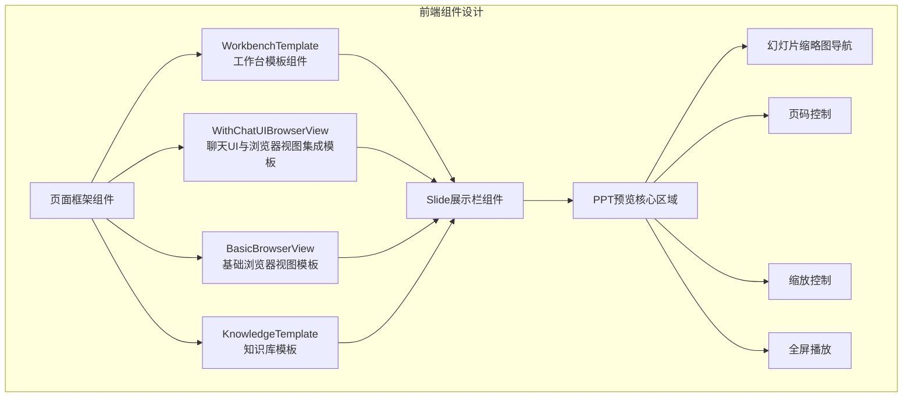

### 15.3 前端技术复用策略

**优先复用**：banana-slides项目的前端代码与技术实现，包括：
- 页面组件结构
- 状态管理模式
- API调用方式
- 共享组件库

**功能修改或扩展**：必须采用Ant Design组件库进行实现，确保：
- 视觉一致性：与灵感岛Manus现有UI风格保持一致
- 代码质量：使用成熟的组件库，提高开发效率和代码质量
- 可维护性：统一的组件规范，便于后续维护和升级

## 16. 专家职责与模板策略优化

### 16.1 目标客户群体

明确目标客户群体为：
- **品牌商/广告代理公司**：高价值·高定制需求
- **中小企业SMB**：核心客户·规模大

应用场景聚焦于**社交媒体商业应用**，包括：
- 商务演示
- 营销方案
- 品牌提案
- 数据报告

### 16.2 模板开发策略

**修订模板开发策略**：基于天下秀已有的商业PPT案例（PPT格式、PDF格式）提取行业案例与单页模板，构建符合商业应用场景的高品质模板库。

**模板分类体系**：
- **营销推广类**：适合产品推广、活动宣传等场景
- **品牌提案类**：适合品牌定位、战略规划等场景
- **数据报告类**：适合数据分析、业绩汇报等场景
- **活动策划类**：适合活动方案、执行计划等场景
- **产品发布类**：适合新产品发布、功能介绍等场景

### 16.3 图片资源获取方案

**完善图片资源获取方案**，通过多种方式获取并优化模板中的图片元素：

1. **客户资料搜索**：从客户提供的资料中获取相关图片
2. **RPA技术抓取**：通过RPA技术抓取社交文章截图与媒体资源
3. **LLM图片生成**：使用AI模型生成符合场景的图片
4. **图片优化处理**：对获取的图片进行编辑和优化

```mermaid
flowchart TD
    subgraph "模板策略优化"
        A["目标客户群体"] --> B["品牌商/广告代理公司"]
        A --> C["中小企业SMB"]
        
        D["应用场景"] --> E["社交媒体商业应用"]
        
        F["模板开发策略"] --> G["天下秀商业PPT案例提取"]
        G --> H["行业案例与单页模板"]
        H --> I["高品质模板库"]
        
        J["图片资源获取方案"] --> K["客户资料搜索"]
        J --> L["RPA技术抓取"]
        J --> M["LLM图片生成"]
        J --> N["图片优化处理"]
    end
```

## 17. 功能解耦与边界定义

### 17.1 边界定义

**灵感岛Manus幻灯片功能**：
- 专注于PPT生成、编辑、预览与导出
- 基于banana-slides技术栈
- 独立的前后端架构
- 国产模型集成
- 商业级模板库

**pptx Skill功能**：
- 专注于PPT文件的处理与转换
- 作为Skills系统的一部分
- 与AgentFlow深度集成
- 支持多种文件格式的转换
- 轻量级PPT操作

### 17.2 技术隔离方案

**架构隔离**：
- 幻灯片功能作为独立模块部署
- pptx Skill作为Skills系统的一部分
- 通过API接口进行通信

**数据隔离**：
- 各自维护独立的数据存储
- 通过标准化的文件格式进行数据交换
- 避免直接的数据库依赖

**代码隔离**：
- 独立的代码base
- 避免共享内部实现细节
- 通过明确的接口进行交互

**部署隔离**：
- 幻灯片功能可独立部署和扩展
- pptx Skill随Skills系统部署
- 独立的版本控制和更新机制

```mermaid
flowchart TD
    subgraph "功能解耦与边界定义"
        A["灵感岛Manus客户端"] --> B["幻灯片功能\n(独立模块)"]
        A --> C["pptx Skill\n(Skills系统)"]
        
        B --> D["PPT生成与编辑"]
        B --> E["基于banana-slides技术栈"]
        B --> F["独立前后端架构"]
        B --> G["国产模型集成"]
        
        C --> H["PPT文件处理与转换"]
        C --> I["与AgentFlow集成"]
        C --> J["多种文件格式转换"]
        C --> K["轻量级PPT操作"]
        
        B -.-> L["API接口"]
        C -.-> L
    end
```

### 17.3 AgentFlow层整合

**幻灯片功能**：无需通过AgentFlow层进行规划与调用执行，直接通过API接口与后端服务通信。

**pptx Skill**：作为Skills系统的一部分，通过AgentFlow层进行规划与调用执行，与其他Skills协同工作。

**整合策略**：
- 明确功能边界，避免功能重叠
- 通过标准化接口进行通信
- 保持各自的独立性和可维护性
- 确保AgentFlow层不会混淆这两个独立功能的实现逻辑

## 18. 总结与建议

### 18.1 技术总结

banana-slides项目是一个功能完整、技术先进的AI PPT生成应用，其核心优势包括：

1. **可编辑PPTX导出技术**：通过混合识别策略和递归版面分析，实现了高质量的可编辑PPTX导出
2. **灵活的AI Provider架构**：支持多种AI模型，便于集成国内大模型
3. **高效的并发处理**：通过智能线程池和并行处理，提高了系统性能
4. **深度的文档解析能力**：支持多种格式的文档解析和图片标注
5. **模块化的服务设计**：单一职责原则，便于维护和扩展

### 18.2 集成建议

**短期建议**：
1. **优先集成通义万相Wan2.5**：作为主要的图像生成模型
2. **建立独立的后端服务**：确保模块的独立性和可维护性
3. **复用现有前端组件结构**：加快开发速度，保持UI一致性
4. **构建商业级模板库**：基于天下秀的商业PPT案例

**长期建议**：
1. **持续优化国产模型适配**：针对不同模型的特点进行优化
2. **扩展多模态能力**：集成视频生成等多模态功能
3. **建立模板质量评估体系**：确保模板的商业级品质
4. **完善监控和告警机制**：提高系统的可靠性和稳定性

### 18.3 发展前景

灵感岛Manus幻灯片功能结合banana-slides的技术优势和国内大模型的能力，具有广阔的发展前景：

- **商业价值**：满足品牌商和中小企业的PPT生成需求，提高工作效率
- **技术创新**：持续优化AI生成能力，提升PPT质量和用户体验
- **生态整合**：与灵感岛Manus现有功能深度整合，形成完整的AI创作生态
- **市场潜力**：随着AI技术的不断发展，PPT生成市场需求将持续增长

通过合理的架构设计和技术选型，灵感岛Manus幻灯片功能有望成为国内领先的AI PPT生成解决方案，为用户提供高效、高质量的PPT创作体验。