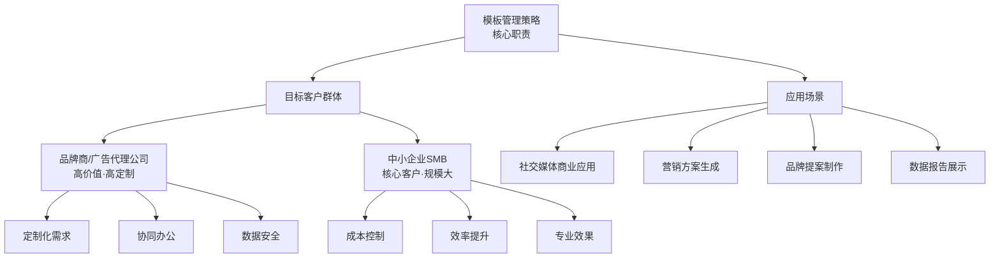
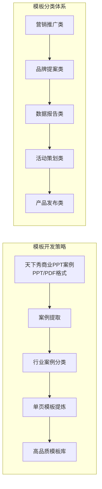
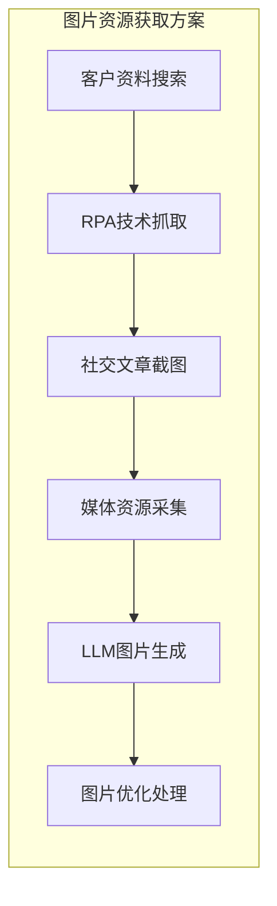
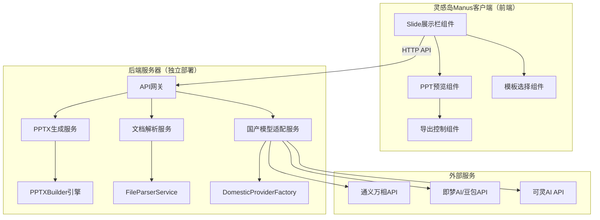
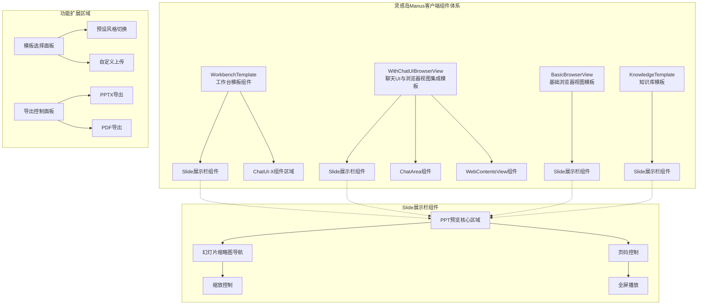
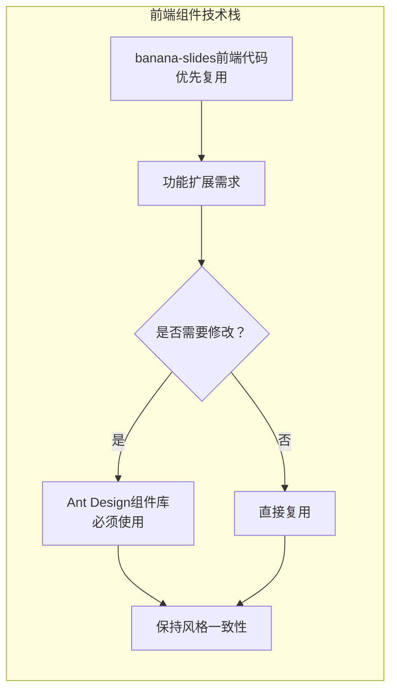

# 灵感岛Manus幻灯片项目竞品分析报告

## 文档信息

| 项目 | 内容 |
|------|------|
| 文档版本 | 1.0.0 |
| 创建日期 | 2026年1月29日 |
| 项目名称 | 灵感岛Manus幻灯片功能研发 |
| 分析范围 | Manus Slides及主流AI PPT生成工具 |
| 文档状态 | 初稿完成 |

---

## 一、项目背景与目标

### 1.1 项目概述

灵感岛Manus幻灯片项目旨在研发一款集成于灵感岛Manus平台的AI驱动演示文稿生成功能。该功能将基于现有的Skills系统架构，利用AI代理技术实现从用户输入到专业PPT的一键生成。项目定位于企业级演示文稿创作场景，目标是提供与Manus Slides相媲美甚至更优的用户体验和功能完整性。

本项目的核心挑战在于：如何在现有AgentFlow架构基础上扩展幻灯片生成能力，同时保持系统的可扩展性和可维护性。项目采用渐进式开发策略，优先实现核心功能，再逐步完善高级特性和优化用户体验。

### 1.2 分析目标

本次竞品分析旨在达成以下目标：首先，全面了解Manus Slides的产品功能特性、技术实现方案和用户体验设计；其次，深入分析主流AI PPT生成工具的市场定位、功能差异和技术路线；再次，识别行业最佳实践和潜在的技术创新机会；最后，为灵感岛Manus幻灯片功能的设计开发提供数据支撑和决策依据。

### 1.3 竞品选择依据

本次分析选取的竞品包括Manus Slides、Gamma、Beautiful.ai、Tome、智谱AI Slides、百度文库、讯飞智文等七款主流AI PPT生成工具。选择依据包括：市场影响力（用户规模和行业知名度）、技术创新性（AI应用深度和技术架构）、功能完整性（核心功能和增值特性）、用户体验（交互设计和生成质量）、商业模式（定价策略和市场策略）。

---

## 二、Manus Slides深度分析

### 2.1 产品概述

Manus Slides是AI初创公司Manus于2025年推出的全新功能模块，旨在通过单一提示词快速生成结构化的幻灯片演示文稿。该功能利用Manus强大的AI代理能力，用户仅需输入议题和目标，即可获得一套完整的专业PPT[^1]。Manus Slides的核心差异化在于其"通用AI代理"定位，与传统PPT工具的单一功能不同，它将幻灯片生成作为Agent多任务处理能力的一部分，实现了与其他工作流程的无缝衔接。

根据实测报道，Manus Slides在10分钟内可生成8页高质量PPT，生成内容包括图文并茂的幻灯片、丰富的数据图表和详尽的分析报告[^2]。用户反馈显示，Manus Slides在设计美感、内容完整性和操作便捷性方面均获得较高评价。有网友评价其"当前第一名没跑"，认为其在AI PPT生成领域处于领先地位[^3]。

### 2.2 核心功能模块

#### 2.2.1 智能内容生成

Manus Slides的内容生成功能采用"单一提示词"设计理念，用户只需用自然语言描述需求，系统即可自动完成内容规划、结构组织、要点填充和视觉设计全流程。生成的内容包括但不限于：标题页、目录页、章节过渡页、正文内容页、数据展示页、总结页等。

内容生成的核心技术特点是多阶段协同：首先，AI代理理解用户意图并生成内容大纲；然后，根据大纲结构填充具体内容，包括文字描述、数据引用和图表建议；最后，结合内容语义匹配设计风格和布局模板。实测案例显示，用户提出需求后40多分钟，系统生成了一份31页的PPT文件，同时附带一份详尽的多维度分析报告[^4]。

#### 2.2.2 专业视觉设计

Manus Slides强调"一键生成超美幻灯片"的设计理念[^5]。系统内置多套专业设计模板，覆盖商务、学术、科技、创意等多种风格。设计引擎根据内容类型自动匹配最佳视觉方案，包括：配色方案选择、字体搭配建议、版式布局规划、图文比例协调等。

视觉设计的技术实现采用"内容感知"策略，即设计引擎根据文本长度、数据类型、图片数量等输入特征动态调整布局参数。对于数据密集型内容，系统自动推荐图表类型并应用一致的数据可视化风格；对于文字密集型内容，系统优化段落间距和字体大小以确保可读性。

#### 2.2.3 多格式导出支持

Manus Slides支持多种格式的导出功能，这是其区别于竞品的重要优势之一。支持的导出格式包括：PPTX格式（Microsoft PowerPoint原生格式，支持二次编辑）、Google Slides格式（在线协作编辑）、PDF格式（固定版式分享）。根据报道，Manus Slides刚刚新增了Google Slides导出支持，进一步扩展了其在企业协作场景中的应用范围[^6]。

导出功能的技术挑战在于如何保持视觉还原度。Manus Slides采用"精确布局还原"技术，确保导出的PPTX文件在设计细节上与预览版本高度一致。用户可以在PowerPoint中打开导出的文件，进行进一步的编辑和调整，而不会因为格式转换导致设计失真。

#### 2.2.4 文档转换能力

Manus Slides的独特能力之一是支持将研究论文、报告文档等转换为PPT格式。用户可以提供现有文档内容或链接，系统自动分析文档结构，提取关键信息，并生成对应的幻灯片演示[^7]。这一功能对于学术研究、商业分析等场景具有重要价值。

文档转换的技术实现包括：文档解析（结构化信息提取）、内容摘要（关键信息凝练）、幻灯片映射（内容重组与版式设计）。系统需要处理不同格式的输入文档，包括Word、PDF、Markdown等，并针对不同文档类型优化解析策略。

### 2.3 技术架构分析

#### 2.3.1 AI代理架构

Manus Slides的技术基础是Manus的通用AI代理架构。与传统AI助手"仅能回答问题和提供建议"不同，Manus能够"独立思考、规划和执行复杂任务"[^8]。这种代理架构的核心特点是"从想到做的跃迁"，即AI不仅能理解用户需求，还能将需求转化为具体的执行步骤，并自主完成整个工作流程。

在幻灯片生成场景中，代理架构的工作流程包括：需求理解阶段（解析用户输入，识别核心意图和约束条件）、任务规划阶段（将复杂任务分解为可执行的子任务）、执行协调阶段（调用各模块协同工作）、质量控制阶段（验证输出结果是否符合预期）。

#### 2.3.2 内容生成引擎

内容生成引擎是Manus Slides的核心组件，负责将用户意图转换为结构化的幻灯片内容。引擎采用大语言模型作为主要技术栈，结合提示词工程和输出解析技术实现内容的智能生成。

内容生成的输入是用户提示词，输出是结构化的幻灯片描述（JSON格式），包含每页的标题、正文、图表建议、布局信息等。引擎的Prompt设计遵循"结构化输出"原则，要求模型按照预定义格式返回内容，便于后续处理和渲染。

#### 2.3.3 设计渲染系统

设计渲染系统负责将结构化的幻灯片描述转换为可视化的PPT页面。系统采用模板驱动的渲染策略，预定义多套设计模板，渲染时根据内容特征自动选择匹配的模板。

渲染系统的技术实现基于python-pptx库，该库提供了对PowerPoint文件的编程操作能力。系统首先创建PPTX演示文稿对象，然后根据幻灯片描述创建页面、添加文本框、插入图片、应用样式。对于复杂的布局需求，系统可能需要结合其他图像处理库（如Pillow）进行图片生成和调整。

#### 2.3.4 导出与兼容性

导出模块负责将渲染结果转换为目标格式。对于PPTX格式，直接使用python-pptx的保存功能；对于PDF格式，可能需要通过LibreOffice或专门的PDF转换工具实现；对于Google Slides格式，需要调用Google Drive API进行上传和格式转换。

兼容性问题主要体现在字体渲染和版式还原两个层面。字体方面，不同系统的字体库存在差异，导出的PPT可能在目标机器上显示不同字体；版式方面，复杂的布局效果在PPTX格式中可能无法完全保留。Manus Slides通过字体回退机制和布局降级策略来缓解这些问题。

### 2.4 用户交互设计

#### 2.4.1 输入界面

Manus Slides采用极简的输入界面设计，用户通过一个文本输入框描述需求，系统自动完成剩余工作。输入支持多种形式：纯文本描述、参考文档上传、URL链接引用。这种设计降低了用户的学习成本，使得非技术背景的用户也能轻松使用。

输入界面的技术实现需要处理不同类型的数据：文本直接传递给内容生成引擎；文件需要先进行解析，提取可用的结构化信息；URL需要抓取页面内容并进行信息提取。

#### 2.4.2 生成过程展示

生成过程中，Manus Slides会实时展示任务进度，包括：内容生成进度、设计渲染进度、导出处理进度。用户可以查看详细的执行日志，了解系统正在进行的具体步骤。这种透明化的进度展示有助于建立用户信任，同时在出现问题时便于排查。

#### 2.4.3 预览与编辑

生成完成后，用户可以在线预览幻灯片效果。预览界面支持幻灯片切换、缩放、全屏等基本操作。对于需要调整的内容，用户可以直接在预览界面进行简单编辑，或者导出到本地使用PowerPoint进行深度编辑。

### 2.5 商业模式分析

Manus采用积分制定价模式，新用户免费获得1000积分用于体验[^9]。不同功能消耗不同数量的积分，如PPT生成可能消耗较多积分，而简单的对话交互消耗较少。这种设计既降低了用户的尝试门槛，又通过积分消耗控制成本。

从市场策略看，Manus定位为"通用AI代理"平台，幻灯片生成是其中的一个功能模块。这种定位使得Manus可以与其他功能（如代码编写、数据分析、报告生成）形成协同，为用户提供一站式的工作流解决方案。

---

## 三、主流竞品对比分析

### 3.1 Gamma

#### 3.1.1 产品定位

Gamma是AI PPT生成领域的先行者，以"内容即设计"为核心理念[^10]。Gamma的产品定位是"来自未来的网页设计师"，强调通过AI自动完成幻灯片的视觉设计，使用户专注于内容创作。Gamma已吸引千万级用户，在市场上具有较高的知名度和影响力[^11]。

Gamma的差异化优势在于：设计感强（生成的PPT视觉效果优秀）、操作便捷（极简的输入和快速的生成）、模板丰富（多风格模板库支持）。其局限性在于：中文支持相对较弱、长文档处理能力有限、生成的内容可能与用户预期存在偏差。

#### 3.1.2 技术特点

Gamma采用"AI优先"的设计思路，整个产品围绕AI内容生成和设计展开。技术实现上，Gamma使用自研的设计引擎，结合大语言模型进行内容生成。Gamma的生成速度较快，1-2分钟可完成10页以内的PPT[^12]。

Gamma支持多种输入方式：主题描述、文档导入、大纲输入等。输出格式包括在线演示文稿（Web版）和PPTX导出。Gamma的在线演示功能支持嵌入分享，便于在网页中展示PPT内容。

#### 3.1.3 市场表现

Gamma在全球AI PPT工具市场占据重要地位，尤其在英语市场具有较高的用户粘性。其商业模式包括免费基础版和专业付费版，付费版提供更多模板、无限导出和高级功能。

### 3.2 Beautiful.ai

#### 3.2.1 产品定位

Beautiful.ai的产品定位是"有点强迫症的设计导师"，强调通过智能设计规则确保幻灯片的专业性和一致性[^13]。Beautiful.ai的核心特点是"智能排版"，即AI自动处理版式布局，用户只需关注内容创作。

Beautiful.ai的优势在于：设计规范严格（避免常见的排版错误）、动态效果支持（内置动画和转场效果）、品牌一致性（支持企业品牌套件）。其局限性在于：设计自由度相对较低、定制化能力有限。

#### 3.2.2 技术特点

Beautiful.ai采用"约束驱动"的设计引擎，预定义了一套设计规则，AI在生成过程中必须遵守这些规则。这种方法确保了输出质量的下限，但可能限制了创意的上限。

技术实现上，Beautiful.ai使用React构建前端界面，结合自研的渲染引擎生成幻灯片。Beautiful.ai支持实时协作，允许多人同时编辑同一份演示文稿。

### 3.3 Tome

#### 3.3.1 产品定位

Tome的产品定位是"最会讲故事的导演"，强调叙事结构和内容逻辑[^14]。Tome不仅是一个PPT生成工具，更是一个故事创作平台，帮助用户构建有说服力的演示叙事。

Tome的优势在于：叙事能力强（结构化的故事线设计）、模板美观（艺术感强的设计风格）、集成能力（与Figma、Notion等工具的整合）。其局限性在于：生成速度相对较慢、对中文内容的支持不够理想。

### 3.4 国内竞品

#### 3.4.1 智谱AI Slides

智谱AI近期悄然上线了AI Slides功能，借助最新的GLM-Experimental模型，能够根据用户提供的研究主题或文档快速生成高质量的PPT展示[^15]。智谱AI Slides的优势在于：国产大模型支持（GLM模型能力提升）、免费使用无限制、中文理解能力强。

#### 3.4.2 讯飞智文

讯飞智文是科大讯飞推出的AI PPT生成工具，在2026年的横向测评中表现优异[^16]。讯飞智文的特点包括：语音输入支持（结合讯飞语音技术）、中文优化（针对中文内容优化）、企业服务（面向企业用户的定制化方案）。

#### 3.4.3 百度文库

百度文库整合了AI PPT生成能力，用户可以直接将文库中的文档转换为PPT格式[^17]。百度文库的优势在于：海量文档资源（可作为生成素材）、搜索整合（与百度搜索引擎的协同）、百度生态整合（与百度网盘、百度大脑的联动）。

---

## 四、功能对比矩阵

### 4.1 核心功能对比

| 功能维度 | Manus Slides | Gamma | Beautiful.ai | Tome | 国内竞品 |
|---------|-------------|-------|--------------|------|---------|
| **单一提示词生成** | ✅ | ✅ | ✅ | ✅ | ✅ |
| **文档转PPT** | ✅ | ✅ | ✅ | ✅ | ✅ |
| **在线编辑** | ✅ | ✅ | ✅ | ✅ | ✅ |
| **PPTX导出** | ✅ | ✅ | ✅ | ✅ | ✅ |
| **Google Slides导出** | ✅ | ❌ | ❌ | ❌ | ❌ |
| **多语言支持** | ✅ | ✅（英文优） | ✅ | ✅ | ✅（中文优） |
| **设计模板库** | 多风格 | 丰富 | 规范 | 艺术感 | 中式风格 |
| **数据图表** | ✅ | ✅ | ✅ | ✅ | ✅ |
| **AI图片生成** | ✅ | ✅ | ✅ | ✅ | ✅ |
| **多人协作** | ✅ | ✅ | ✅ | ✅ | ✅ |

### 4.2 技术能力对比

| 技术维度 | Manus Slides | Gamma | Beautiful.ai | Tome |
|---------|-------------|-------|--------------|------|
| **AI代理架构** | ✅ 通用Agent | ❌ 单一功能 | ❌ 单一功能 | ❌ 单一功能 |
| **生成速度** | 快（10分钟8页） | 快（1-2分钟10页） | 中等 | 较慢 |
| **视觉还原度** | 高 | 高 | 高 | 高 |
| **中文理解** | 优秀 | 一般 | 一般 | 一般 |
| **内容可控性** | 中等 | 中等 | 高 | 中等 |
| **格式兼容性** | 优秀 | 良好 | 良好 | 一般 |

### 4.3 用户体验对比

| 体验维度 | Manus Slides | Gamma | Beautiful.ai | Tome |
|---------|-------------|-------|--------------|------|
| **上手难度** | 低 | 低 | 低 | 中等 |
| **操作便捷性** | 高 | 高 | 高 | 中等 |
| **设计美感** | 高 | 高 | 高 | 高 |
| **生成质量** | 高 | 高 | 高 | 高 |
| **错误恢复** | 好 | 好 | 好 | 一般 |
| **帮助文档** | 基础 | 完善 | 完善 | 一般 |

### 4.4 商业模式对比

| 商业维度 | Manus Slides | Gamma | Beautiful.ai | Tome |
|---------|-------------|-------|--------------|------|
| **免费额度** | 1000积分 | 有限 | 有限 | 有限 |
| **付费定价** | 积分制 | 订阅制 | 订阅制 | 订阅制 |
| **企业版** | 支持 | 支持 | 支持 | 支持 |
| **API支持** | 待确认 | 支持 | 支持 | 支持 |

---

## 五、技术实现深度分析

### 5.1 AI PPT生成技术架构

#### 5.1.1 主流技术路线

当前AI PPT生成工具采用的技术路线可分为三类：

第一类是"内容优先"路线，以Gamma为代表。技术流程是：用户输入主题→AI生成内容大纲→AI填充详细内容→设计引擎匹配模板→渲染输出。这种路线的优势是内容可控性强，用户可以预览和调整大纲后再进入设计阶段。

第二类是"设计优先"路线，以Beautiful.ai为代表。技术流程是：用户输入主题→设计引擎直接应用模板→内容生成在模板约束下进行。这种路线的优势是视觉质量稳定，但内容灵活性受限。

第三类是"代理驱动"路线，以Manus Slides为代表。技术流程是：用户输入需求→Agent理解意图→自主规划和执行→多模块协同生成→质量验证。这种路线的优势是处理复杂任务能力强，但技术实现复杂度高。

#### 5.1.2 核心技术组件

AI PPT生成系统的核心技术组件包括：

**内容生成引擎**：负责将用户需求转换为结构化的幻灯片内容。技术实现基于大语言模型（GPT-4、Claude、GLM等），通过精心设计的Prompt模板引导模型生成符合要求的内容。关键技术挑战包括：提示词工程（如何设计高质量的Prompt）、输出解析（如何从模型输出中提取结构化信息）、内容质量控制（如何确保生成内容的准确性和相关性）。

**设计渲染引擎**：负责将内容转换为可视化的幻灯片页面。技术实现基于模板匹配和动态布局算法。关键技术挑战包括：模板管理（如何组织和维护设计模板）、布局计算（如何根据内容自动调整布局）、样式应用（如何保持视觉一致性）。

**文档解析器**：负责处理用户上传的文档，提取可用于生成的内容。支持的输入格式包括Word、PDF、Markdown、TXT等。技术实现包括：文本提取（从不同格式文档中提取文字）、结构分析（识别标题、段落、列表等结构）、语义理解（理解内容的含义和关系）。

**导出模块**：负责将生成的幻灯片导出为各种格式。支持的输出格式包括PPTX、PDF、图像、HTML等。技术实现需要处理不同格式的规范，确保导出的文件在目标应用中正确显示。

### 5.2 python-pptx技术详解

python-pptx是Python生态中最成熟的PPT处理库，广泛应用于AI PPT生成系统[^18]。该库提供了对PowerPoint文件的完整操作能力，包括创建新文件、读取现有文件、添加和修改幻灯片、插入文本和图片、应用样式和主题等。

#### 5.2.1 核心概念

python-pptx将PPT抽象为以下核心对象：

**Presentation**：演示文稿对象，表示一个完整的PPTX文件。包含所有幻灯片的集合，以及文稿级别的属性（如标题、作者、主题等）。

**Slide**：幻灯片对象，表示演示文稿中的一页。可以通过slide_layouts选择不同的布局模板来创建幻灯片。

**SlideLayout**：幻灯片布局，定义了幻灯片中占位符的位置和类型。python-pptx预定义了10种标准布局，包括标题页、标题+内容、两栏内容、仅标题、空白等。

**Shape**：形状对象，表示幻灯片中的各种元素，包括文本框、图片、图表、表格等。Shape是所有可放置元素的基类。

**TextFrame**：文本框对象，用于管理形状中的文本内容。TextFrame包含Paragraph对象的列表，每个Paragraph又包含Run对象。

#### 5.2.2 常用操作

**创建演示文稿**：
```python
from pptx import Presentation

prs = Presentation()  # 创建空白演示文稿
prs.save('output.pptx')  # 保存文件
```

**添加幻灯片**：
```python
# 使用指定布局添加幻灯片
slide = prs.slides.add_slide(prs.slide_layouts[1])  # 布局索引1为"标题+内容"

# 获取幻灯片中的占位符
title = slide.placeholders[0]  # 标题占位符
content = slide.placeholders[1]  # 内容占位符
```

**添加文本**：
```python
# 直接添加形状（文本框）
textbox = slide.shapes.add_textbox(left, top, width, height)
tf = textbox.text_frame
tf.text = "Hello, World!"
```

**添加图片**：
```python
# 添加图片
slide.shapes.add_picture('image.png', left, top, width=Inches(2))
```

**应用样式**：
```python
# 设置字体
paragraph.font.name = 'Microsoft YaHei'
paragraph.font.size = Pt(18)
paragraph.font.bold = True

# 设置段落对齐
paragraph.alignment = PP_ALIGN.CENTER
```

#### 5.2.3 模板化开发

python-pptx支持基于模板的开发模式，可以预先设计好PPT模板，然后在运行时填充内容[^19]。这种方法的优势是设计工作可以由专业设计师完成，开发人员只需关注内容填充逻辑。

模板开发流程：首先在PowerPoint中设计模板，定义占位符的位置和样式；然后在Python中使用python-pptx加载模板；最后通过代码替换占位符中的内容。

### 5.3 布局算法分析

#### 5.3.1 布局类型

PPT布局的基本类型包括：

**标题页布局**：用于演示文稿的第一页，包含主标题、副标题和演讲者信息等占位符。

**内容页布局**：最常用的布局类型，包含标题和内容区域。内容区域可以是文本、列表、图表等。

**两栏布局**：将页面分为左右两栏，适合对比展示或并列内容。

**图文布局**：将页面分为图片区域和文字区域，适合图文结合的内容。

**表格布局**：专门用于展示表格数据，包含表格占位符。

#### 5.3.2 动态布局算法

AI PPT生成系统需要实现动态布局算法，根据内容自动调整页面元素的位置和大小。核心算法包括：

**空间分配算法**：计算每个内容元素所需的最小空间，然后根据页面总大小进行分配。对于超出可用空间的内容，需要进行自动换行或分页处理。

**对齐算法**：确保页面元素之间的对齐关系，常见对齐方式包括左对齐、居中对齐、右对齐、两端对齐等。

**间距算法**：计算元素之间的合理间距，既要保证视觉舒适，又要充分利用页面空间。

**优先级算法**：当空间有限时，根据内容优先级决定保留哪些元素、压缩哪些元素。

### 5.4 设计模板系统

#### 5.4.1 模板结构

设计模板通常包含以下组成部分：

**布局定义**：每种幻灯片类型的布局规格，包括占位符的位置、大小、类型等。

**样式定义**：全局样式设置，包括默认字体、颜色、间距等。

**主题资源**：背景图片、图标、装饰元素等视觉资源。

**品牌元素**：Logo、企业色等品牌相关资源。

#### 5.4.2 模板管理策略

**目标客户群体与应用场景**：



- **品牌商/广告代理公司**：高价值、高定制需求，注重品牌一致性和专业品质
- **中小企业SMB**：核心客户群体，规模大，注重效率和成本效益
- **应用场景**：聚焦于社交媒体商业应用，包括品牌营销、产品推广、活动宣传等

**模板开发策略**：



- **基于天下秀商业PPT案例**：提取现有商业PPT案例（PPT格式、PDF格式）中的行业案例与单页模板
- **构建商业应用场景模板库**：针对不同行业和应用场景，构建符合商业需求的高品质模板库
- **模块化模板设计**：采用组件化设计理念，将模板拆解为可复用的页面组件，提高模板的可维护性和扩展性

**图片资源获取方案**：



- **客户资料搜索**：基于客户提供的品牌资料和产品信息，搜索相关图片素材
- **RPA技术抓取**：利用RPA技术抓取社交文章截图、媒体资源和行业相关图片
- **LLM图片生成**：通过通义万相、即梦AI等国产模型生成符合场景需求的图片
- **多源整合优化**：对获取的图片资源进行筛选、编辑和优化，确保与模板风格一致

**模板管理需要考虑以下方面**：

**模板分类**：按风格（商务、学术、创意）、按场景（产品发布、工作汇报、学术答辩）、按行业（科技、金融、教育）进行分类。

**模板版本**：支持模板版本管理，便于追踪变更和回滚。

**模板扩展**：支持用户自定义模板，扩展系统模板库。

**模板推荐**：根据用户输入的内容特征，智能推荐最合适的模板。

---

## 六、技术可行性评估

### 6.1 技术能力评估

#### 6.1.1 内容生成能力

基于现有的大语言模型（如通义千问、GLM-4、文心一言等），内容生成的技术可行性已得到充分验证。关键技术点包括：提示词模板设计、输出格式解析、内容质量控制。通过前期调研中确定的通义万相Wan2.5模型，可以实现高质量的中文内容生成。

#### 6.1.2 设计渲染能力

基于python-pptx库，设计渲染的技术实现路径清晰。banana-slides项目提供了成熟的技术参考，其PPTXBuilder类实现了完整的PPT渲染逻辑。建议复用或借鉴其设计思路，结合灵感岛产品的设计规范进行定制。

#### 6.1.3 导出兼容性

PPTX格式的导出兼容性较好，python-pptx生成的PPTX文件可以在Microsoft PowerPoint和WPS中正常打开。PDF导出可通过中间转换实现，Google Slides导出需要集成Google API。

### 6.2 资源需求评估

#### 6.2.1 开发资源

核心开发任务包括：AI内容生成模块（基于通义万相API）、设计渲染模块（基于python-pptx）、文档解析模块（支持Word、PDF、Markdown等格式）、导出模块（支持PPTX、PDF、Google Slides）、前端交互界面（集成到现有Manus平台）。

建议开发团队配置：后端开发工程师2名（负责内容生成、渲染引擎、导出模块）、前端开发工程师1名（负责交互界面和预览组件）、设计师1名（负责模板设计和视觉规范）、测试工程师1名（负责功能测试和兼容性测试）。

#### 6.2.2 计算资源

AI内容生成需要调用大模型API，产生一定的API调用费用。设计渲染和导出在服务器端执行，计算资源需求适中。建议初期采用云服务器部署，根据用户量弹性扩展。

#### 6.2.3 数据资源

模板库建设是数据资源投入的重点。建议初期建设20-30套高质量模板，覆盖主要使用场景。后续根据用户反馈和数据分析持续迭代优化。

### 6.3 风险评估与应对

#### 6.3.1 技术风险

**风险一：生成内容质量不稳定**。大语言模型的输出具有随机性，可能生成质量参差不齐的内容。应对措施：设计内容审核机制，对低质量输出进行过滤或重试；建立Prompt模板库，持续优化提示词设计。

**风险二：设计渲染兼容性问题**。python-pptx生成的PPTX在不同版本的PowerPoint中可能显示不一致。应对措施：建立兼容性测试矩阵，覆盖主流PowerPoint版本；针对常见问题提供修复方案。

**风险三：性能瓶颈**。大量并发请求可能导致渲染速度下降。应对措施：实现渲染队列和异步处理机制；考虑引入缓存策略，对于相同内容的重复请求直接返回缓存结果。

#### 6.3.2 市场风险

**风险一：竞品快速迭代**。AI PPT工具市场竞争激烈，主要竞品持续更新功能。应对措施：保持对竞品动态的持续关注，快速响应市场变化；聚焦核心差异化功能，避免功能追赶陷阱。

**风险二：用户期望管理**。AI生成的内容可能无法完全满足用户的高期望。应对措施：设置合理的用户预期，明确AI生成内容的特点和局限性；提供便捷的编辑功能，便于用户进行调整。

---

## 七、灵感岛Manus幻灯片功能规划建议

### 7.1 核心功能优先级

基于竞品分析和可行性评估，建议功能开发优先级如下：

**P0（必须实现）**：
- 单一提示词生成PPT
- PPTX格式导出
- 基础设计模板库（10套以上）
- 中文内容优化

**P1（应该实现）**：
- 文档转PPT（支持Word、PDF）
- 在线预览和简单编辑
- 多风格模板扩展
- 数据图表支持

**P2（可以实现）**：
- Google Slides导出
- 高级设计模板
- 品牌定制功能
- 多人协作

### 7.2 技术架构建议

基于幻灯片功能需求，建议采用以下独立模块架构：



**前端层**：
- **集成方式**：集成到现有Manus平台，提供输入界面、预览界面、编辑界面
- **技术栈**：采用React技术栈，与现有前端代码保持一致
- **页面框架组件**：Slide展示与编辑页面组件需设计为独立页面框架组件，参照以下现有模板组件结构进行开发：
  - `BasicBrowserView`：基础浏览器视图模板
  - `KnowledgeTemplate`：知识库模板
  - `WithChatUIBrowserView`：聊天UI与浏览器视图集成模板
  - `WorkbenchTemplate`：工作台模板
- **组件嵌入特性**：Slide展示栏组件应具备ChatUI-X组件的嵌入特性，可集成至工作台模板组件及聊天UI与浏览器视图集成模板等多种页面框架
- **技术复用策略**：优先复用banana-slides项目的前端代码与技术，如需进行功能修改或扩展，必须采用Ant Design组件库（https://ant.design/components/overview-cn/）进行实现

**前端组件架构**：



**前端技术栈**：



**后端服务器（独立部署）**：
- **API网关**：统一处理前端请求
- **PPTX生成服务**：基于banana-slides后端代码定制开发
- **文档解析服务**：支持多格式文档解析
- **国产模型适配服务**：支持通义万相、即梦AI、可灵AI的灵活切换
- **PPTXBuilder引擎**：核心渲染引擎

**前后端分离架构**：
- **前端**：负责在灵感岛Manus客户端进行展示，处理用户界面交互
- **后端**：作为独立服务部署于服务器端，封装核心业务逻辑
- **API调用**：前端通过HTTP API与后端通信
- **LLM集成**：API调用与LLM集成在后端实现，最大限度复用banana-slides项目的后端代码与技术栈

**基础设施层**：使用现有的EventManager进行事件管理，使用现有的文件存储服务管理模板和输出文件。

### 7.3 功能解耦与边界定义

#### 7.3.1 功能边界明确化

**灵感岛Manus幻灯片功能**与**pptx Skill功能**是两个独立的功能模块，需要明确其边界和职责分工：

| 功能模块 | 核心职责 | 技术实现 | 调用方式 |
|---------|---------|---------|----------|
| **幻灯片功能** | 完整的PPT生成流程，包括内容规划、视觉设计、模板应用、多格式导出 | 独立的PPT生成服务，集成banana-slides核心组件 | 直接通过前端界面调用，无需通过AgentFlow |
| **pptx Skill** | 专注于PPT文件的解析、修改和格式转换 | 基于python-pptx的文件处理工具 | 通过Skills系统调用，由AgentFlow管理执行 |

#### 7.3.2 技术隔离方案

为确保两个功能模块的独立性，采用以下技术隔离策略：

**1. 架构分层隔离**
- 幻灯片功能：独立的前端组件 + 后端服务
- pptx Skill：Skills系统内的专用工具

**2. 接口边界清晰**
- 幻灯片功能：提供完整的PPT生成API
- pptx Skill：提供PPT文件处理API
- 两个模块通过不同的接口路径暴露，避免功能混淆

**3. 数据流向分离**
- 幻灯片功能：用户输入 → 内容规划 → 模板应用 → 生成导出
- pptx Skill：文件上传 → 解析处理 → 格式转换 → 结果返回

**4. AgentFlow层处理**
- AgentFlow只负责pptx Skill的执行调度
- 幻灯片功能的执行逻辑独立于AgentFlow，直接由前端组件控制

### 7.4 差异化策略建议

#### 7.4.1 中文优化

作为国产产品，中文内容生成应该是核心差异化优势。建议：在Prompt设计中充分考虑中文表达习惯；针对中文场景优化模板设计；支持中文字体和排版规范。

#### 7.4.2 企业集成

面向企业用户提供定制化服务，包括：企业模板库（支持上传和定制企业品牌模板）、企业数据集成（支持从企业系统导入数据）、私有化部署（支持在企业内网部署）。

#### 7.4.3 与现有功能协同

利用Manus平台的多功能优势，实现幻灯片生成与其他功能的协同：支持将AI分析报告直接转换为PPT；支持将生成的代码文档转换为技术分享PPT；支持从数据可视化结果生成数据报告PPT。

---

## 八、总结与建议

### 8.1 核心发现

通过本次竞品分析，我们得出以下核心发现：

第一，Manus Slides在AI PPT生成领域具有领先地位，其代理驱动的技术架构和多格式导出能力是核心差异化优势。国内竞品在快速追赶，但在技术架构的先进性方面仍有差距。

第二，AI PPT生成的核心技术已相对成熟，内容生成（基于大语言模型）、设计渲染（基于python-pptx）、导出兼容（PPTX格式标准）等环节均有成熟的技术方案。

第三，用户体验是竞争的关键因素，包括生成速度、设计美感、操作便捷性等。技术实现需要服务于用户体验目标，避免过度追求技术复杂度而忽视用户价值。

第四，中文优化和企业服务是国内产品的机会窗口。通过深度理解中文内容特点和企业需求，可以建立差异化竞争优势。

### 8.2 实施建议

基于以上分析，对灵感岛Manus幻灯片功能的开发实施提出以下建议：

**第一阶段（1-2个月）**：完成核心功能开发，包括内容生成、设计渲染、PPTX导出。采用敏捷开发方式，快速验证技术可行性和市场需求。

**第二阶段（2-3个月）**：完善功能和优化体验，包括模板扩展、文档解析、在线编辑。持续收集用户反馈，迭代优化产品。

**第三阶段（3-6个月）**：拓展高级功能和商业化，包括企业服务、API开放、品牌合作。基于前两个阶段的经验，做出战略调整和资源优化。

### 8.3 后续工作

本次竞品分析为后续工作奠定了基础，后续建议开展以下工作：

**需求细化**：基于本报告的发现，与产品和设计团队进一步细化功能需求，形成详细的需求规格文档。

**技术验证**：针对关键技术点（如通义万相API集成、python-pptx渲染优化）进行技术验证，降低开发风险。

**模板设计**：启动设计模板库的建设工作，制定模板设计规范和审核流程。

**市场调研**：针对目标用户群体进行更深入的需求调研，确保产品设计符合用户期望。

---

## 参考文献

[^1]: Manus Slides重磅发布:一键生成专业幻灯片. 站长之家. https://m.chinaz.com/ainews/18525.shtml

[^2]: Manus新功能一手实测，10分钟8页PPT，网友:当前第一名没跑. 今日头条. http://m.toutiao.com/group/7511667433988538932/

[^3]: Manus新功能一手实测，10分钟8页PPT，网友:当前第一名没跑. 今日头条. http://m.toutiao.com/group/7511667433988538932/

[^4]: Manus刷屏!记者实测来了: 一句话就能写文章、做PPT、敲代码…. 今日头条. http://m.toutiao.com/group/7478744836972134912/

[^5]: Manus Slides 来啦. 哔哩哔哩. https://www.bilibili.com/video/BV13g75z9Etm/

[^6]: Manus新功能一手实测，10分钟8页PPT，网友:当前第一名没跑. 今日头条. http://m.toutiao.com/group/7511667433988538932/

[^7]: Manus新功能一手实测，10分钟8页PPT，网友:当前第一名没跑. 今日头条. http://m.toutiao.com/group/7511667433988538932/

[^8]: 预见·科技丨Manus一夜走红带火催热AI智能体赛道. 今日头条. http://m.toutiao.com/group/7478995910370820620/

[^9]: Manus AI一键生成PPT实测!效果太惊艳了. 哔哩哔哩. https://www.bilibili.com/video/BV1Q87izJE1P/

[^10]: 5款顶级AIPPT生成工具横评(2025):Gamma,Tome,Canva谁更好用? https://www.jindage.com/archives/4940

[^11]: 你还在为ppt排版费时发愁吗?一款小而美的产品如何抢夺微软500…. 今日头条. http://m.toutiao.com/group/7540870317699318299/

[^12]: 职场人必看!2025AI生成PPT工具权威排行榜:5款主流工具深度测评. 今日头条. http://m.toutiao.com/group/7579478730725179939/

[^13]: 5款顶级AIPPT生成工具横评(2025):Gamma,Tome,Canva谁更好用? https://www.jindage.com/archives/4940

[^14]: 5款顶级AIPPT生成工具横评(2025):Gamma,Tome,Canva谁更好用? https://www.jindage.com/archives/4940

[^15]: 智谱上线了类似Manus的PPT生成功能AI Slides，免费使用无限制. 站长之家. https://m.chinaz.com/ainews/19618.shtml

[^16]: 2026年AI PPT开年实测:讯飞、百度、Gamma等6款工具全面对比. 今日头条. http://m.toutiao.com/group/7599851528924529158/

[^17]: 2026年AI PPT开年实测:讯飞、百度、Gamma等6款工具全面对比. 今日头条. http://m.toutiao.com/group/7599851528924529158/

[^18]: Python使用python-pptx自动化操作和生成PPT. 脚本之家. https://m.jb51.net/python/347456ksb.htm

[^19]: Python-PPTX-ChatGPT-Presentation-Generator:自动化生成PPT. CSDN. https://blog.csdn.net/gitblog_00898/article/details/146906043
