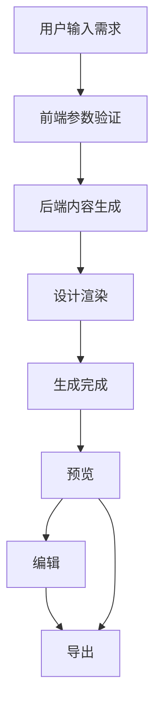
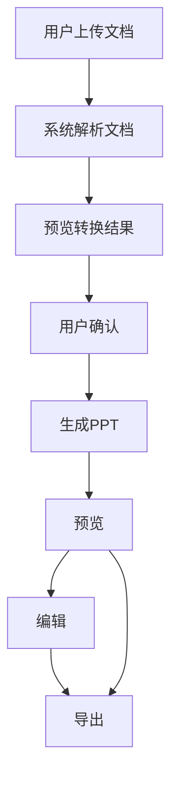
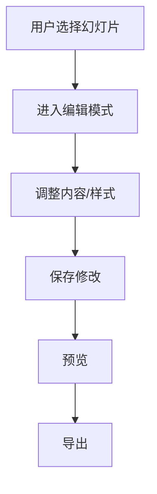

# 灵感岛Manus幻灯片功能需求文档（FRD）

## 文档信息

| 项目 | 内容 |
|------|------|
| 文档版本 | 1.0.0 |
| 创建日期 | 2026年1月29日 |
| 项目名称 | 灵感岛Manus幻灯片功能研发 |
| 文档状态 | 初稿完成 |
| 保密级别 | 内部 |

---

## 一、项目概述

### 1.1 文档目的

本文档是灵感岛Manus幻灯片功能研发的功能需求文档（FRD），旨在明确产品的功能范围、用户需求、技术约束和验收标准。本文档作为产品、设计、开发、测试各团队的工作基准，确保对功能需求的理解一致，减少沟通成本和返工风险。

本文档的预期读者包括：产品经理（用于需求管理和优先级排序）、设计师（用于交互和视觉设计）、开发工程师（用于技术实现）、测试工程师（用于测试用例编写）、项目管理人员（用于进度跟踪和资源规划）。

### 1.2 项目背景

灵感岛Manus是新一代AI驱动的企业级工作空间平台，通过AI代理技术帮助用户完成复杂的工作任务。幻灯片生成功能是平台的核心能力之一，旨在帮助用户快速创建专业级的演示文稿，提升工作效率和内容质量。

本项目的战略意义在于：扩展平台能力边界，从对话式AI向生产力工具延伸；提升用户粘性，通过高价值功能增强用户依赖；探索商业化路径，通过幻灯片功能开辟新的收入来源。

### 1.3 产品愿景

灵感岛Manus幻灯片功能的产品愿景是：让每个人都能快速创建专业级的演示文稿。用户无需具备设计技能，只需用自然语言描述需求，即可获得一套结构完整、视觉精美的PPT。系统同时提供便捷的编辑和定制能力，满足用户进一步调整的需求。

### 1.4 目标用户

**核心用户群体**包括：企业职员（日常汇报、方案展示、商务洽谈）、销售人员（产品介绍、客户提案、市场分析）、教育工作者（课程课件、学术报告、教学材料）、创业者（融资路演、产品发布、团队介绍）。

**用户特征**分析：目标用户普遍面临PPT制作耗时、设计效果不佳、内容组织困难等痛点；用户对AI辅助工具有较高的接受度和期待；用户愿意为能够显著提升效率的工具付费。

### 1.5 竞品定位

基于竞品分析，本产品的市场定位是：面向中国用户的专业AI PPT生成工具，在中文内容理解、企业场景支持、价格竞争力方面建立差异化优势。

与主要竞品的差异化策略：相比Manus Slides，强调中文优化和企业服务；相比Gamma，突出性价比和本地化支持；相比国内竞品（智谱AI Slides、讯飞智文），提供更完整的用户体验和设计质量。

---

## 二、系统架构概述

### 2.1 整体架构

灵感岛Manus幻灯片功能是一个独立的功能模块，拥有完整的前后端实现，不依赖于AgentFlow架构。整体架构分为四层：

**前端层**：基于React和Ant Design构建的用户界面，包括输入界面、预览界面、编辑界面，集成在现有Manus平台中。

**后端服务层**：独立的业务逻辑服务，包括内容生成服务、设计渲染服务、文档解析服务、导出服务。

**核心能力层**：幻灯片生成的核心技术能力，包括模板管理、内容生成、设计渲染、导出处理。

**基础设施层**：底层支持，包括大模型API（通义万相）、文件存储、消息队列、日志监控。

### 2.2 数据流

用户输入需求后，系统按照以下独立流程处理：

第一阶段是需求处理，前端接收用户输入，验证参数后直接调用后端服务。

第二阶段是内容生成，后端内容生成服务接收用户需求，通过通义万相API生成结构化的幻灯片内容描述。

第三阶段是设计渲染，后端设计渲染服务根据内容描述匹配设计模板，生成PPTX格式的幻灯片文件。

第四阶段是输出处理，后端服务将生成的幻灯片文件存储并返回访问链接。

第五阶段是前端展示，前端接收后端返回的结果，提供在线预览、编辑和导出功能。

### 2.3 与现有系统的集成

**与Manus平台集成**：幻灯片功能作为独立模块集成到Manus平台中，通过平台的导航系统和用户认证体系提供访问。

**与文件存储集成**：生成的PPTX文件和临时文件存储在文件存储服务中，支持文件的生命周期管理（生成、使用、清理）。

**与权限系统集成**：使用Manus平台的权限控制体系，确保用户只能访问自己的演示文稿。

---

## 三、功能需求

### 3.1 功能清单概览

| 功能模块 | 功能项 | 优先级 | 预估工时 |
|---------|-------|-------|---------|
| 内容生成 | 单一提示词生成 | P0 | 3周 |
| 内容生成 | 文档转PPT | P1 | 2周 |
| 内容生成 | 大纲导入生成 | P1 | 1周 |
| 视觉设计 | 基础模板库 | P0 | 2周 |
| 视觉设计 | 高级模板库 | P2 | 3周 |
| 视觉设计 | 自定义模板 | P2 | 2周 |
| 导出功能 | PPTX导出 | P0 | 1周 |
| 导出功能 | PDF导出 | P1 | 1周 |
| 导出功能 | Google Slides导出 | P2 | 2周 |
| 用户交互 | 在线预览 | P0 | 1周 |
| 用户交互 | 在线编辑 | P1 | 2周 |
| 用户交互 | 模板选择 | P1 | 1周 |

### 3.2 内容生成模块

#### 3.2.1 FR-PPT-001：单一提示词生成

**需求描述**：用户通过自然语言描述需求，系统自动生成完整的PPT演示文稿。

**用户场景**：用户输入"帮我制作一份关于2024年Q4工作总结的PPT，包含业绩数据、市场分析和下季度计划"，系统生成包含封面、目录、章节内容、总结的完整PPT。

**业务规则**：
- 生成内容自动结构化，包括封面页、目录页、正文页、总结页
- 页数根据内容复杂度自动调整，通常5-15页
- 生成过程中实时展示进度
- 支持取消生成操作

**输入参数**：
| 参数名称 | 类型 | 必填 | 说明 |
|---------|------|-----|------|
| prompt | String | 是 | 用户需求描述 |
| pageCount | Integer | 否 | 期望页数（默认自动） |
| style | String | 否 | 设计风格（默认商务） |
| language | String | 否 | 语言（默认中文） |

**输出结果**：
| 字段名称 | 类型 | 说明 |
|---------|------|------|
| presentationId | String | 演示文稿ID |
| previewUrl | String | 预览链接 |
| downloadUrl | String | 下载链接 |
| pageCount | Integer | 实际页数 |
| estimatedTime | Integer | 预估生成时间 |

**验收标准**：
- 用户输入需求后5秒内返回任务ID
- 10页以内PPT生成时间不超过5分钟
- 生成内容结构完整、逻辑清晰
- 系统支持高并发请求（100+ QPS）

**优先级**：P0（必须实现）

#### 3.2.2 FR-PPT-002：文档转PPT

**需求描述**：用户上传现有文档（Word、PDF、Markdown等），系统自动解析并转换为PPT格式。

**用户场景**：用户上传一份30页的市场分析报告，选择"转换为PPT"选项，系统生成一份结构化的演示文稿。

**业务规则**：
- 支持的文档格式：.docx、.pdf、.md、.txt
- 单文件大小限制：10MB
- 自动提取文档标题、章节、关键段落
- 保留文档的核心内容和结构

**输入参数**：
| 参数名称 | 类型 | 必填 | 说明 |
|---------|------|-----|------|
| file | File | 是 | 上传的文档文件 |
| targetStyle | String | 否 | 目标设计风格 |
| pagePerChapter | Boolean | 否 | 是否每章单独成页 |

**输出结果**：
| 字段名称 | 类型 | 说明 |
|---------|------|------|
| presentationId | String | 演示文稿ID |
| originalStructure | Object | 原始文档结构 |
| convertedPages | Integer | 转换页数 |

**验收标准**：
- 支持主流文档格式的解析
- 转换准确率达到90%以上（关键内容不丢失）
- 10MB文件解析时间不超过30秒
- 提供转换预览，允许用户确认后继续

**优先级**：P1（应该实现）

#### 3.2.3 FR-PPT-003：大纲导入生成

**需求描述**：用户提供结构化的大纲（JSON、Markdown格式），系统根据大纲生成PPT。

**用户场景**：用户导入一份结构化的大纲，指定设计风格，系统快速生成对应的PPT。

**业务规则**：
- 支持的输入格式：JSON大纲、Markdown大纲
- 自动识别大纲层级结构
- 支持大纲预览和编辑

**输入参数**：
| 参数名称 | 类型 | 必填 | 说明 |
|---------|------|-----|------|
| outline | Object/String | 是 | 结构化大纲 |
| style | String | 否 | 设计风格 |

**验收标准**：
- 支持标准大纲格式的解析
- 大纲到PPT的转换准确率达到95%以上
- 支持大纲在线编辑和实时预览

**优先级**：P1（应该实现）

### 3.3 视觉设计模块

#### 3.3.1 FR-PPT-004：基础模板库

**需求描述**：系统内置多套专业设计模板，覆盖主要使用场景，特别关注社交媒体业务应用。

**模板类别**：
| 类别 | 适用场景 | 模板数量 |
|------|---------|--------|
| 社交媒体营销 | 品牌推广、产品宣传、活动营销 | 8套 |
| 电商运营 | 产品展示、促销活动、直播预告 | 6套 |

**模板规范**：
- 页面尺寸：16:9宽屏（1920x1080）
- 字体规范：标题使用思源黑体Bold，正文使用思源黑体Regular
- 配色方案：每套模板包含主色、辅色、强调色，适合社交媒体平台显示
- 布局类型：标题页、内容页、图表页、产品展示页、活动宣传页、社交媒体特化页

**验收标准**：
- 基础模板库不少于20套模板
- 模板覆盖主要使用场景，包括社交媒体业务应用
- 模板设计符合专业审美标准
- 模板具有良好的可扩展性

**优先级**：P0（必须实现）

#### 3.3.2 FR-PPT-005：高级模板库

**需求描述**：扩展高级模板库，提供更多风格和场景的模板选择。

**扩展模板类别**：
| 类别 | 适用场景 | 模板数量 |
|------|---------|---------|
| 行业垂直 | 金融、医疗、教育、制造 | 每行业3套 |
| 节日主题 | 春节、中秋、国庆、活动 | 每主题2套 |
| 品牌定制 | 企业VI定制模板 | 按需 |
| 动态模板 | 支持动画和转场效果 | 5套 |

**验收标准**：
- 高级模板库不少于50套模板
- 行业垂直模板覆盖主要行业
- 支持动态模板的动画预览

**优先级**：P2（可以实现）

#### 3.3.3 FR-PPT-006：自定义模板

**需求描述**：用户可以上传自定义模板，或基于系统模板进行个性化调整。

**功能特性**：
- 模板上传：用户上传自定义PPTX模板
- 模板编辑：用户在线调整模板的布局、颜色、字体
- 模板保存：用户保存自定义模板供后续使用

**验收标准**：
- 支持PPTX格式模板的上传和解析
- 提供模板编辑界面，支持拖拽调整
- 用户自定义模板与系统模板同等使用

**优先级**：P2（可以实现）

### 3.4 导出功能模块

#### 3.4.1 FR-PPT-007：PPTX导出

**需求描述**：用户可以将生成的幻灯片导出为PPTX格式，支持在Microsoft PowerPoint和WPS中编辑。

**业务规则**：
- 导出的PPTX文件可以在PowerPoint 2016及以上版本打开
- 保持设计还原度，字体、颜色、布局与预览一致
- 支持带字体和不带字体两种导出模式

**输出参数**：
| 参数名称 | 类型 | 说明 |
|---------|------|------|
| format | String | 导出格式（PPTX） |
| includeFonts | Boolean | 是否包含嵌入字体 |
| resolution | Integer | 图片分辨率（仅当PPT包含图片时） |

**验收标准**：
- PPTX文件可以在PowerPoint和WPS中正常打开
- 设计还原度达到95%以上
- 10页PPT导出时间不超过10秒
- 导出文件大小合理（单页不超过500KB）

**优先级**：P0（必须实现）

#### 3.4.2 FR-PPT-008：PDF导出

**需求描述**：用户可以将幻灯片导出为PDF格式，便于分享和打印。

**业务规则**：
- 一页幻灯片对应一页PDF
- PDF分辨率为300DPI，适合打印
- 嵌入必要的字体确保跨平台显示

**验收标准**：
- PDF文件可以在主流PDF阅读器中打开
- 文字和图片清晰度满足打印要求
- 10页PPT导出为PDF时间不超过30秒

**优先级**：P1（应该实现）

#### 3.4.3 FR-PPT-009：Google Slides导出

**需求描述**：用户可以将幻灯片导出到Google Slides，支持在线协作编辑。

**业务规则**：
- 需要用户授权Google账号
- 导出后可在Google Slides中继续编辑
- 保留原有的设计样式

**验收标准**：
- 成功导出到用户Google云端硬盘
- Google Slides中显示效果与预览一致
- 支持Google Slides的协作编辑功能

**优先级**：P2（可以实现）

### 3.5 用户交互模块

#### 3.5.1 FR-PPT-010：在线预览

**需求描述**：用户可以在浏览器中预览生成的幻灯片效果。

**预览功能**：
| 功能 | 说明 |
|------|------|
| 幻灯片切换 | 上一页、下一页、页码跳转 |
| 缩放控制 | 放大、缩小、适应屏幕 |
| 全屏模式 | 支持演示全屏播放 |
| 大纲视图 | 显示幻灯片结构概览 |

**验收标准**：
- 预览加载时间不超过2秒
- 幻灯片切换流畅无卡顿
- 全屏播放支持键盘控制

**优先级**：P0（必须实现）

#### 3.5.2 FR-PPT-011：在线编辑

**需求描述**：用户可以对生成的幻灯片进行在线编辑和调整。

**编辑功能**：
| 功能 | 说明 |
|------|------|
| 文本编辑 | 修改标题、正文内容 |
| 图片替换 | 替换幻灯片中的图片 |
| 元素调整 | 调整元素位置和大小 |
| 样式调整 | 修改颜色、字体、对齐方式 |

**验收标准**：
- 提供所见即所得的编辑体验
- 支持常用快捷键操作
- 编辑操作实时保存

**优先级**：P1（应该实现）

#### 3.5.3 FR-PPT-012：模板选择

**需求描述**：用户在生成前可以选择设计模板，或在生成后更换模板。

**选择方式**：
- 生成前：在输入需求后、生成开始前，选择模板
- 生成后：在预览界面，可以一键更换模板

**验收标准**：
- 模板展示清晰美观，包含缩略图和名称
- 模板切换流畅，更换后保持内容完整性
- 支持模板收藏和快速访问

**优先级**：P1（应该实现）

### 3.6 数据图表模块

#### 3.6.1 FR-PPT-013：数据图表生成

**需求描述**：用户可以插入数据图表，系统自动生成对应的图表幻灯片。

**支持图表类型**：
| 图表类型 | 适用场景 |
|---------|---------|
| 柱状图 | 对比不同类别数据 |
| 折线图 | 展示趋势变化 |
| 饼图 | 展示占比分布 |
| 面积图 | 展示累积趋势 |
| 散点图 | 展示相关性 |

**验收标准**：
- 支持至少5种基础图表类型
- 图表设计风格与PPT模板一致
- 图表数据支持在线编辑

**优先级**：P1（应该实现）

---

## 四、非功能需求

### 4.1 性能需求

| 指标 | 目标值 | 说明 |
|------|-------|------|
| 页面加载时间 | ≤2秒 | 输入界面和预览界面的首次加载 |
| 10页PPT生成时间 | ≤5分钟 | 从提交请求到生成完成 |
| 预览响应时间 | ≤500毫秒 | 幻灯片切换的响应时间 |
| 并发处理能力 | ≥100 QPS | 系统支持的每秒请求数 |
| 可用性 | ≥99.5% | 系统正常运行时间占比 |

### 4.2 安全需求

| 需求项 | 说明 |
|-------|------|
| 数据加密 | 传输和存储的数据必须加密 |
| 权限控制 | 用户只能访问自己的演示文稿 |
| 内容审核 | 过滤违规内容（暴力、色情、政治敏感） |
| 文件安全 | 上传文件进行病毒扫描 |
| 隐私保护 | 不记录用户的敏感信息 |

### 4.3 兼容性需求

| 维度 | 要求 |
|------|------|
| 浏览器支持 | Chrome、Firefox、Safari、Edge最新版本 |
| 操作系统 | Windows、macOS、Linux |
| Office兼容 | PowerPoint 2016+、WPS Office 2019+ |
| 移动端 | 支持响应式设计，提供基本功能 |

### 4.4 可用性需求

| 指标 | 目标值 | 说明 |
|------|-------|------|
| 新用户上手时间 | ≤5分钟 | 完成首次PPT生成 |
| 操作步骤数 | ≤5步 | 从输入到导出的完整流程 |
| 错误恢复 | ≤30秒 | 操作失败后恢复到正常状态 |
| 帮助支持 | 提供新手引导和帮助文档 |

### 4.5 可扩展性需求

| 需求项 | 说明 |
|-------|------|
| 模板扩展 | 支持动态添加新模板，无需重新部署 |
| 功能扩展 | 预留新功能接入点，支持插件化扩展 |
| 国际化 | 支持多语言界面和内容生成 |
| 多租户 | 支持企业用户的定制化配置 |

---

## 五、用户交互设计要求

### 5.1 核心流程设计

**主流程**（单一提示词生成）：

**分支流程**（文档转PPT）：

**编辑流程**：

### 5.2 界面布局要求

**输入界面**：
- 简洁的输入区域，突出提示词输入框
- 模板选择入口，便于用户提前选择风格
- 高级选项折叠展示，避免界面过于复杂

**预览界面**：
- 左侧幻灯片缩略图导航
- 中间主预览区域
- 底部工具栏（导出、编辑、分享）
- 右上角模板切换入口

**编辑界面**：
- 左侧导航栏（幻灯片列表）
- 中间编辑区域（所见即所得）
- 右侧属性面板（元素属性编辑）
- 顶部工具栏（保存、撤销、重做）

### 5.3 前端组件设计规范

**独立页面框架组件**：
- 基于现有WorkbenchTemplate组件构建，确保与Manus平台的一致性
- 使用WithChatUIBrowserView组件提供浏览器视图集成
- 组件设计遵循React最佳实践，支持组件化开发和复用

**Ant Design组件库**：
- 统一使用Ant Design组件库，确保界面风格一致性
- 遵循Ant Design设计规范，包括颜色、字体、间距等
- 利用Ant Design的Form、Upload、Modal等组件简化开发

**组件层次结构**：
- 页面级组件：SlidesPage、EditPage、PreviewPage
- 功能组件：PromptInput、TemplateSelector、SlidesEditor
- 通用组件：ProgressBar、Notification、ErrorBoundary

**状态管理**：
- 使用React Context API管理全局状态
- 局部状态使用useState和useReducer
- 异步状态使用useQuery和useMutation

**性能优化**：
- 组件懒加载，减少初始加载时间
- 虚拟滚动，优化大量幻灯片的渲染
- 缓存策略，减少重复请求

### 5.4 交互细节要求

**加载状态**：
- 生成过程中显示进度条和状态文字
- 允许取消正在进行的生成任务
- 长时间等待时提供预估完成时间

**错误处理**：
- 输入验证失败时，提供明确的错误提示
- 生成失败时，提供重试选项和错误详情
- 网络异常时，提供离线提示和重连机制

**反馈机制**：
- 操作成功后提供视觉反馈（如toast提示）
- 支持操作撤销和重做
- 提供使用数据统计（如已生成数量）

---

## 六、验收标准总览

### 6.1 功能验收

| 功能项 | 验收标准 | 测试方法 |
|-------|---------|---------|
| 单一提示词生成 | 10页PPT在5分钟内生成，内容结构完整 | 功能测试、性能测试 |
| 文档转PPT | 支持4种以上文档格式，转换准确率≥90% | 兼容性测试、准确率测试 |
| PPTX导出 | PowerPoint/WPS中正常打开，还原度≥95% | 兼容性测试 |
| 在线预览 | 加载≤2秒，切换流畅 | 性能测试 |
| 基础模板 | 不少于20套，覆盖主要场景 | 人工审核 |

### 6.2 性能验收

| 指标 | 验收标准 | 测试方法 |
|------|---------|---------|
| 生成速度 | 10页PPT≤5分钟 | 性能测试 |
| 预览响应 | ≤500毫秒 | 性能测试 |
| 并发能力 | ≥100 QPS | 压力测试 |
| 可用性 | ≥99.5% | 稳定性测试 |

### 6.3 体验验收

| 指标 | 验收标准 | 测试方法 |
|------|---------|---------|
| 上手时间 | 新用户≤5分钟完成首次生成 | 用户测试 |
| 操作步骤 | 主流程≤5步 | 流程测试 |
| 满意度 | 用户满意度评分≥4.0（5分制） | 用户调研 |

---

## 七、项目范围与里程碑

### 7.1 版本规划

**V1.0版本（ MVP）**：
- 单一提示词生成PPT
- 基础模板库（20套）
- PPTX导出
- 在线预览

**V1.1版本**：
- 文档转PPT（Word、PDF）
- 在线编辑
- 模板选择
- PDF导出

**V1.2版本**：
- 大纲导入生成
- 高级模板库（扩展至50套）
- 数据图表
- 性能优化

**V2.0版本**：
- Google Slides导出
- 自定义模板
- 企业定制
- API开放

### 7.2 依赖关系

| 功能项 | 前置依赖 | 依赖说明 |
|-------|---------|---------|
| 文档转PPT | 文件上传功能 | 需要先实现文件上传 |
| 在线编辑 | 在线预览 | 依赖预览组件 |
| PDF导出 | PPTX导出 | 需要先实现PPTX生成 |
| 自定义模板 | 基础模板库 | 需要先建立模板规范 |

---

## 八、风险与应对

### 8.1 已知风险

| 风险项 | 可能性 | 影响 | 应对措施 |
|-------|-------|------|---------|
| 生成内容质量不稳定 | 中 | 高 | 建立质量评估机制，引入人工审核 |
| 渲染兼容性差 | 中 | 中 | 全面测试，建立问题库和修复方案 |
| 性能不达预期 | 低 | 高 | 预留优化时间，准备性能优化方案 |
| 用户期望过高 | 高 | 中 | 设置合理预期，提供编辑能力 |

### 8.2 假设与约束

**假设条件**：
- 通义万相API稳定可用
- python-pptx库满足渲染需求
- 用户网络环境正常
- 团队资源按计划到位

**约束条件**：
- 开发周期有限（V1.0 3个月内）
- 服务器资源有限
- 设计资源有限
- 测试时间有限

---

## 九、功能解耦与边界定义

### 9.1 与pptx Skill功能的边界

**幻灯片功能**：
- 独立的前后端实现，拥有完整的用户界面和业务逻辑
- 支持完整的幻灯片生成、编辑、预览、导出流程
- 基于独立的后端服务，不依赖AgentFlow
- 专注于用户直接交互的幻灯片创作体验

**pptx Skill功能**：
- 作为Skills系统的一部分，通过自然语言指令调用
- 提供基础的PPT生成能力，集成到对话流程中
- 依赖AgentFlow的任务调度和执行
- 专注于通过对话方式生成简单的幻灯片

### 9.2 功能边界划分

| 功能项 | 幻灯片功能 | pptx Skill功能 |
|-------|-----------|---------------|
| 完整用户界面 | ✅ | ❌ |
| 在线编辑 | ✅ | ❌ |
| 模板选择 | ✅ | ❌ |
| 文档转PPT | ✅ | ❌ |
| 大纲导入 | ✅ | ❌ |
| 数据图表 | ✅ | ❌ |
| 多格式导出 | ✅ | ❌ |
| 对话式生成 | ❌ | ✅ |
| AgentFlow集成 | ❌ | ✅ |
| 简单PPT生成 | ✅ | ✅ |

### 9.3 技术实现差异

**幻灯片功能**：
- 独立的后端服务架构
- 完整的React前端应用
- 直接调用底层服务API
- 支持复杂的用户交互

**pptx Skill功能**：
- 集成到Skills系统
- 通过SkillTemplate配置
- 依赖AgentFlow的执行环境
- 专注于单一功能点

---

## 十、附录

### 10.1 术语表

| 术语 | 定义 |
|------|------|
| PPTX | Microsoft PowerPoint的XML-based文件格式 |
| 模板 | 预设了布局和样式的PPT文件 |
| 渲染 | 将内容转换为可视化页面的过程 |
| 导出 | 将生成的内容保存为文件的过程 |
| 技能（Skill） | Manus系统中封装特定功能的能力模块 |

### 10.2 参考文档

- [01-Manus平台Slide产品技术调研报告.md](./01-Manus平台Slide产品技术调研报告.md)
- [02-banana-slides项目技术分析报告.md](./02-banana-slides项目技术分析报告.md)
- [05-灵感岛Manus-Skills系统新设计方案-重构版_v3.md](../../../../apps/agent-tars/src/lgdmanus/render/docs/newui/05-灵感岛Manus-Skills系统新设计方案-重构版_v3.md)

### 10.3 修订历史

| 版本 | 日期 | 作者 | 变更说明 |
|-----|------|-----|---------|
| 1.0.0 | 2026-01-29 | AI助手 | 初始版本 |
| 1.1.0 | 2026-01-29 | AI助手 | 更新架构设计，添加功能解耦部分，优化模板策略 |
