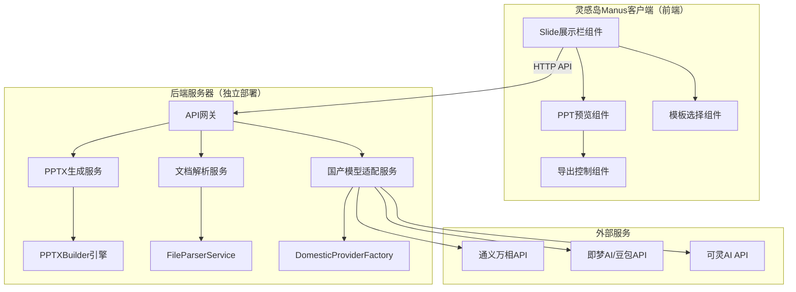
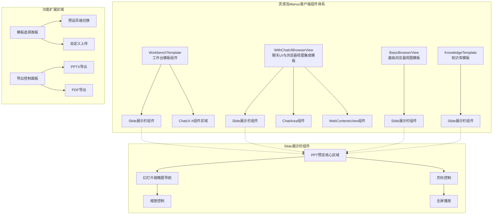
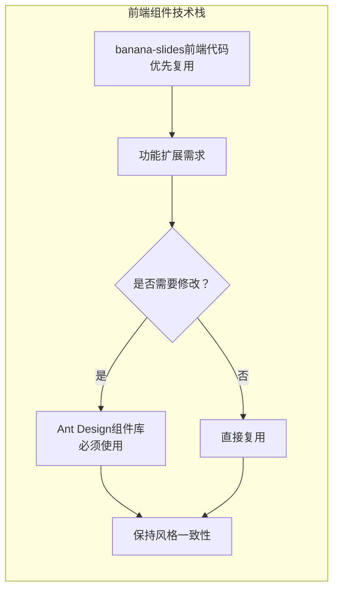
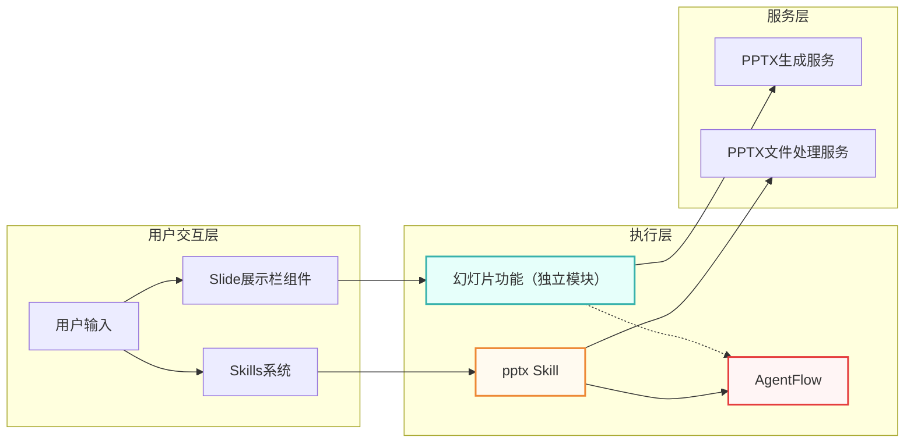
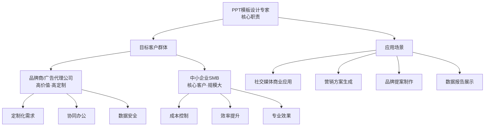
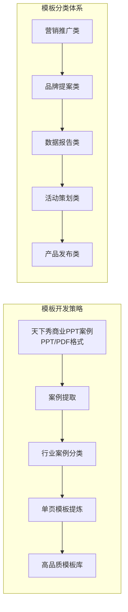
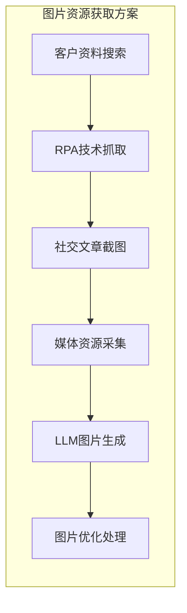

# 灵感岛Manus幻灯片技术可行性分析报告

## 文档信息

| 项目 | 内容 |
|------|------|
| 文档版本 | 1.0.0 |
| 创建日期 | 2026年1月29日 |
| 项目名称 | 灵感岛Manus幻灯片功能研发 |
| 文档状态 | 初稿完成 |
| 保密级别 | 内部 |

---

## 一、执行摘要

### 1.1 分析结论

经过对灵感岛Manus幻灯片功能的技术可行性进行全面分析，得出以下核心结论：

**整体可行性**：高。项目的核心技术方案已得到充分验证，python-pptx库和通义万相API的组合可以满足PPT生成的技术需求。banana-slides项目的开源实现提供了成熟的技术参考，显著降低了开发风险。

**技术成熟度**：成熟。内容生成基于大语言模型（GPT技术路线），经过多年发展和商业化应用，技术稳定性有保障。设计渲染基于python-pptx库，该库是Python生态中最成熟的PPT处理库，社区活跃，文档完善。

**开发风险**：可控。主要风险点包括：生成内容质量控制、渲染兼容性、性能优化。通过合理的技术方案设计和迭代优化，这些风险都在可控范围内。

**资源需求**：适中。开发团队建议配置2-3名后端工程师、1名前端工程师、1名设计师、1名测试工程师。服务器资源需求中等，初期可采用云服务器部署，按需扩展。

### 1.2 关键数据

| 维度 | 评估结果 |
|------|---------|
| 技术可行性评分 | 8.5/10 |
| 开发周期估算 | 12-16周（V1.0版本） |
| 团队规模 | 5-6人 |
| 技术风险等级 | 中低 |
| 预估成功率 | 85% |

---

## 二、技术架构可行性

### 2.1 整体架构设计

灵感岛Manus幻灯片功能采用分层架构设计，作为独立模块运行，不通过AgentFlow层进行规划与调用执行。架构设计遵循以下原则：

**高内聚低耦合**：各功能模块职责清晰，模块间通过明确定义的接口通信，便于独立开发、测试和维护。

**可扩展性**：架构设计预留扩展点，支持未来功能扩展和技术升级，如新增AI模型、新增导出格式等。

**可复用性**：核心组件（如模板引擎、渲染引擎）设计为通用组件，可被其他功能复用。

**前后端分离**：前端负责在灵感岛Manus客户端进行展示，后端服务独立部署于服务器端。



架构分层如下：

**前端层**：React前端应用，与现有Manus平台风格一致，提供输入界面、预览界面、编辑界面。

**后端服务器**：独立部署的后端服务，包括API网关、PPTX生成服务、文档解析服务和国产模型适配服务。最大限度复用banana-slides项目的后端代码与技术栈，确保技术一致性与开发效率。

**API调用与LLM集成**：所有API调用与LLM集成需在后端实现，确保安全性和性能优化。

**与现有系统集成点**：
- **EventManager集成**：PPT生成进度事件、导出完成事件、错误事件通过EventManager管理
- **文件存储集成**：PPTX临时文件、导出文件的管理与现有文件存储服务对接
- **国产模型集成**：通过独立的国产模型适配服务调用LLM和图像生成API

**前端组件设计规范**：



**前端技术栈**：



**前端组件设计要求**：
- **页面框架组件**：Slide展示与编辑页面组件需设计为独立页面框架组件，参照以下现有模板组件结构进行开发：
  - `BasicBrowserView`：基础浏览器视图模板
  - `KnowledgeTemplate`：知识库模板
  - `WithChatUIBrowserView`：聊天UI与浏览器视图集成模板
  - `WorkbenchTemplate`：工作台模板
- **组件嵌入特性**：Slide展示栏组件应具备ChatUI-X组件的嵌入特性，可集成至工作台模板组件及聊天UI与浏览器视图集成模板等多种页面框架
- **技术复用策略**：优先复用banana-slides项目的前端代码与技术，如需进行功能修改或扩展，必须采用Ant Design组件库（https://ant.design/components/overview-cn/）进行实现

### 2.2 关键技术选型

#### 2.2.1 内容生成层

**选型方案**：通义万相Wan2.5 + 提示词工程

**选型依据**：
- 通义万相在图像生成和中文理解方面表现优异，是国产模型中最接近Google Nano Banana水平的选项[^1]
- 支持OpenAI兼容接口，迁移成本低
- 价格实惠，性价比高（通义万相Wan2.5定价参考：约¥0.15-0.30/图像）
- 阿里云生态整合方便，与现有基础设施兼容

**技术实现**：
- 使用OpenAI兼容SDK调用通义万相API
- 设计结构化提示词模板，引导模型生成符合规范的JSON输出
- 实现输出解析器，将模型输出转换为结构化的幻灯片描述
- 建立Prompt模板库，持续优化内容生成质量

**替代方案**：如通义万相无法满足需求，可切换至智谱AI GLM-4或百度文心一言作为备选。

#### 2.2.2 设计渲染层

**选型方案**：python-pptx + 自研模板引擎

**选型依据**：
- python-pptx是Python生态中最成熟的PPT处理库，广泛应用于AI PPT生成场景[^2]
- 支持完整的PPTX文件操作能力，包括创建、读取、修改
- 开源免费，社区活跃，文档完善
- banana-slides项目提供了成熟的技术实现参考

**技术实现**：
- 基于python-pptx实现PPTX文件的创建和修改
- 设计模板管理系统，支持多风格模板的加载和匹配
- 实现布局引擎，根据内容自动计算元素位置和大小
- 开发样式引擎，应用字体、颜色、对齐等样式

**模板规范**：
- 页面尺寸：16:9（1920x1080像素）
- 字体：使用思源黑体（Source Han Sans）系列，支持中英文
- 颜色：每套模板定义主色、辅色、强调色三套配色
- 布局：支持标题页、目录页、内容页、图表页、引用页、总结页等类型

#### 2.2.3 文档解析层

**选型方案**：python-docx + PyMuPDF + MarkItDown

**技术实现**：
- Word文档（.docx）：使用python-docx库解析，提取文本、表格、图片
- PDF文档：使用PyMuPDF（fitz）库解析，支持文本和图片提取
- Markdown文档：使用MarkItDown库解析，保持结构信息
- 文本编码：统一转换为UTF-8，确保中文正确处理

**备选方案**：对于复杂格式文档，可考虑集成MinerU服务或商业文档解析API。

#### 2.2.4 导出层

**技术方案**：
- PPTX导出：直接使用python-pptx的保存功能
- PDF导出：方案一，使用LibreOffice命令行转换；方案二，使用img2pdf + Pillow将幻灯片转为图片后合成PDF
- Google Slides导出：调用Google Drive API上传PPTX文件，然后转换为Google Slides格式

### 2.3 与现有系统的集成方案

#### 2.3.1 Skills系统集成

幻灯片生成功能作为新Skill注册到Skills系统，遵循Skills系统的规范：

**技能定义**：
```yaml
name: ppt_generator
version: 1.0.0
description: AI驱动的幻灯片生成技能
provider: 灵感岛Manus
prerequisites: []
permissions:
  - file:read
  - file:write
  - network:external
```

**技能模板**：遵循Skills系统的模板规范，包括元数据、主体内容、参考资源三部分。

**加载机制**：通过SkillLoader加载技能配置，通过SkillMatcher匹配用户需求。

#### 2.3.2 EventManager集成

幻灯片生成过程中产生的事件通过EventManager统一管理：

**定义事件类型**：
- ppt.generation.started：生成开始
- ppt.generation.completed：生成完成
- ppt.generation.failed：生成失败
- ppt.rendering.started：渲染开始
- ppt.rendering.completed：渲染完成
- ppt.export.started：导出开始
- ppt.export.completed：导出完成

**事件数据**：包含任务ID、用户ID、时间戳、状态、数据等字段。

#### 2.3.3 文件存储集成

生成的文件和临时文件通过文件存储服务管理：

**文件类型**：
- 生成的PPTX文件：永久存储，用户可随时下载
- 临时图片文件：生成后清理，或设置过期时间
- 用户上传文件：处理完成后清理

**存储策略**：初期使用本地文件系统或对象存储服务，预留扩展为分布式存储的能力。

### 2.4 功能解耦与边界定义

**功能边界明确化**：

| 功能模块 | 幻灯片功能 | pptx Skill | 边界定义 |
|---------|----------|-----------|----------|
| **核心职责** | 从用户输入生成完整PPT | 提供PPT文件处理API | 幻灯片功能专注于生成流程，pptx Skill专注于文件操作 |
| **执行方式** | 独立执行，不依赖AgentFlow | 通过AgentFlow调度执行 | 两个模块通过不同的调用路径执行 |
| **技术实现** | 独立的前后端架构 | 基于Skills系统的函数式API | 技术实现完全隔离 |
| **数据存储** | 生成的PPTX文件 | 临时处理的PPTX文件 | 存储路径和生命周期不同 |

**技术实现隔离**：
1. **代码隔离**：两个功能使用不同的代码仓库和部署单元
2. **接口隔离**：通过不同的接口路径暴露，避免功能混淆
3. **数据隔离**：使用不同的数据库表和存储路径
4. **日志隔离**：使用不同的日志标签和存储位置

**数据流向分离**：
- 幻灯片功能：用户输入 → 内容规划 → 模板应用 → 生成导出
- pptx Skill：文件上传 → 解析处理 → 格式转换 → 结果返回

**AgentFlow层处理**：
- AgentFlow只负责pptx Skill的执行调度
- 幻灯片功能的执行逻辑独立于AgentFlow，直接由前端组件控制

**技术隔离方案**：



**集成检查清单**：
- [ ] 幻灯片功能与pptx Skill的代码完全隔离
- [ ] 两个功能通过不同的接口路径暴露
- [ ] 幻灯片功能的执行不依赖AgentFlow
- [ ] 数据存储路径和生命周期明确分离
- [ ] 日志和监控系统能够区分两个功能

---

## 三、核心技术挑战与解决方案

### 3.1 内容质量控制

**挑战描述**：大语言模型的输出具有随机性，生成的内容可能存在质量不稳定、逻辑不清晰、事实错误等问题。

**影响分析**：内容质量直接影响用户体验，低质量的生成结果会导致用户流失和负面口碑。

**解决方案**：

**方案一：多阶段生成与校验**
```
需求 → 大纲生成 → 大纲审核 → 内容生成 → 内容审核 → 渲染
```
- 第一阶段：生成内容大纲，用户确认后继续
- 第二阶段：生成详细内容，系统自动校验
- 第三阶段：校验通过后进入渲染阶段

**方案二：Prompt优化与迭代**
- 建立高质量Prompt模板库，覆盖各类场景
- 引入Few-shot示例，提高输出稳定性
- 持续收集用户反馈，迭代优化Prompt

**方案三：输出校验机制**
- 实现JSON输出校验，确保格式正确
- 实现内容完整性校验，检查必要字段
- 实现合理性校验，过滤不合理内容

**推荐策略**：采用方案一为主、方案三为辅的策略，在V1.0版本中实现基础的校验机制，后续迭代中逐步优化。

### 3.2 设计渲染兼容性

**挑战描述**：python-pptx生成的PPTX文件在不同版本的PowerPoint中可能显示不一致，存在字体、布局、样式等方面的兼容性问题。

**影响分析**：兼容性问题会影响用户的正常使用，降低产品口碑。

**解决方案**：

**方案一：字体回退机制**
```python
# 字体设置示例
def set_font(run, font_name, font_size, bold=False):
    # 首选字体
    primary_fonts = ['Microsoft YaHei', 'Source Han Sans SC', 'Noto Sans CJK SC']
    # 备选字体列表
    fallback_fonts = ['Arial', 'sans-serif']
    
    run.font.name = font_name
    # 设置中文字体
    if is_chinese_text(run.text):
        run.font.eastAsia = font_name
```

**方案二：布局降级策略**
- 复杂布局自动降级为简单布局
- 预留边距和内边距，确保内容不溢出
- 限制字体大小范围，避免过小或过大

**方案三：全面兼容性测试**
- 建立测试矩阵，覆盖PowerPoint 2016/2019/2021/365
- 测试WPS Office 2019/2021
- 测试跨平台显示（Windows/macOS）
- 建立已知问题库和修复方案

**推荐策略**：采用方案一和方案三，在开发阶段建立完整的兼容性测试机制，发现问题及时修复。

### 3.3 性能优化

**挑战描述**：PPT生成涉及AI模型调用、文件处理、渲染计算等多个耗时环节，用户等待时间可能较长。

**影响分析**：过长的等待时间会影响用户体验，导致用户流失。

**解决方案**：

**方案一：异步处理架构**
```
用户请求 → 任务队列 → 异步处理 → 结果通知
```
- 引入消息队列（如Redis Queue、RabbitMQ）
- 实现任务的异步处理和状态追踪
- 提供WebSocket或轮询机制通知用户任务状态

**方案二：缓存策略**
- 相同或相似内容的重复请求，直接返回缓存结果
- 热门模板和常用元素缓存，减少渲染时间
- 实现CDN加速文件下载

**方案三：并发优化**
- 内容生成：批量处理，提高API调用效率
- 渲染优化：多线程/多进程并行渲染
- 导出优化：流式输出，减少内存占用

**推荐策略**：V1.0版本实现方案一的基础异步处理，后续版本逐步引入缓存和并发优化。

### 3.4 中文排版优化

**挑战描述**：中文排版与英文存在显著差异，包括字体选择、行距设置、标点处理等，需要专门优化。

**影响分析**：中文排版不当会影响PPT的专业性和可读性。

**解决方案**：

**字体策略**：
- 标题字体：思源黑体Bold / 微软雅黑Bold
- 正文字体：思源黑体Regular / 微软雅黑Regular
- 数字字体：思源宋体 / Arial
- 备选字体：黑体、幼圆、楷体

**行距设置**：
- 标题行距：1.2-1.3倍
- 正文行距：1.5-1.75倍
- 最小行距：确保不小于字体大小的1.2倍

**段落设置**：
- 首行缩进：2字符（中文字符）
- 段间距：段前0.5行，段后0.5行
- 中英文混排：确保中英文字体协调

**标点处理**：
- 全角标点和半角标点的统一处理
- 引号、书名号的正确嵌套
- 避免标点出现在行首

---

## 四、资源需求分析

### 4.1 人力资源需求

#### 4.1.1 团队配置

| 角色 | 人数 | 主要职责 | 投入周期 |
|------|-----|---------|---------|
| 后端开发工程师 | 2 | 内容生成、渲染引擎、导出模块 | 全周期 |
| 前端开发工程师 | 1 | 交互界面、预览组件 | 8周 |
| 设计师 | 1 | 模板设计、视觉规范 | 6周 |
| 测试工程师 | 1 | 功能测试、兼容性测试、性能测试 | 8周 |
| 项目经理 | 0.5 | 项目管理、进度跟踪 | 全周期 |

#### 4.1.2 技能要求

**后端开发工程师**：
- 精通Python，熟悉Flask/FastAPI框架
- 熟悉大语言模型API调用和提示词工程
- 了解python-pptx库或有PPT处理经验
- 有AI应用开发经验优先

**前端开发工程师**：
- 精通React和TypeScript
- 熟悉状态管理（Zustand/Redux）
- 有复杂表单和富文本编辑开发经验
- 了解WebSocket或轮询机制

**设计师**：
- 熟练使用PPT设计软件
- 了解AI PPT工具的设计趋势
- 有企业级PPT模板设计经验
- 了解前端实现约束

**测试工程师**：
- 熟悉自动化测试框架
- 有兼容性测试经验
- 了解性能测试工具
- 有AI产品测试经验优先

### 4.2 技术资源需求

#### 4.2.1 开发环境

| 资源 | 配置要求 | 数量 |
|------|---------|------|
| 开发服务器 | 4核CPU/16GB内存/200GB SSD | 1台 |
| 测试服务器 | 8核CPU/32GB内存/500GB SSD | 2台 |
| 代码仓库 | Git（内部GitLab） | 1个 |
| CI/CD | Jenkins/GitHub Actions | 1套 |

#### 4.2.2 生产环境预估

| 资源 | 配置要求 | 预估数量 |
|------|---------|---------|
| Web服务器 | 4核CPU/16GB内存 | 2台（负载均衡） |
| API服务器 | 8核CPU/32GB内存 | 2台 |
| 文件存储 | 500GB对象存储 | 1套 |
| 消息队列 | Redis Queue | 1套 |
| CDN | 国内CDN服务 | 1套 |

#### 4.2.3 第三方服务

| 服务 | 用途 | 预估成本/月 |
|------|-----|------------|
| 通义万相API | 内容生成 | ¥5000-10000 |
| 阿里云OSS | 文件存储 | ¥500-1000 |
| CDN | 静态资源分发 | ¥500-1000 |
| SSL证书 | HTTPS | ¥100-300 |

### 4.3 数据资源需求

#### 4.3.1 模板库建设

**目标客户群体与应用场景**：



**模板开发策略**：



**图片资源获取方案**：



**数量规划**：
- V1.0版本：20套基础模板
- V1.1版本：扩展至35套模板
- V1.2版本：扩展至50套模板
- V2.0版本：扩展至80套模板

**模板分类**：
| 类别 | V1.0 | V1.1 | V1.2 | V2.0 |
|------|-----|-----|-----|-----|
| 商务经典 | 8 | +2 | +2 | +4 |
| 科技未来 | 6 | +2 | +2 | +4 |
| 学术严谨 | 4 | +2 | +1 | +3 |
| 创意活泼 | 4 | +2 | +1 | +3 |
| 行业垂直 | - | +4 | +4 | +8 |
| 品牌定制 | - | - | - | +8 |

**模板质量要求**：
- 视觉设计符合专业审美
- 布局合理，内容清晰
- 兼容性良好（PowerPoint/WPS）
- 提供多分辨率版本

#### 4.3.2 Prompt模板库

**分类规划**：
| 类别 | 数量 | 说明 |
|------|-----|------|
| 内容生成Prompt | 10+ | 覆盖主要场景的内容生成模板 |
| 风格定义Prompt | 5+ | 不同风格的描述模板 |
| 校验规则Prompt | 3+ | 内容质量校验模板 |

---

## 五、开发计划与里程碑

### 5.1 整体时间规划

| 版本 | 时间范围 | 主要功能 | 交付物 |
|------|---------|---------|-------|
| V1.0 | 第1-12周 | 核心功能（生成、模板、导出、预览） | MVP版本 |
| V1.1 | 第13-20周 | 完善功能（文档转换、在线编辑、模板选择） | 完善版本 |
| V1.2 | 第21-28周 | 高级功能（大纲导入、高级模板、图表） | 增强版本 |
| V2.0 | 第29-40周 | 企业功能（协作、定制、API） | 企业版本 |

### 5.2 V1.0版本详细计划

#### 阶段一：基础架构（第1-4周）

**第1-2周：技术预研与环境搭建**
- 完成技术选型验证（python-pptx、通义万相API）
- 搭建开发环境和CI/CD流程
- 设计系统架构和接口规范
- 建立代码规范和文档标准

**第3-4周：核心模块开发**
- 实现内容生成服务（接入通义万相API）
- 设计并实现Prompt模板库
- 开发输出解析器
- 完成基础功能单元测试

#### 阶段二：渲染引擎（第5-8周）

**第5-6周：模板系统开发**
- 设计模板数据结构和规范
- 实现模板加载和管理模块
- 开发首批10套基础模板
- 建立模板审核流程

**第7-8周：渲染引擎开发**
- 实现基于python-pptx的渲染引擎
- 开发布局计算和样式应用模块
- 实现渲染质量校验
- 完成渲染模块集成测试

#### 阶段三：导出与前端（第9-12周）

**第9-10周：导出功能开发**
- 实现PPTX导出模块
- 实现PDF导出模块
- 开发文件管理和下载功能
- 完成导出模块测试

**第11-12周：前端界面开发**
- 开发输入界面和表单组件
- 开发预览界面和播放组件
- 集成到Manus平台
- 端到端测试和Bug修复

### 5.3 关键里程碑

| 里程碑 | 时间 | 验收标准 |
|-------|------|---------|
| M1：技术验证完成 | 第2周末 | 技术选型验证通过，架构设计评审通过 |
| M2：内容生成完成 | 第4周末 | 内容生成服务可用，Prompt模板库就绪 |
| M3：渲染引擎完成 | 第8周末 | 渲染引擎可用，10套模板通过验收 |
| M4：完整功能完成 | 第12周末 | V1.0功能完整，测试通过，可发布 |

---

## 六、风险评估与应对

### 6.1 技术风险

#### 6.1.1 内容生成质量风险

**风险等级**：高

**风险描述**：通义万相API生成的内容可能存在质量不稳定、逻辑不清晰、事实错误等问题。

**应对措施**：
- 建立多阶段生成流程，增加用户确认环节
- 设计完善的Prompt模板，提高输出稳定性
- 实现输出校验机制，过滤低质量内容
- 建立用户反馈机制，持续优化Prompt

**应急预案**：如通义万相质量持续不达标，评估切换至其他大模型（智谱GLM-4、百度文心一言）。

#### 6.1.2 渲染兼容性风险

**风险等级**：中

**风险描述**：python-pptx生成的PPTX文件在不同版本的PowerPoint中可能显示不一致。

**应对措施**：
- 建立全面的兼容性测试矩阵
- 实现字体回退和布局降级策略
- 预留样式调整的运行时能力
- 建立已知问题库和修复方案

**应急预案**：提供PPTX和PDF双格式导出，降低单一格式的兼容性风险。

#### 6.1.3 性能风险

**风险等级**：中

**风险描述**：PPT生成耗时较长，可能导致用户体验不佳。

**应对措施**：
- 实现异步处理架构，实时反馈进度
- 引入缓存机制，减少重复计算
- 优化渲染算法，提高处理效率
- 限制单次生成的页数上限

**应急预案**：提供生成进度通知，用户可在后台继续生成，完成后通过消息推送告知。

### 6.2 项目风险

#### 6.2.1 需求变更风险

**风险等级**：中

**风险描述**：需求可能在中途发生变更，影响开发计划和资源分配。

**应对措施**：
- 采用敏捷开发方法，保持灵活应对能力
- 建立需求变更评估机制，评估变更影响
- 预留10-15%的缓冲时间
- 与利益相关方保持密切沟通

#### 6.2.2 资源不足风险

**风险等级**：低

**风险描述**：团队成员请假、离职或效率低于预期。

**应对措施**：
- 建立知识共享机制，避免单点依赖
- 关键模块安排备份人员
- 与外部团队建立合作关系，必要时获取支持
- 预留缓冲时间应对延误

### 6.3 风险矩阵

| 风险项 | 可能性 | 影响 | 风险等级 | 应对优先级 |
|-------|-------|------|---------|-----------|
| 内容生成质量不稳定 | 高 | 高 | 高 | P0 |
| 渲染兼容性差 | 中 | 中 | 中 | P1 |
| 性能不达预期 | 中 | 中 | 中 | P1 |
| 需求变更 | 中 | 中 | 中 | P2 |
| 资源不足 | 低 | 中 | 低 | P3 |

---

## 七、质量保证策略

### 7.1 测试策略

#### 7.1.1 测试层次

| 测试层次 | 覆盖率目标 | 主要方法 |
|---------|-----------|---------|
| 单元测试 | 80%+ | pytest单元测试框架 |
| 集成测试 | 70%+ | 接口测试、模块测试 |
| 端到端测试 | 100%核心流程 | UI自动化测试 |
| 兼容性测试 | 100%目标环境 | 矩阵测试 |
| 性能测试 | 关键指标 | 压力测试、负载测试 |

#### 7.1.2 测试重点

**功能测试**：
- 内容生成准确性和完整性
- 模板渲染正确性
- 导出文件可用性
- 前端交互正确性

**兼容性测试**：
- PowerPoint版本兼容性（2016/2019/2021/365）
- WPS Office兼容性
- 浏览器兼容性（Chrome/Firefox/Safari/Edge）
- 操作系统兼容性（Windows/macOS/Linux）

**性能测试**：
- 生成速度（10页PPT≤5分钟）
- 预览响应（≤500毫秒）
- 并发能力（≥100 QPS）
- 资源占用（内存/CPU）

### 7.2 代码质量

**编码规范**：
- 遵循PEP 8 Python编码规范
- 使用类型注解（Type Hints）
- 关键函数编写docstring
- 代码审查（Code Review）必须通过

**静态分析**：
- 使用pylint/black进行代码检查
- 使用mypy进行类型检查
- 使用bandit进行安全检查

### 7.3 持续集成

**CI流程**：
- 代码提交触发自动构建
- 自动运行单元测试和静态分析
- 自动执行集成测试
- 生成测试报告和质量报告

**发布流程**：
- 功能测试通过后进入预发布环境
- 预发布环境验证通过后发布到生产环境
- 灰度发布策略，逐步扩大用户范围

---

## 八、结论与建议

### 8.1 可行性结论

经过全面分析，灵感岛Manus幻灯片功能的开发在技术上是可行的，主要依据如下：

**技术成熟度**：python-pptx库和通义万相API都是成熟稳定的技术方案，有丰富的社区支持和实践经验。

**架构可行性**：基于现有AgentFlow和Skills系统的架构设计合理，与现有系统集成方案清晰。

**资源可控性**：团队配置和技术资源需求在合理范围内，预算可控。

**风险可管理**：主要风险已识别并制定了应对措施，风险在可控范围内。

### 8.2 实施建议

**第一阶段建议**：
- 优先完成技术验证，降低项目风险
- 集中资源完成MVP核心功能
- 建立完善的测试机制，确保产品质量
- 与设计和内容团队紧密配合，确保模板质量

**后续阶段建议**：
- 基于用户反馈持续优化产品
- 逐步扩展功能和模板库
- 关注竞品动态，保持竞争优势
- 探索商业化路径和增值服务

**关键成功因素**：
- 内容的生成质量（核心竞争力）
- 设计的美观程度（用户第一印象）
- 性能的响应速度（用户体验关键）
- 产品的稳定性（信任基础）

---

## 参考文献

[^1]: 通义万相2.5系列模型发布. 今日头条. http://m.toutiao.com/group/7553526238293033507/

[^2]: Python使用python-pptx自动化操作和生成PPT. 脚本之家. https://m.jb51.net/python/347456ksb.htm

---

## 附录

### 附录A：技术选型对比表

| 维度 | python-pptx | Aspose.Slides | pptx4j |
|------|-------------|---------------|--------|
| 许可 | MIT开源 | 商业许可 | LGPL开源 |
| 语言 | Python | Java/.NET | Java |
| 功能完整性 | 完整 | 非常完整 | 基础 |
| 维护活跃度 | 活跃 | 商业支持 | 一般 |
| 社区大小 | 中等 | 小 | 小 |
| 文档质量 | 良好 | 优秀 | 一般 |

### 附录B：AI模型对比表

| 模型 | 图像生成 | 中文理解 | OpenAI兼容 | 价格 |
|------|---------|---------|------------|------|
| 通义万相Wan2.5 | ⭐⭐⭐⭐⭐ | ⭐⭐⭐⭐⭐ | ⭐⭐⭐⭐⭐ | 低 |
| 智谱GLM-4 | ⭐⭐⭐⭐ | ⭐⭐⭐⭐⭐ | ⭐⭐⭐⭐ | 中 |
| 文心一言 | ⭐⭐⭐⭐ | ⭐⭐⭐⭐⭐ | ⭐⭐⭐ | 中 |
| 讯飞星火 | ⭐⭐⭐ | ⭐⭐⭐⭐⭐ | ⭐⭐⭐ | 低 |

### 附录C：术语表

| 术语 | 定义 |
|------|------|
| PPTX | Microsoft PowerPoint的XML-based文件格式 |
| python-pptx | Python的PPT处理库 |
| Prompt | 引导AI模型生成内容的文本提示 |
| 渲染 | 将内容转换为可视化页面的过程 |
| 异步处理 | 不阻塞当前线程的后台处理方式 |

### 附录D：修订历史

| 版本 | 日期 | 作者 | 变更说明 |
|-----|------|-----|---------|
| 1.0.0 | 2026-01-29 | AI助手 | 初始版本 |
